# //total-byte-weight/samples/pages

[→ Parent](../..)


## Raw


```yaml
p90min: 2201548
p90max: 2210823
p90range: 9275
p90mean: 2202702.063829787
p90median: 2202542
p90stdev: 1416.513008167852
p90skewness: 5.08738921335457
p90eccentricity: 1
p90discretization: 2.611111111111111
outlandishness: 0.9976169556552088
confidence: 22874.10743055255
p90confidence: 572.7099481196302

```

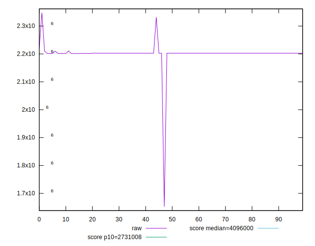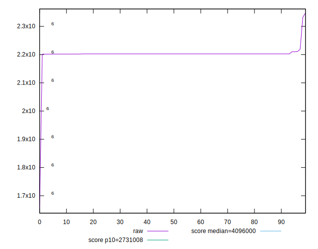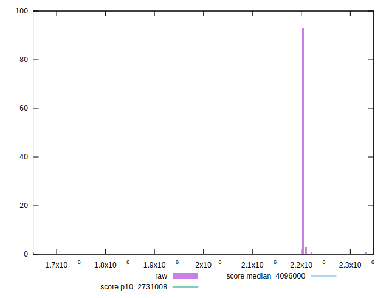
## Score


```yaml
p90min: 0.97
p90max: 0.98
p90range: 0.010000000000000009
p90mean: 0.97968085106383
p90median: 0.98
p90stdev: 0.0017577352810487575
p90skewness: -5.326002287485621
p90eccentricity: 1.0000000000000004
p90discretization: 47
outlandishness: 0.9994267300276742
confidence: 0.001550231156384832
p90confidence: 0.0007106694225981935

```

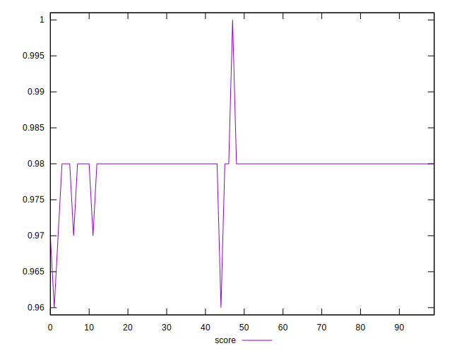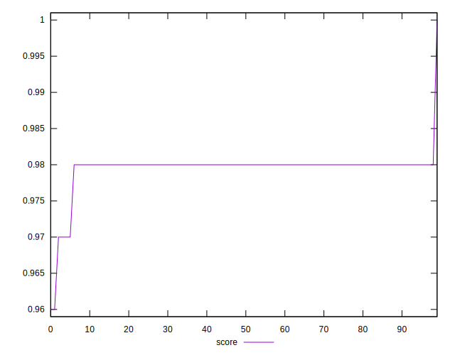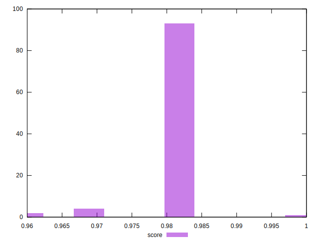
## Raw Estimate

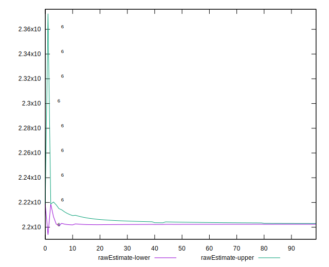
## Score Estimate


## P Score


```yaml
p90min: 0
p90max: 0
p90range: 0
p90mean: 0
p90median: 0
p90stdev: 0
p90skewness: .nan
p90eccentricity: .nan
p90discretization: 94
outlandishness: .nan
confidence: 0
p90confidence: 0

```


## Score Difference


```yaml
p90min: -0.98
p90max: -0.97
p90range: 0.010000000000000009
p90mean: -0.97968085106383
p90median: -0.98
p90stdev: 0.0017577352810487575
p90skewness: 5.32600228748562
p90eccentricity: 1.0000000000000004
p90discretization: 47
outlandishness: 0.9994267300276742
confidence: 0.001550231156384832
p90confidence: 0.0007106694225981935

```

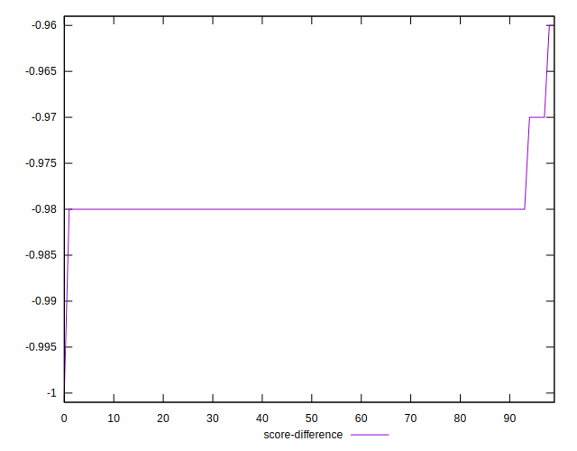
## P Score Difference


```yaml
p90min: -0.98
p90max: -0.97
p90range: 0.010000000000000009
p90mean: -0.97968085106383
p90median: -0.98
p90stdev: 0.0017577352810487575
p90skewness: 5.32600228748562
p90eccentricity: 1.0000000000000004
p90discretization: 47
outlandishness: 0.9994267300276742
confidence: 0.001550231156384832
p90confidence: 0.0007106694225981935

```

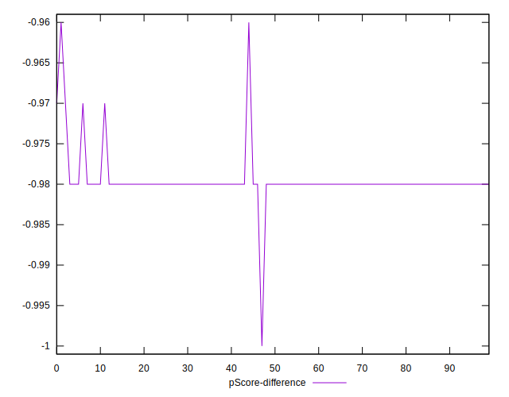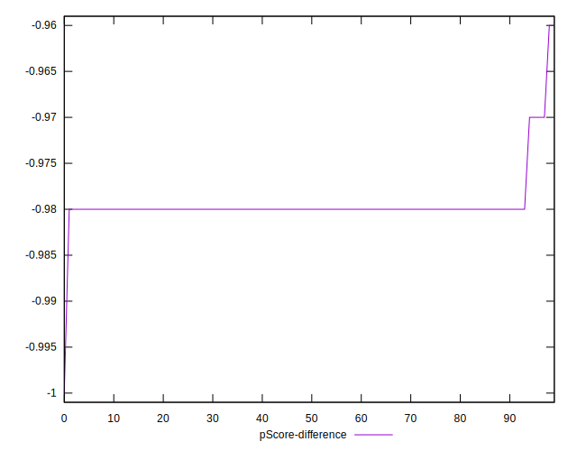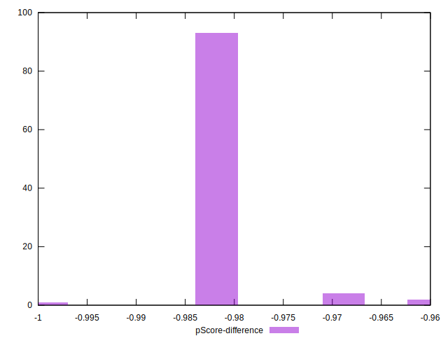