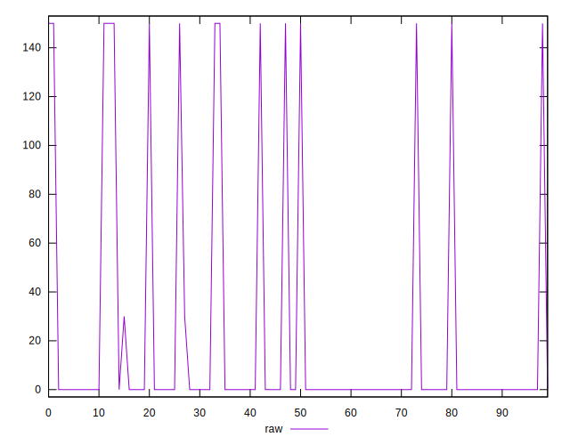
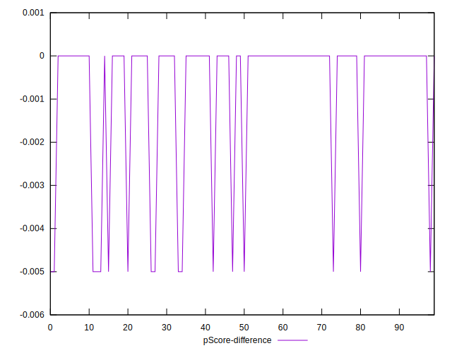

# //unminified-css/samples/pages+cached

[→ Parent](../..)


## Raw


```yaml
p90min: 0
p90max: 150
p90range: 150
p90mean: 19.78723404255319
p90median: 0
p90stdev: 49.99954730442421
p90skewness: 2.202272428846548
p90eccentricity: 1.000000000000001
p90discretization: 31.333333333333332
outlandishness: 1.3628679500520293
confidence: 20.961134451459984
p90confidence: 20.2153019263545

```


## Score


```yaml
p90min: 0.88
p90max: 1
p90range: 0.12
p90mean: 0.9842553191489363
p90median: 1
p90stdev: 0.03998641688794385
p90skewness: -2.2106854000563945
p90eccentricity: 0.9999999999999974
p90discretization: 31.333333333333332
outlandishness: 0.9946116879555746
confidence: 0.016766297653245534
p90confidence: 0.01616689618050481

```


## Raw Estimate


## Score Estimate


## P Score


```yaml
p90min: 0.875
p90max: 1
p90range: 0.125
p90mean: 0.9835106382978723
p90median: 1
p90stdev: 0.041666289420353504
p90skewness: -2.2022724288465416
p90eccentricity: 1.0000000000000022
p90discretization: 31.333333333333332
outlandishness: 0.9943940334930287
confidence: 0.017467612042883336
p90confidence: 0.01684608493862875

```


## Score Difference


```yaml
p90min: 0
p90max: 0
p90range: 0
p90mean: 0
p90median: 0
p90stdev: 0
p90skewness: .nan
p90eccentricity: .nan
p90discretization: 94
outlandishness: .nan
confidence: 0
p90confidence: 0

```


## P Score Difference


```yaml
p90min: -0.0050000000000000044
p90max: 0
p90range: 0.0050000000000000044
p90mean: -0.0007446808510638305
p90median: 0
p90stdev: 0.0017801277160299491
p90skewness: -1.9721272054017467
p90eccentricity: 0.9999999999999982
p90discretization: 47
outlandishness: 1.3028591836734689
confidence: 0.0007362267582748822
p90confidence: 0.0007197229012478091

```

