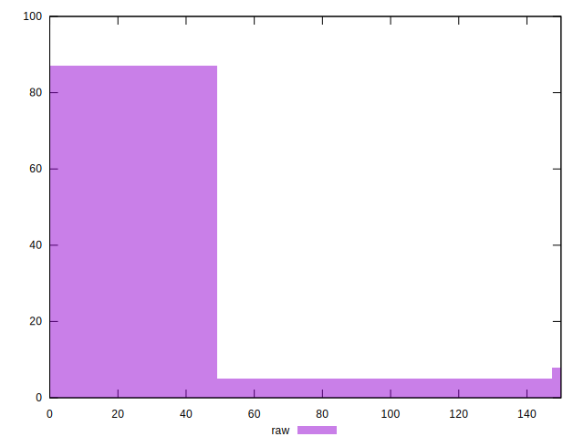
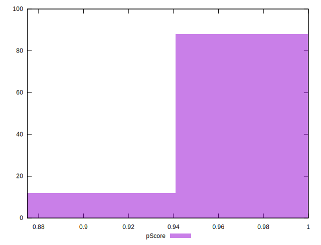

# //unminified-css/samples/pages

[→ Parent](../..)


## Raw


```yaml
p90min: 0
p90max: 150
p90range: 150
p90mean: 14.042553191489361
p90median: 0
p90stdev: 39.90198493799341
p90skewness: 2.7567042992479167
p90eccentricity: 1.0000000000000007
p90discretization: 10.444444444444445
outlandishness: 1.588745661157025
confidence: 17.720979438440523
p90confidence: 16.132759524224966

```


## Score


```yaml
p90min: 0.88
p90max: 1
p90range: 0.12
p90mean: 0.9886170212765958
p90median: 1
p90stdev: 0.03224246782665275
p90skewness: -2.747073446502509
p90eccentricity: 1.0000000000000009
p90discretization: 11.75
outlandishness: 0.994107490118469
confidence: 0.01427688136847676
p90confidence: 0.013035942465600733

```


## Raw Estimate


## Score Estimate


## P Score


```yaml
p90min: 0.875
p90max: 1
p90range: 0.125
p90mean: 0.9882978723404255
p90median: 1
p90stdev: 0.0332516541149945
p90skewness: -2.7567042992479234
p90eccentricity: 1.0000000000000009
p90discretization: 10.444444444444445
outlandishness: 0.9938415883196742
confidence: 0.014767482865367113
p90confidence: 0.013443966270187468

```


## Score Difference


```yaml
p90min: 0
p90max: 0
p90range: 0
p90mean: 0
p90median: 0
p90stdev: 0
p90skewness: .nan
p90eccentricity: .nan
p90discretization: 94
outlandishness: .nan
confidence: 0
p90confidence: 0

```


## P Score Difference


```yaml
p90min: -0.0050000000000000044
p90max: 0
p90range: 0.0050000000000000044
p90mean: -0.00040780141843971626
p90median: 0
p90stdev: 0.00132457607770353
p90skewness: -3.095017091949091
p90eccentricity: 1.0000000000000016
p90discretization: 23.5
outlandishness: 1.2176642722117286
confidence: 0.0006324406920698794
p90confidence: 0.0005355389554263808

```

