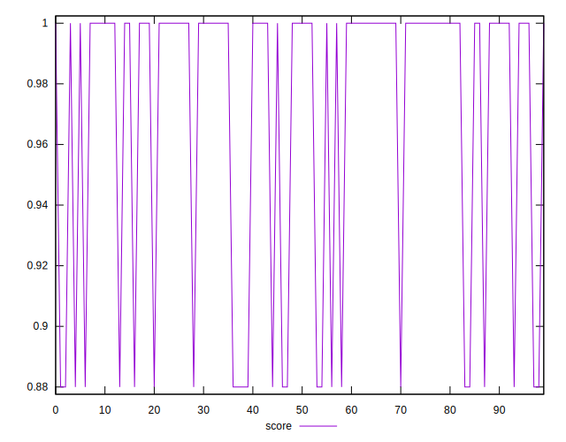

# //unminified-javascript/samples/pages+cached+noadtech+nomedia+nocss

[→ Parent](../..)


## Raw


```yaml
p90min: 0
p90max: 150
p90range: 150
p90mean: 36.702127659574465
p90median: 0
p90stdev: 64.48467239737263
p90skewness: 1.187813193945477
p90eccentricity: 0.9999999999999976
p90discretization: 47
outlandishness: 1.1291372400756148
confidence: 25.791219618145146
p90confidence: 26.07177849427446

```


## Score


```yaml
p90min: 0.88
p90max: 1
p90range: 0.12
p90mean: 0.9706382978723406
p90median: 1
p90stdev: 0.05158773791789807
p90skewness: -1.1878131939454721
p90eccentricity: 0.9999999999999987
p90discretization: 47
outlandishness: 0.9962157745176252
confidence: 0.02063297569451611
p90confidence: 0.020857422795419557

```


## Raw Estimate


## Score Estimate


## P Score


```yaml
p90min: 0.875
p90max: 1
p90range: 0.125
p90mean: 0.9694148936170213
p90median: 1
p90stdev: 0.05373722699781051
p90skewness: -1.1878131939454792
p90eccentricity: 0.9999999999999978
p90discretization: 47
outlandishness: 0.9960532845602805
confidence: 0.021492683015120955
p90confidence: 0.021726482078562044

```


## Score Difference


```yaml
p90min: 0
p90max: 0
p90range: 0
p90mean: 0
p90median: 0
p90stdev: 0
p90skewness: .nan
p90eccentricity: .nan
p90discretization: 94
outlandishness: .nan
confidence: 0
p90confidence: 0

```


## P Score Difference


```yaml
p90min: -0.0050000000000000044
p90max: 0
p90range: 0.0050000000000000044
p90mean: -0.00122340425531915
p90median: 0
p90stdev: 0.0021494890799124227
p90skewness: -1.1878131939454792
p90eccentricity: 0.9999999999999978
p90discretization: 47
outlandishness: 1.1291372400756148
confidence: 0.0008597073206048384
p90confidence: 0.0008690592831424827

```

