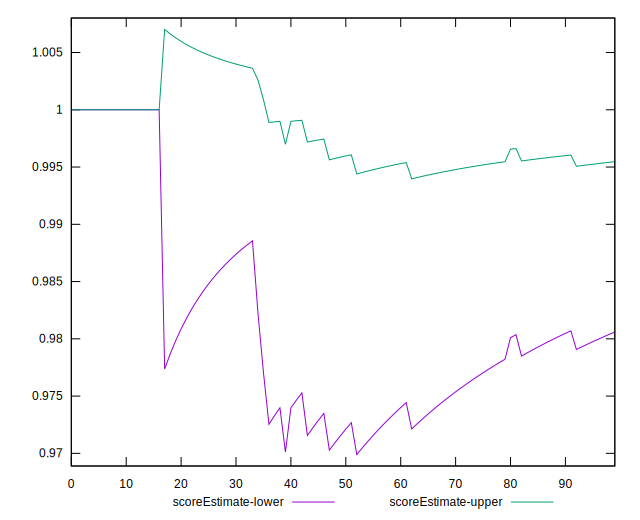
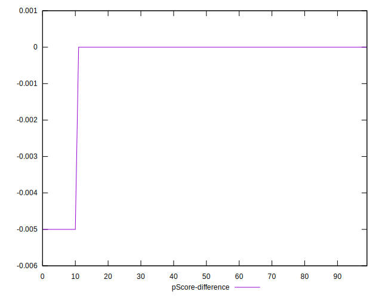

# //unminified-javascript/samples/pages+cached+noadtech

[→ Parent](../..)


## Raw


```yaml
p90min: 0
p90max: 150
p90range: 150
p90mean: 14.361702127659575
p90median: 0
p90stdev: 44.13611708278513
p90skewness: 2.747785799036308
p90eccentricity: 1.0000000000000002
p90discretization: 47
outlandishness: 1.8435604938271604
confidence: 21.45153495978667
p90confidence: 17.84466021768332

```


## Score


```yaml
p90min: 0.88
p90max: 1
p90range: 0.12
p90mean: 0.9885106382978726
p90median: 1
p90stdev: 0.03530889366622806
p90skewness: -2.747785799036323
p90eccentricity: 1.0000000000000047
p90discretization: 47
outlandishness: 0.9914989877424077
confidence: 0.017365369388758108
p90confidence: 0.014275728174146638

```


## Raw Estimate


## Score Estimate


## P Score


```yaml
p90min: 0.875
p90max: 1
p90range: 0.125
p90mean: 0.988031914893617
p90median: 1
p90stdev: 0.03678009756898761
p90skewness: -2.747785799036292
p90eccentricity: 0.9999999999999996
p90discretization: 47
outlandishness: 0.9913512177361069
confidence: 0.01787627913315554
p90confidence: 0.014870550181402768

```


## Score Difference


```yaml
p90min: 0
p90max: 0
p90range: 0
p90mean: 0
p90median: 0
p90stdev: 0
p90skewness: .nan
p90eccentricity: .nan
p90discretization: 94
outlandishness: .nan
confidence: 0
p90confidence: 0

```


## P Score Difference


```yaml
p90min: -0.0050000000000000044
p90max: 0
p90range: 0.0050000000000000044
p90mean: -0.0004255319148936174
p90median: 0
p90stdev: 0.001395199686021703
p90skewness: -2.9737221214858076
p90eccentricity: 0.9999999999999968
p90discretization: 47
outlandishness: 1.67055625
confidence: 0.0006132526547402428
p90confidence: 0.0005640927652556578

```

