# //unminified-javascript/samples/pages+cached

[→ Parent](../..)


## Raw


```yaml
p90min: 0
p90max: 150
p90range: 150
p90mean: 18.19148936170213
p90median: 0
p90stdev: 48.178806278046665
p90skewness: 2.3501487136120476
p90eccentricity: 0.9999999999999997
p90discretization: 31.333333333333332
outlandishness: 1.4098437673130195
confidence: 20.373974100872847
p90confidence: 19.47915866982014

```

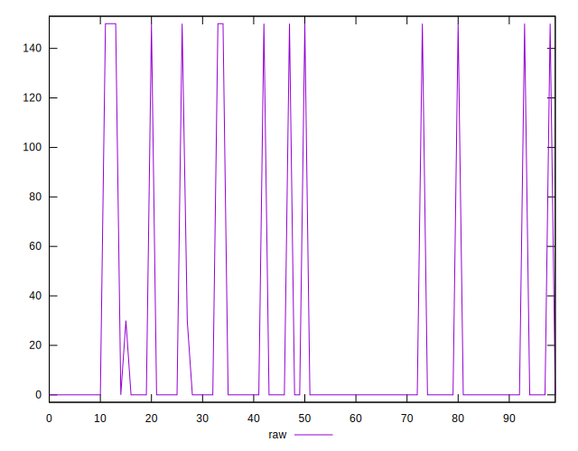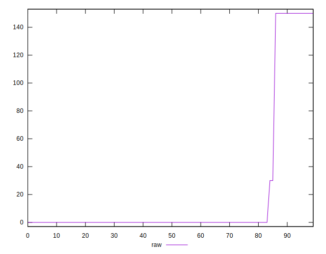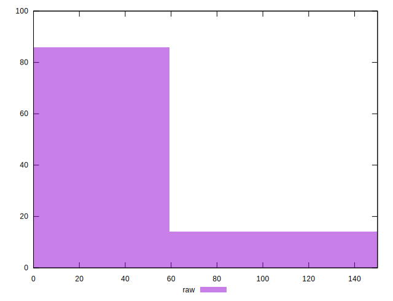
## Score


```yaml
p90min: 0.88
p90max: 1
p90range: 0.12
p90mean: 0.9855319148936171
p90median: 1
p90stdev: 0.03852650431366767
p90skewness: -2.359550569118231
p90eccentricity: 0.9999999999999979
p90discretization: 31.333333333333332
outlandishness: 0.9944636426481245
confidence: 0.016295588943724335
p90confidence: 0.015576639366870362

```

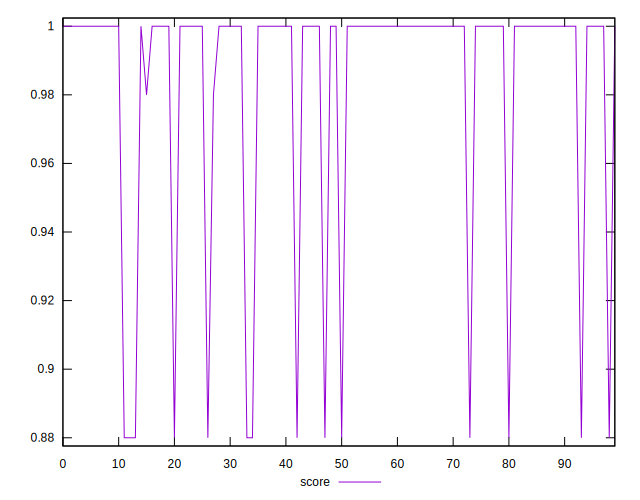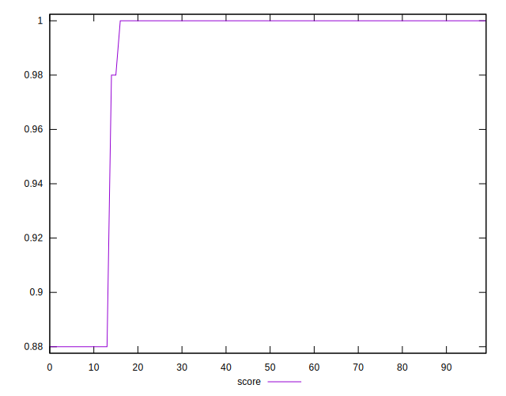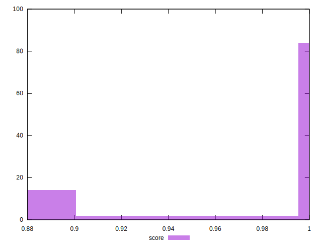
## Raw Estimate

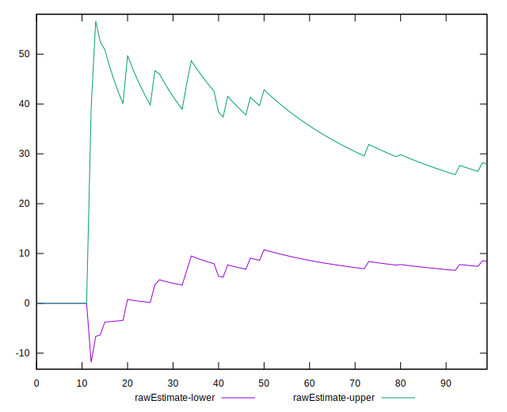
## Score Estimate

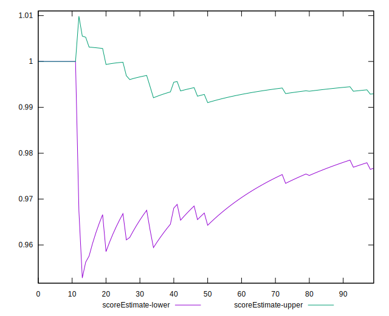
## P Score


```yaml
p90min: 0.875
p90max: 1
p90range: 0.125
p90mean: 0.984840425531915
p90median: 1
p90stdev: 0.040149005231705524
p90skewness: -2.3501487136120427
p90eccentricity: 1.0000000000000016
p90discretization: 31.333333333333332
outlandishness: 0.9942400223333816
confidence: 0.01697831175072737
p90confidence: 0.016232632224850104

```

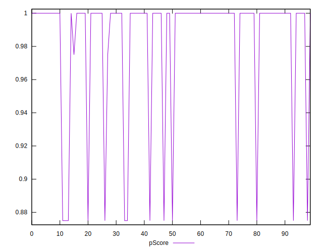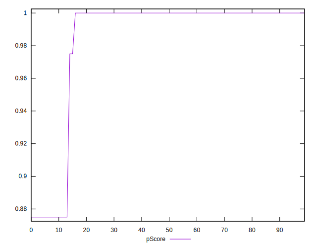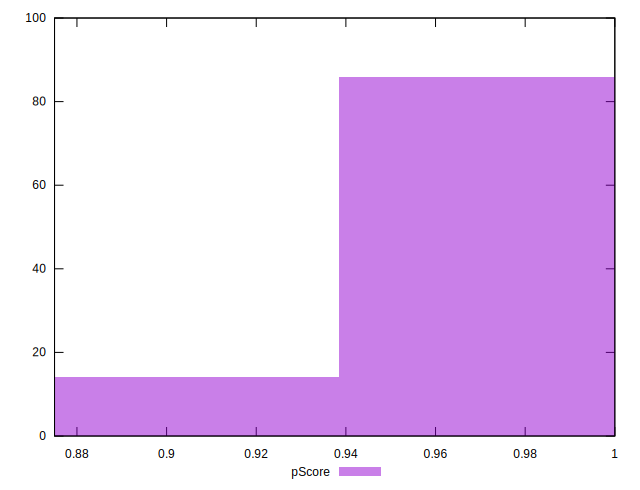
## Score Difference


```yaml
p90min: 0
p90max: 0
p90range: 0
p90mean: 0
p90median: 0
p90stdev: 0
p90skewness: .nan
p90eccentricity: .nan
p90discretization: 94
outlandishness: .nan
confidence: 0
p90confidence: 0

```


## P Score Difference


```yaml
p90min: -0.0050000000000000044
p90max: 0
p90range: 0.0050000000000000044
p90mean: -0.0006914893617021283
p90median: 0
p90stdev: 0.0017260617808072304
p90skewness: -2.0955340746286515
p90eccentricity: 0.9999999999999999
p90discretization: 47
outlandishness: 1.3384710059171594
confidence: 0.0007185346654833651
p90confidence: 0.000697863519245739

```

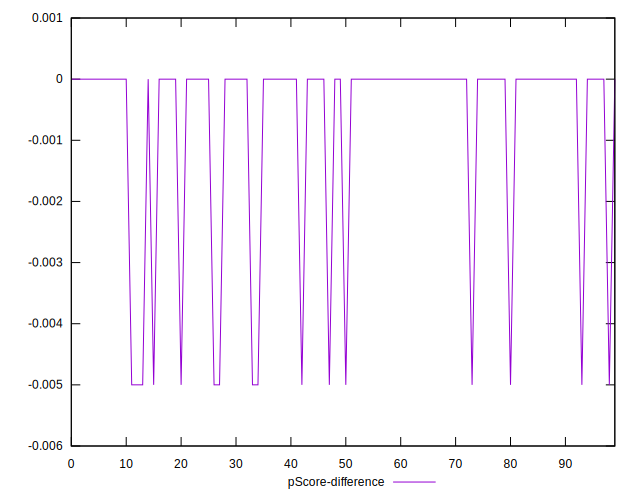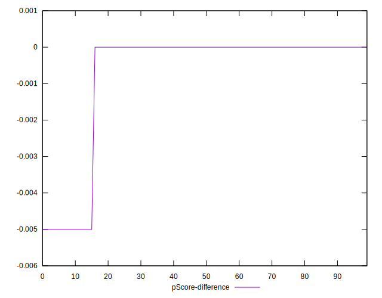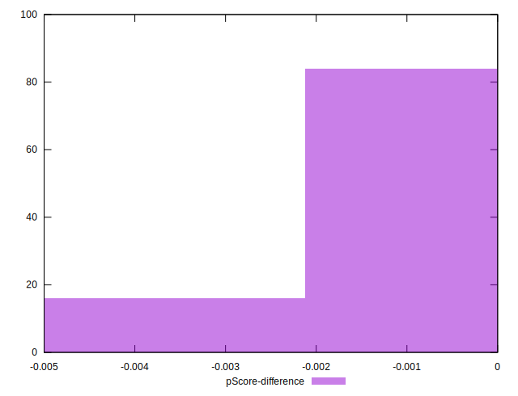