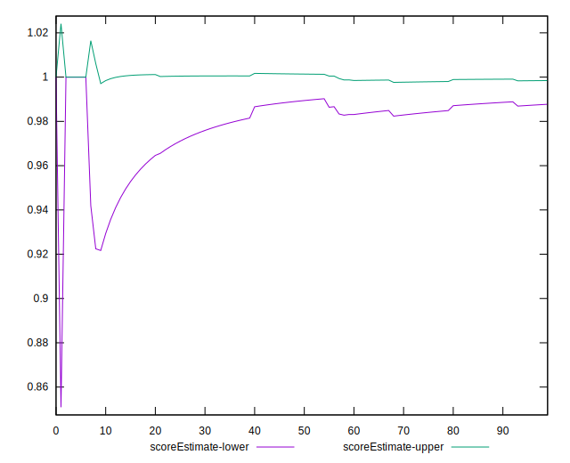

# //unminified-javascript/samples/pages

[→ Parent](../..)


## Raw


```yaml
p90min: 0
p90max: 150
p90range: 150
p90mean: 8.297872340425531
p90median: 0
p90stdev: 31.77843166169973
p90skewness: 3.962405997849111
p90eccentricity: 0.9999999999999988
p90discretization: 18.8
outlandishness: 2.197236094674557
confidence: 15.371466609493785
p90confidence: 12.848328143371804

```


## Score


```yaml
p90min: 0.88
p90max: 1
p90range: 0.12
p90mean: 0.9932978723404255
p90median: 1
p90stdev: 0.025406830120061428
p90skewness: -3.9482268523113317
p90eccentricity: 1.0000000000000022
p90discretization: 18.8
outlandishness: 0.9935714658511328
confidence: 0.01229002132814116
p90confidence: 0.01027222784121473

```


## Raw Estimate


## Score Estimate


## P Score


```yaml
p90min: 0.875
p90max: 1
p90range: 0.125
p90mean: 0.9930851063829786
p90median: 1
p90stdev: 0.026482026384749783
p90skewness: -3.9624059978490895
p90eccentricity: 0.9999999999999934
p90discretization: 18.8
outlandishness: 0.9932946206331087
confidence: 0.012809555507911501
p90confidence: 0.010706940119476505

```


## Score Difference


```yaml
p90min: 0
p90max: 0
p90range: 0
p90mean: 0
p90median: 0
p90stdev: 0
p90skewness: .nan
p90eccentricity: .nan
p90discretization: 94
outlandishness: .nan
confidence: 0
p90confidence: 0

```


## P Score Difference


```yaml
p90min: -0.0050000000000000044
p90max: 0
p90range: 0.0050000000000000044
p90mean: -0.0002836879432624108
p90median: 0
p90stdev: 0.0011308665758228353
p90skewness: -3.8631530331536696
p90eccentricity: 0.9999999999999984
p90discretization: 31.333333333333332
outlandishness: 1.5221390625000086
confidence: 0.0005717588177204354
p90confidence: 0.0004572203250059914

```

