# //unused-css-rules/samples/pages+cached+noadtech+nomedia

[→ Parent](../..)


## Raw


```yaml
p90min: 0
p90max: 150
p90range: 150
p90mean: 38.297872340425535
p90median: 0
p90stdev: 65.40606871889104
p90skewness: 1.1222850838908125
p90eccentricity: 1.0000000000000002
p90discretization: 47
outlandishness: 1.2026777777777777
confidence: 27.67924397810093
p90confidence: 26.444307963789853

```

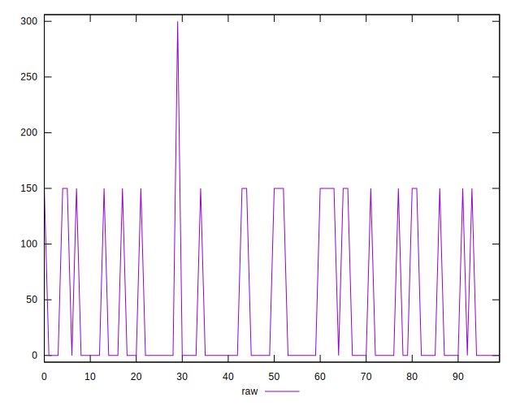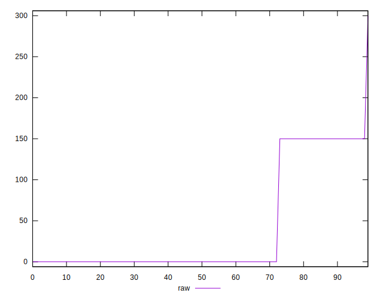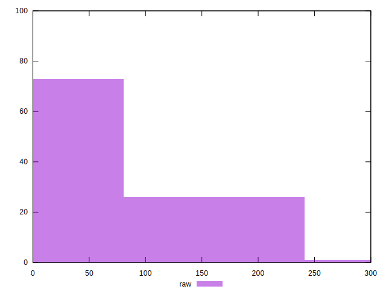
## Score


```yaml
p90min: 0.88
p90max: 1
p90range: 0.12
p90mean: 0.9693617021276596
p90median: 1
p90stdev: 0.052324854975112856
p90skewness: -1.1222850838908054
p90eccentricity: 0.9999999999999992
p90discretization: 47
outlandishness: 0.9936930312592255
confidence: 0.022289573544182973
p90confidence: 0.021155446371031894

```

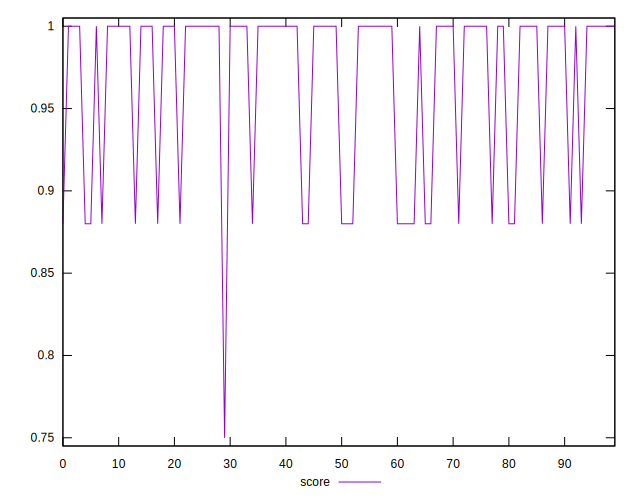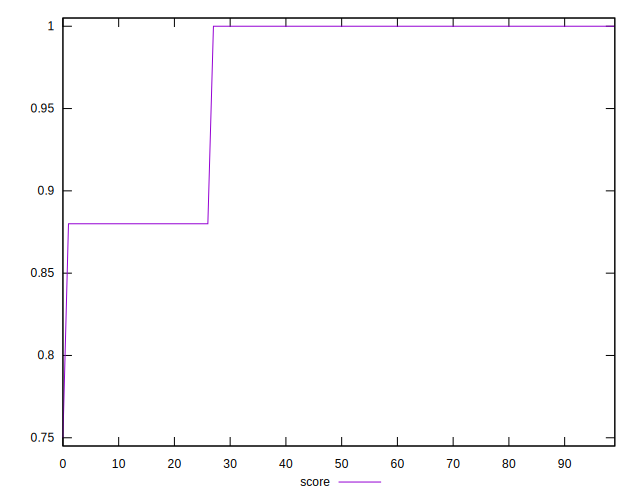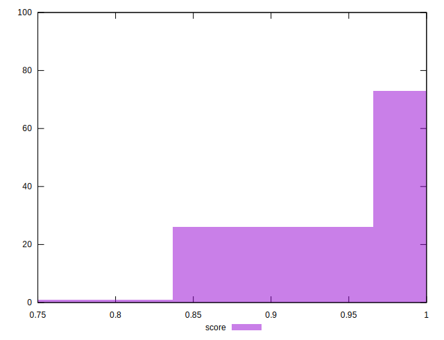
## Raw Estimate

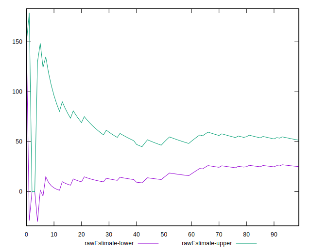
## Score Estimate

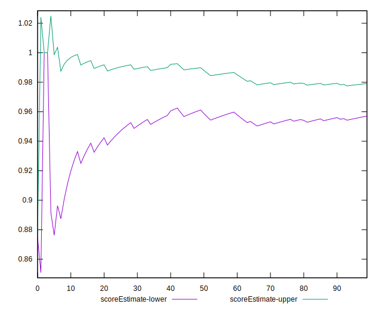
## P Score


```yaml
p90min: 0.875
p90max: 1
p90range: 0.125
p90mean: 0.9680851063829787
p90median: 1
p90stdev: 0.054505057265742535
p90skewness: -1.1222850838908118
p90eccentricity: 1.0000000000000002
p90discretization: 47
outlandishness: 0.9936365294046612
confidence: 0.02306603664841743
p90confidence: 0.022036923303158217

```

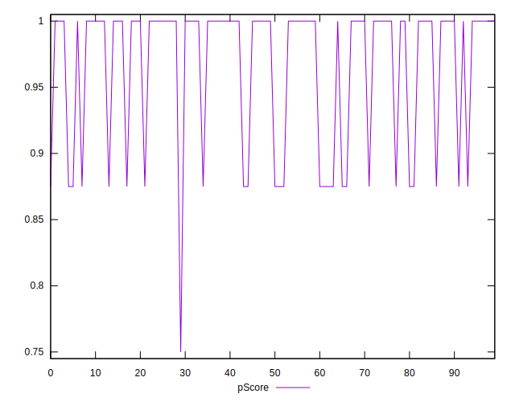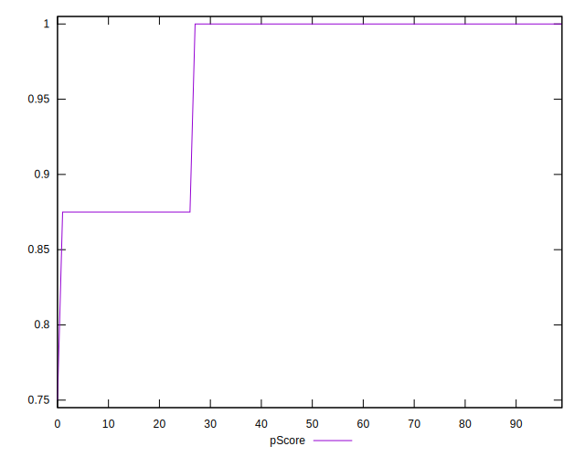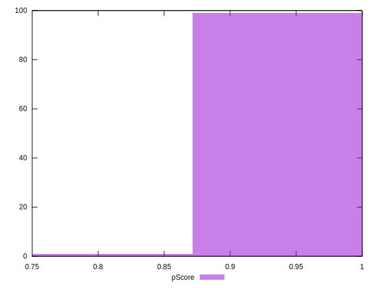
## Score Difference


```yaml
p90min: 0
p90max: 0
p90range: 0
p90mean: 0
p90median: 0
p90stdev: 0
p90skewness: .nan
p90eccentricity: .nan
p90discretization: 94
outlandishness: .nan
confidence: 0
p90confidence: 0

```


## P Score Difference


```yaml
p90min: -0.0050000000000000044
p90max: 0
p90range: 0.0050000000000000044
p90mean: -0.00122340425531915
p90median: 0
p90stdev: 0.0021494890799124227
p90skewness: -1.1878131939454792
p90eccentricity: 0.9999999999999983
p90discretization: 47
outlandishness: 1.1291372400756148
confidence: 0.0008597073206048384
p90confidence: 0.0008690592831424827

```

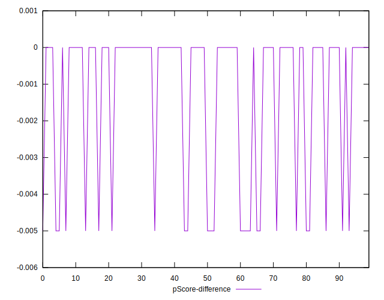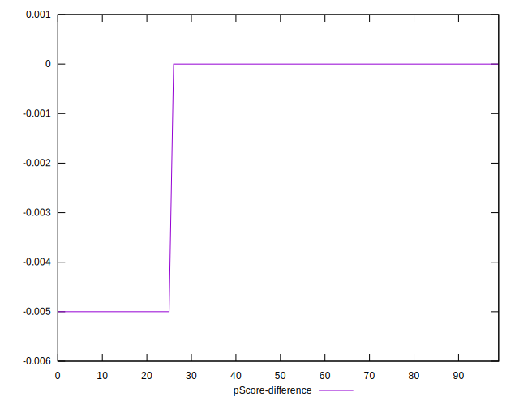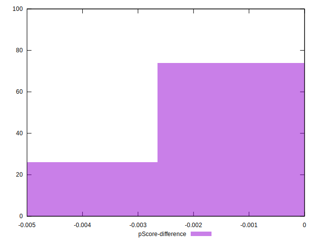