# //unused-css-rules/samples/pages+cached+noadtech

[→ Parent](../..)


## Raw


```yaml
p90min: 0
p90max: 300
p90range: 300
p90mean: 167.5531914893617
p90median: 150
p90stdev: 84.33325698972644
p90skewness: 0.025039494612615957
p90eccentricity: 0.9999999999999988
p90discretization: 31.333333333333332
outlandishness: 0.9874680816326532
confidence: 35.17630311351358
p90confidence: 34.09675375859482

```

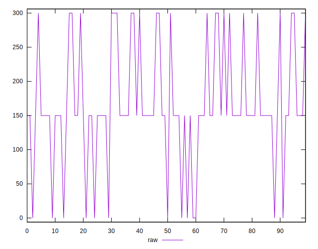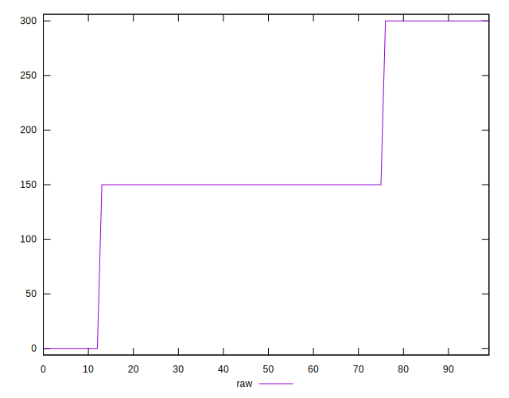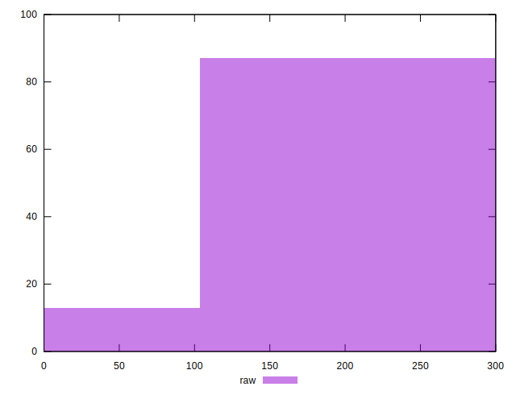
## Score


```yaml
p90min: 0.75
p90max: 1
p90range: 0.25
p90mean: 0.863723404255319
p90median: 0.88
p90stdev: 0.0710106980635656
p90skewness: -0.15765536898468654
p90eccentricity: 0.9999999999999988
p90discretization: 31.333333333333332
outlandishness: 1.0015673090394615
confidence: 0.029554905156654248
p90confidence: 0.02871031396776576

```

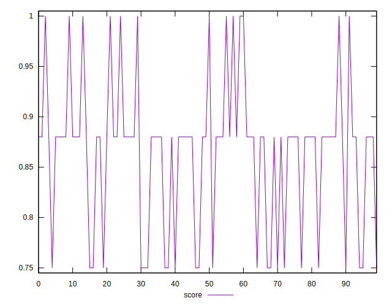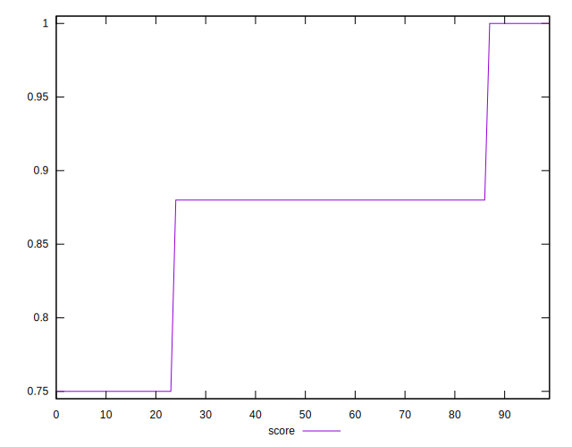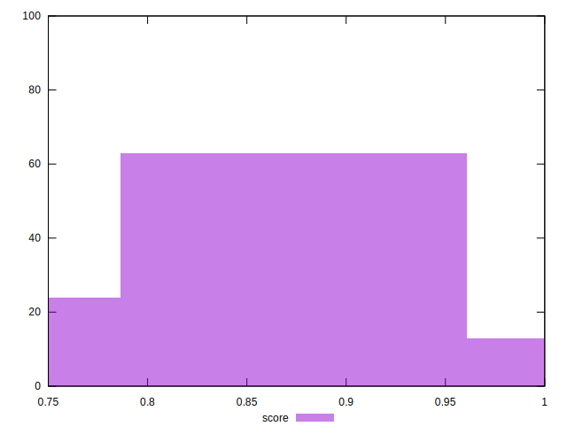
## Raw Estimate

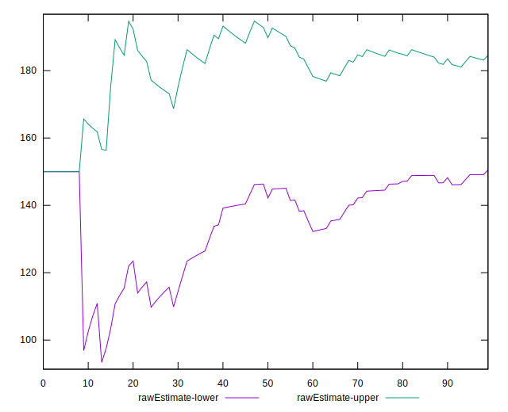
## Score Estimate

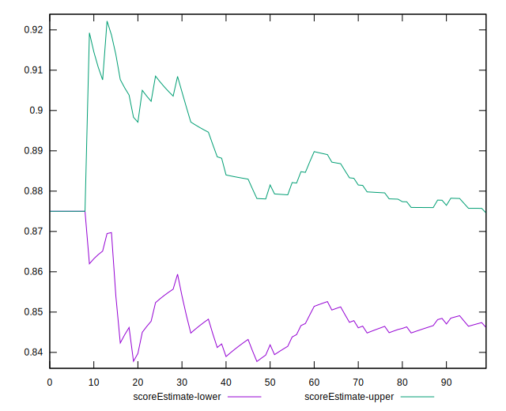
## P Score


```yaml
p90min: 0.75
p90max: 1
p90range: 0.25
p90mean: 0.8603723404255319
p90median: 0.875
p90stdev: 0.07027771415810533
p90skewness: -0.025039494612614805
p90eccentricity: 1
p90discretization: 31.333333333333332
outlandishness: 1.0020412260605958
confidence: 0.02931358592792797
p90confidence: 0.02841396146549567

```

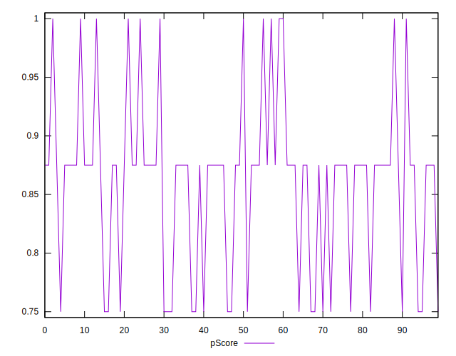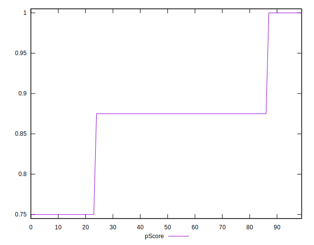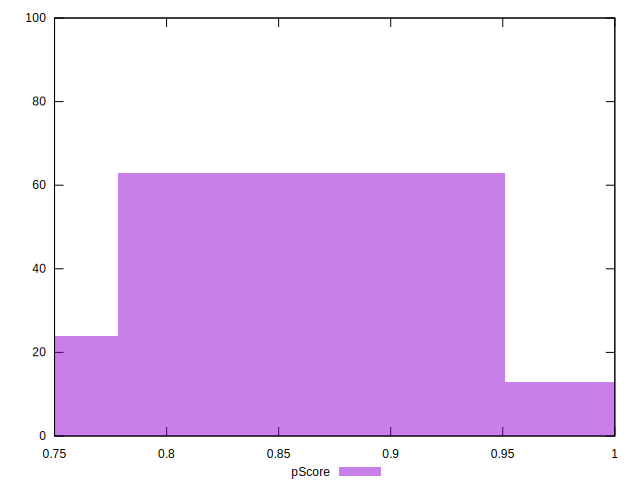
## Score Difference


```yaml
p90min: 0
p90max: 0
p90range: 0
p90mean: 0
p90median: 0
p90stdev: 0
p90skewness: .nan
p90eccentricity: .nan
p90discretization: 94
outlandishness: .nan
confidence: 0
p90confidence: 0

```


## P Score Difference


```yaml
p90min: -0.0050000000000000044
p90max: 0
p90range: 0.0050000000000000044
p90mean: -0.0031914893617021305
p90median: -0.0050000000000000044
p90stdev: 0.0024024659129013226
p90skewness: 0.5756496756010626
p90eccentricity: 1.0000000000000004
p90discretization: 47
outlandishness: 0.974169
confidence: 0.0009462790556193259
p90confidence: 0.0009713402703703622

```

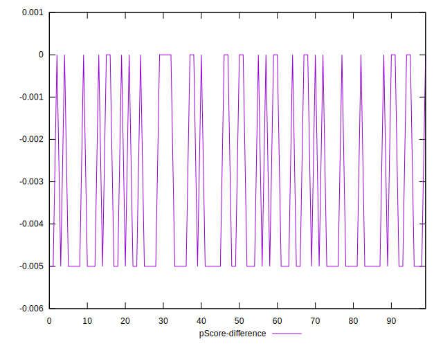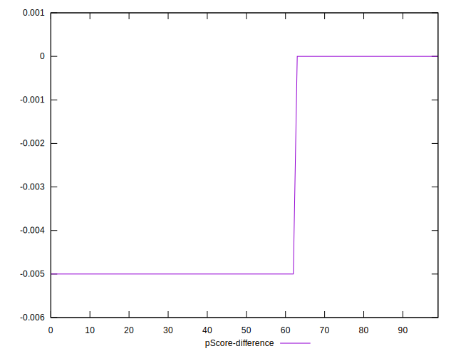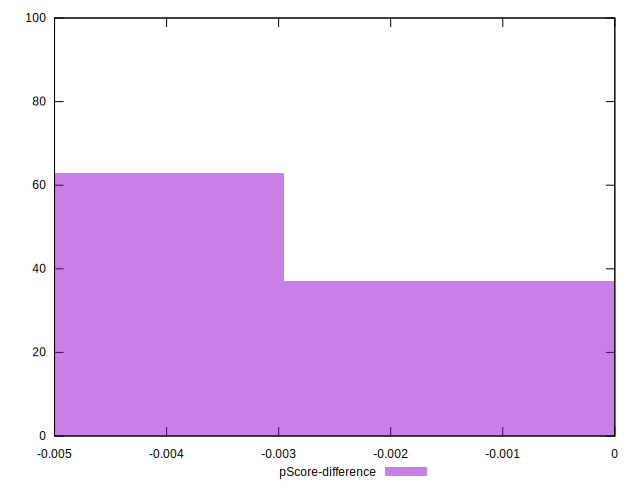