# //unused-css-rules/samples/pages+cached

[→ Parent](../..)


## Raw


```yaml
p90min: 0
p90max: 160
p90range: 160
p90mean: 82.02127659574468
p90median: 150
p90stdev: 73.3916887177178
p90skewness: -0.1722307933995782
p90eccentricity: 1.0000000000000002
p90discretization: 15.666666666666666
outlandishness: 1.043842531723081
confidence: 30.316936800086623
p90confidence: 29.672971582732927

```

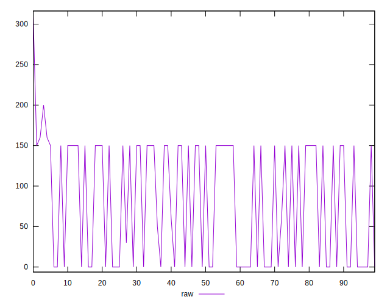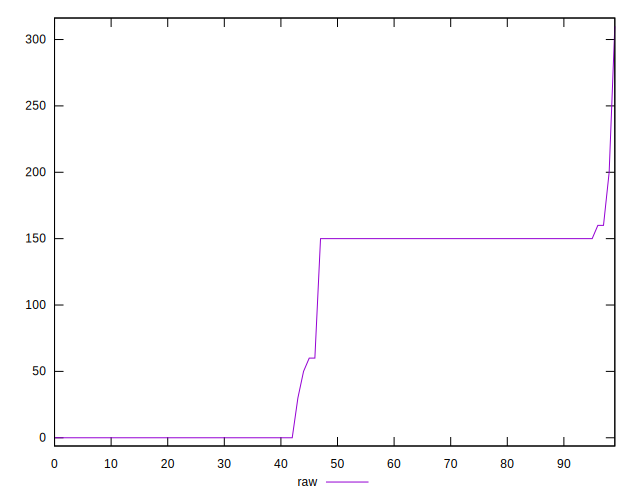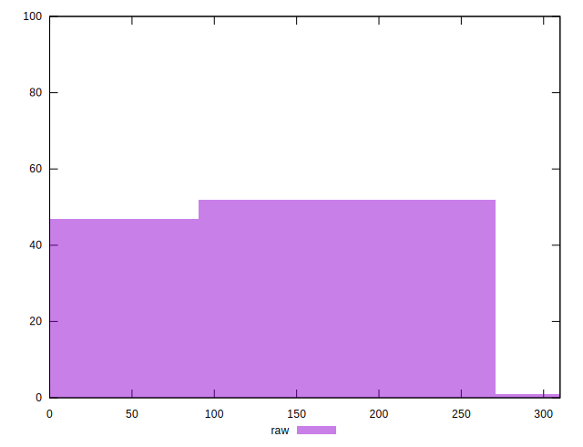
## Score


```yaml
p90min: 0.87
p90max: 1
p90range: 0.13
p90mean: 0.9343617021276595
p90median: 0.88
p90stdev: 0.058755869071048974
p90skewness: 0.17270338897114976
p90eccentricity: 1.0000000000000007
p90discretization: 15.666666666666666
outlandishness: 0.9964462916047244
confidence: 0.0244790321521494
p90confidence: 0.023755567745140555

```

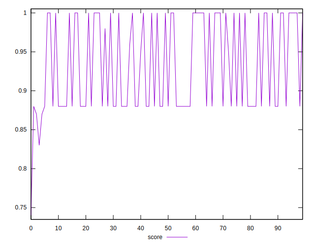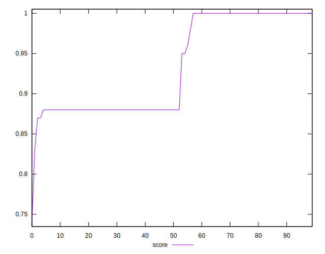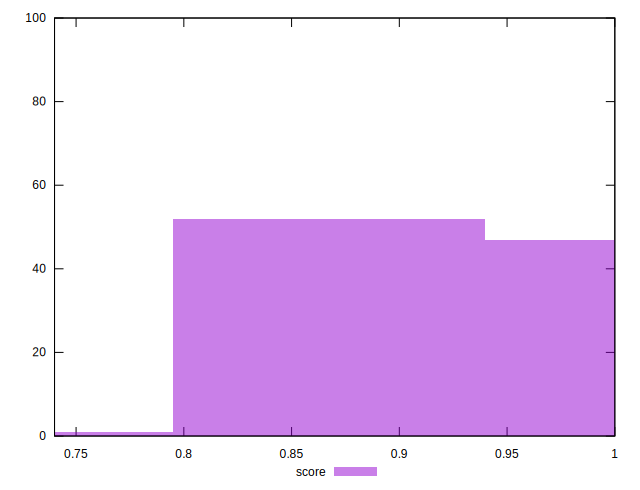
## Raw Estimate

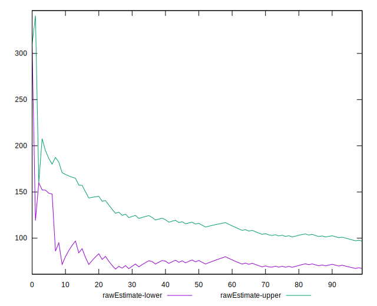
## Score Estimate

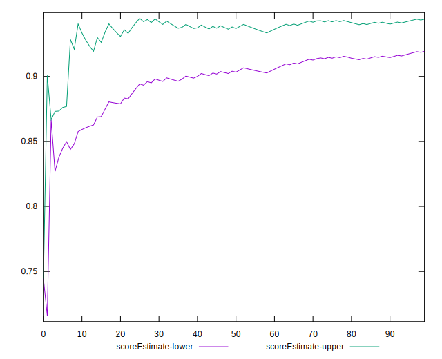
## P Score


```yaml
p90min: 0.8666666666666667
p90max: 1
p90range: 0.1333333333333333
p90mean: 0.9316489361702128
p90median: 0.875
p90stdev: 0.06115974059809817
p90skewness: 0.17223079339957517
p90eccentricity: 1.0000000000000002
p90discretization: 15.666666666666666
outlandishness: 0.9968800343305203
confidence: 0.025232480052154452
p90confidence: 0.02472747631894411

```

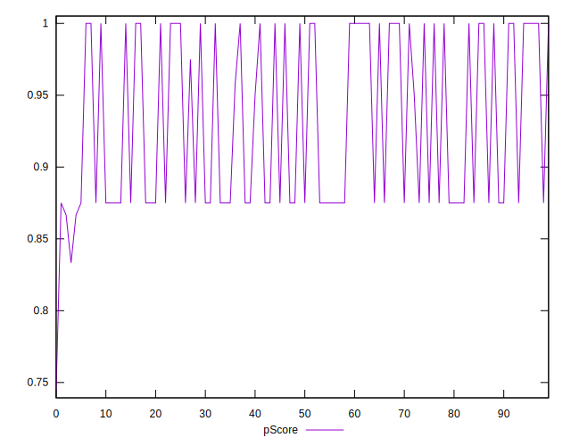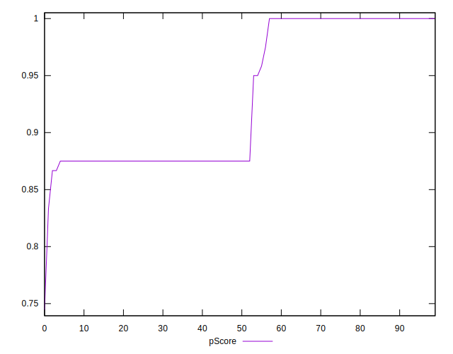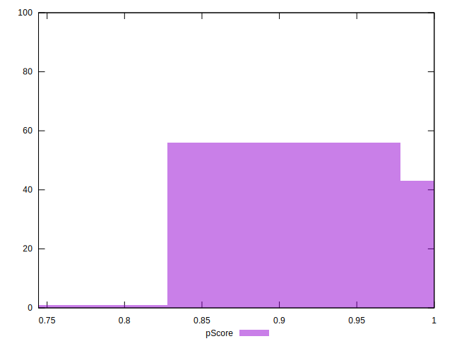
## Score Difference


```yaml
p90min: 0
p90max: 0
p90range: 0
p90mean: 0
p90median: 0
p90stdev: 0
p90skewness: .nan
p90eccentricity: .nan
p90discretization: 94
outlandishness: .inf
confidence: 7.423946114831065e-18
p90confidence: 0

```

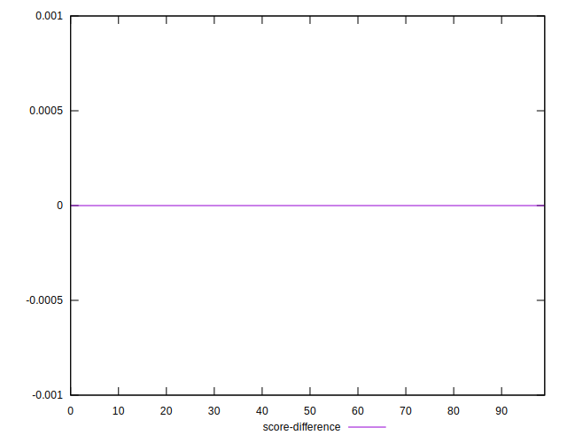
## P Score Difference


```yaml
p90min: -0.0050000000000000044
p90max: 0
p90range: 0.0050000000000000044
p90mean: -0.002588652482269504
p90median: -0.004166666666666652
p90stdev: 0.0024626887283715868
p90skewness: 0.07424163052580916
p90eccentricity: 0.9999999999999979
p90discretization: 23.5
outlandishness: 0.9368295260732681
confidence: 0.0010207505477831521
p90confidence: 0.000995688938772782

```

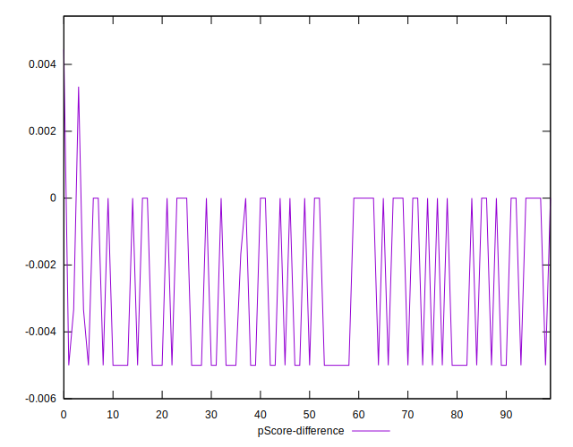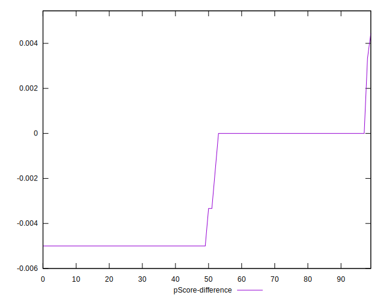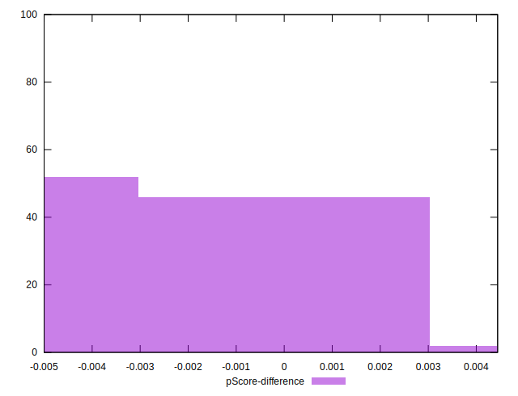