# //unused-css-rules/samples/pages

[→ Parent](../..)


## Raw


```yaml
p90min: 0
p90max: 280
p90range: 280
p90mean: 94.68085106382979
p90median: 110
p90stdev: 71.4247428321404
p90skewness: 0.19626806177550685
p90eccentricity: 0.9999999999999997
p90discretization: 4.086956521739131
outlandishness: 1.1334353622017423
confidence: 35.809695214490716
p90confidence: 28.87771628356686

```

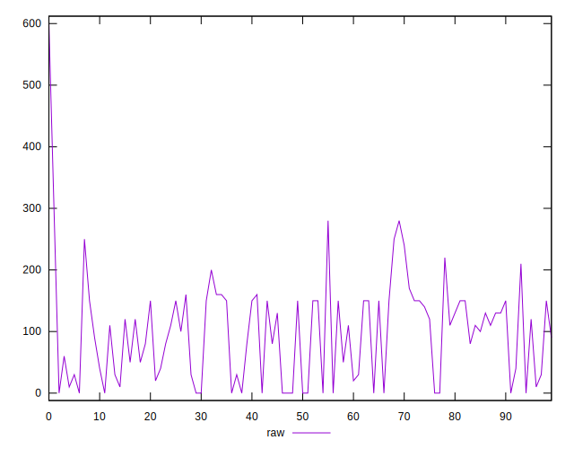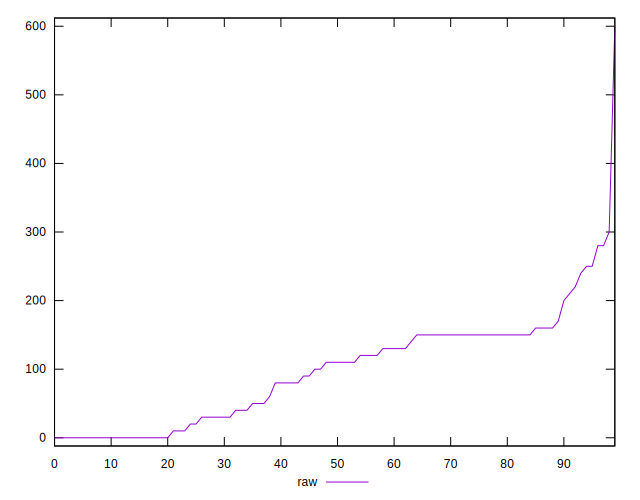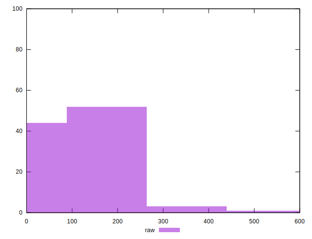
## Score


```yaml
p90min: 0.77
p90max: 1
p90range: 0.22999999999999998
p90mean: 0.9227659574468086
p90median: 0.91
p90stdev: 0.05873496648431054
p90skewness: -0.22948056459220145
p90eccentricity: 1
p90discretization: 4.947368421052632
outlandishness: 0.9905596236894101
confidence: 0.028019781124632215
p90confidence: 0.02374711662658569

```

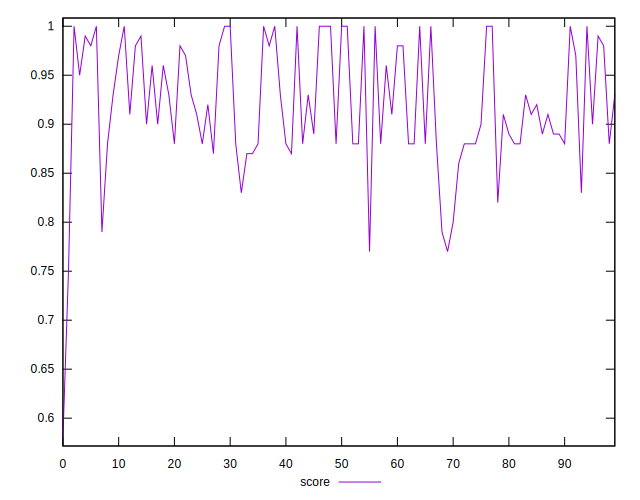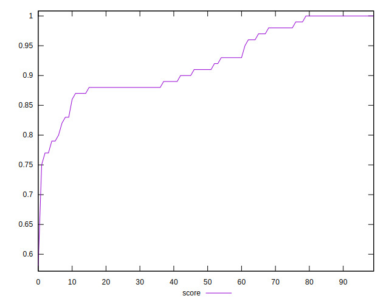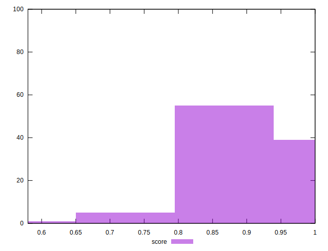
## Raw Estimate

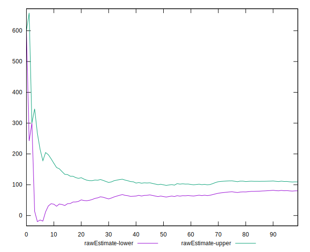
## Score Estimate

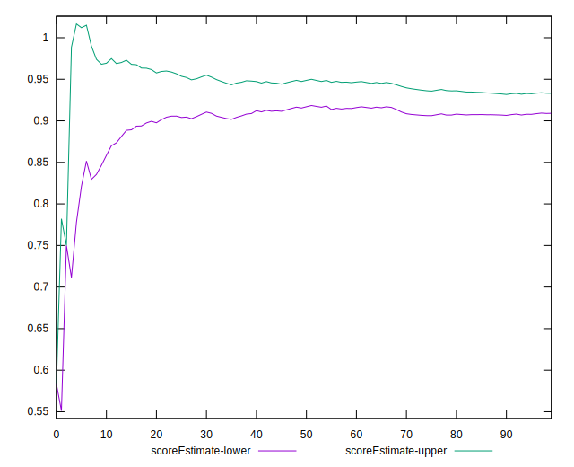
## P Score


```yaml
p90min: 0.7666666666666666
p90max: 1
p90range: 0.2333333333333334
p90mean: 0.9210992907801417
p90median: 0.9083333333333333
p90stdev: 0.05952061902678371
p90skewness: -0.1962680617754963
p90eccentricity: 0.9999999999999991
p90discretization: 4.086956521739131
outlandishness: 0.9907586969998734
confidence: 0.02818754094381636
p90confidence: 0.024064763569639068

```

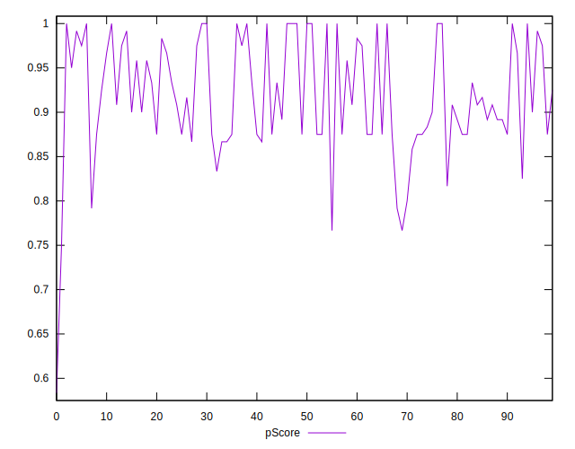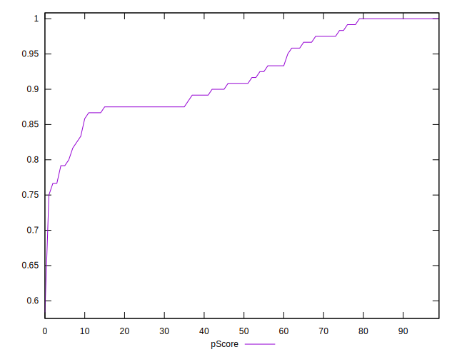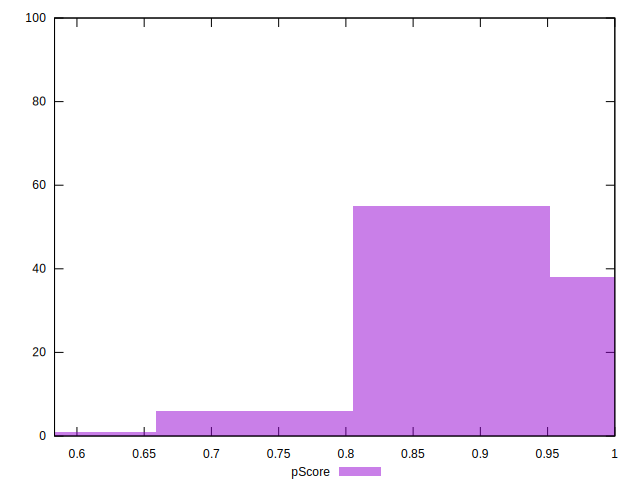
## Score Difference


```yaml
p90min: 0
p90max: 1.1102230246251565e-16
p90range: 1.1102230246251565e-16
p90mean: 1.1810883240693154e-18
p90median: 0
p90stdev: 1.139000331521095e-17
p90skewness: 9.539955591519908
p90eccentricity: 0.9999999999999997
p90discretization: 47
outlandishness: 14.137600000000003
confidence: 8.528132291650275e-18
p90confidence: 4.605088813249998e-18

```

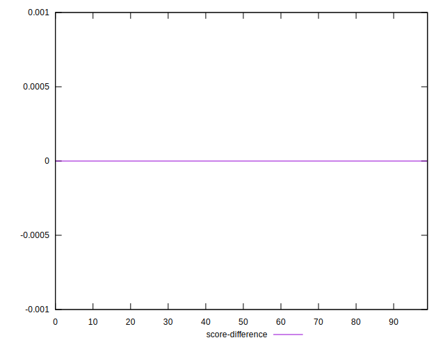
## P Score Difference


```yaml
p90min: -0.0050000000000000044
p90max: 0.0033333333333332993
p90range: 0.008333333333333304
p90mean: -0.0016134751773049722
p90median: -0.0016666666666665941
p90stdev: 0.0027229447935414658
p90skewness: 0.10971482105096306
p90eccentricity: 0.9999999999999989
p90discretization: 10.444444444444445
outlandishness: 0.9428196594614173
confidence: 0.0011118753591347083
p90confidence: 0.0011009129901735145

```

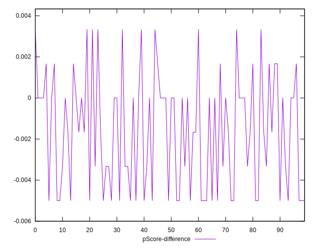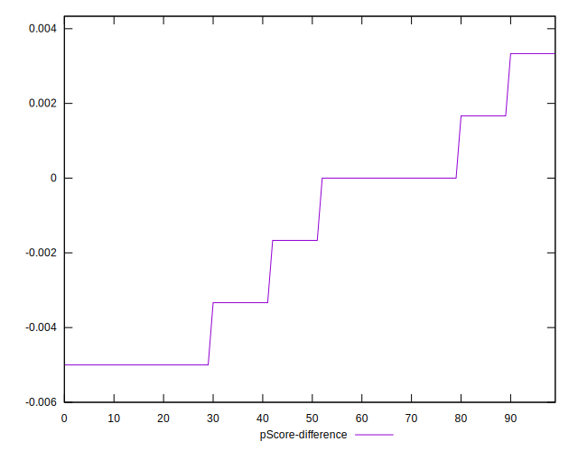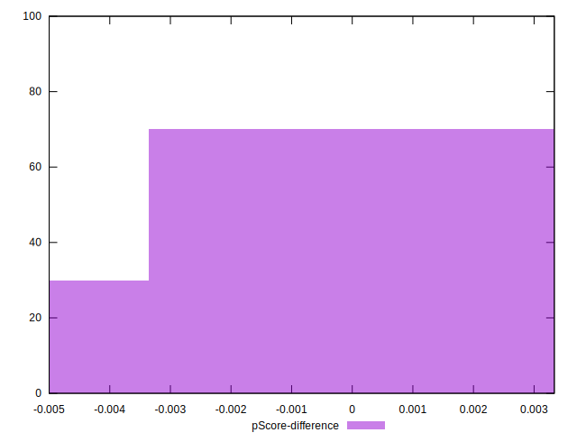