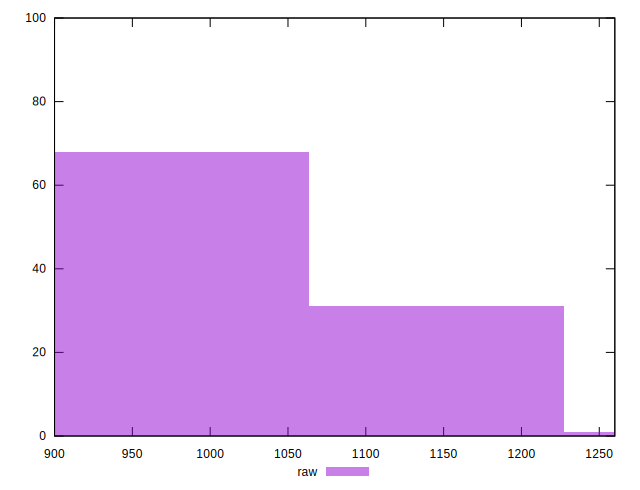
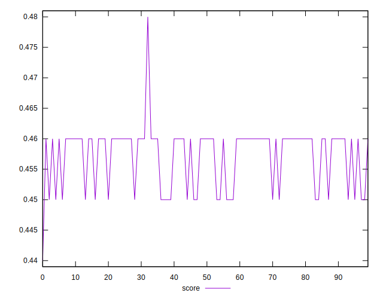
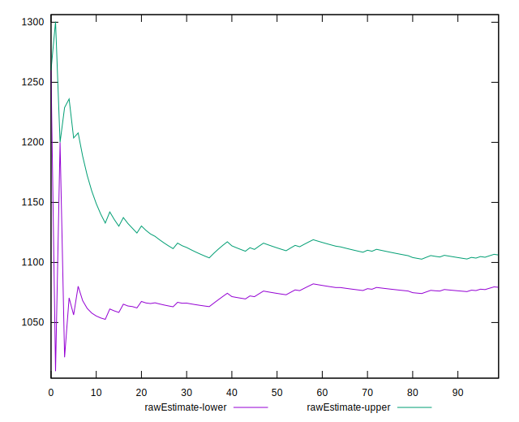

# //unused-javascript/samples/pages+cached+noadtech+nomedia+nocss

[→ Parent](../..)


## Raw


```yaml
p90min: 1050
p90max: 1200
p90range: 150
p90mean: 1092.7659574468084
p90median: 1050
p90stdev: 66.49914821593582
p90skewness: 0.981561735524675
p90eccentricity: 1
p90discretization: 18.8
outlandishness: 1.0020766221432793
confidence: 27.982328311922114
p90confidence: 26.8862506063448

```


## Score


```yaml
p90min: 0.45
p90max: 0.46
p90range: 0.010000000000000009
p90mean: 0.45723404255319205
p90median: 0.46
p90stdev: 0.004473148093963544
p90skewness: -0.9988681377248034
p90eccentricity: 1.0000000000000009
p90discretization: 47
outlandishness: 0.9998510990751595
confidence: 0.002080148844585377
p90confidence: 0.001808537159950823

```


## Raw Estimate


## Score Estimate


## P Score


```yaml
p90min: 0.4470588235294118
p90max: 0.4647058823529412
p90range: 0.017647058823529405
p90mean: 0.459674593241551
p90median: 0.4647058823529412
p90stdev: 0.007823429201874798
p90skewness: -0.9815617355243568
p90eccentricity: 0.9999999999999996
p90discretization: 18.8
outlandishness: 0.9994196006855077
confidence: 0.0032920386249320104
p90confidence: 0.0031630883066287975

```


## Score Difference


```yaml
p90min: 0
p90max: 0
p90range: 0
p90mean: 0
p90median: 0
p90stdev: 0
p90skewness: .nan
p90eccentricity: .nan
p90discretization: 94
outlandishness: .nan
confidence: 0
p90confidence: 0

```


## P Score Difference


```yaml
p90min: -0.002941176470588225
p90max: 0.004705882352941171
p90range: 0.007647058823529396
p90mean: 0.0024468085106382946
p90median: 0.004705882352941171
p90stdev: 0.003335630600983307
p90skewness: -0.9265146073140885
p90eccentricity: 1.0000000000000007
p90discretization: 13.428571428571429
outlandishness: 0.9155210549381544
confidence: 0.0013357880477447763
p90confidence: 0.0013486278046301082

```

