# //unused-javascript/samples/pages+cached+noadtech+nomedia

[→ Parent](../..)


## Raw


```yaml
p90min: 2020
p90max: 2290
p90range: 270
p90mean: 2226.7021276595747
p90median: 2250
p90stdev: 68.42278297113921
p90skewness: -1.5321029020671473
p90eccentricity: 0.9999999999999989
p90discretization: 7.230769230769231
outlandishness: 0.9872844812134729
confidence: 54.26340019433223
p90confidence: 27.66399479542118

```

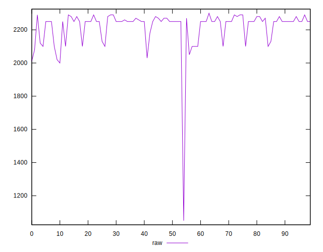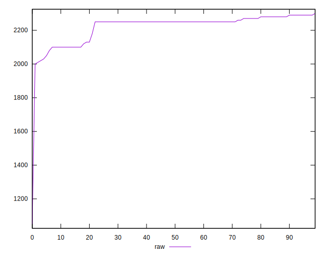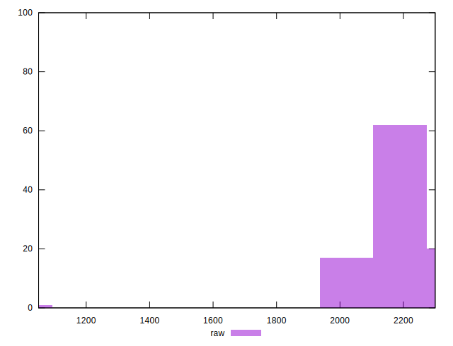
## Score


```yaml
p90min: 0.32
p90max: 0.35
p90range: 0.02999999999999997
p90mean: 0.32425531914893635
p90median: 0.32
p90stdev: 0.00868960759857963
p90skewness: 1.6885474715723208
p90eccentricity: 1.0000000000000013
p90discretization: 23.5
outlandishness: 1.0107901054690998
confidence: 0.006393209041802516
p90confidence: 0.0035132926335772635

```

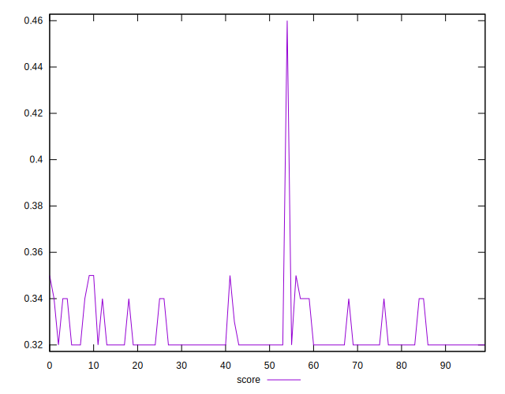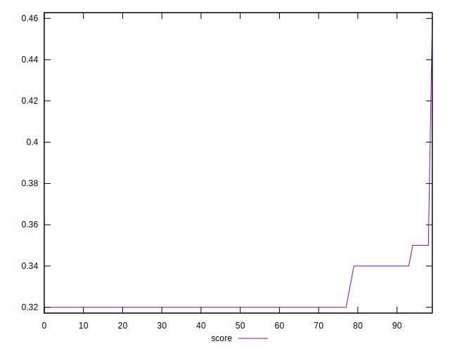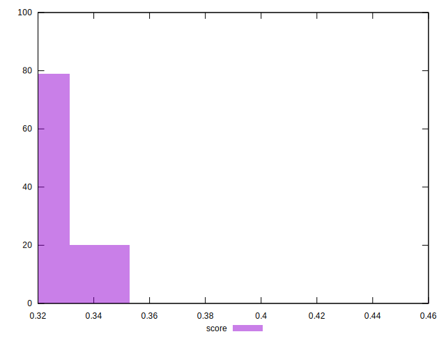
## Raw Estimate

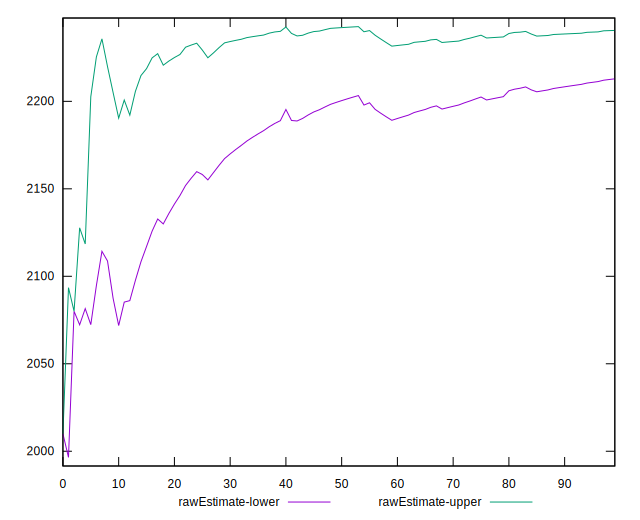
## Score Estimate

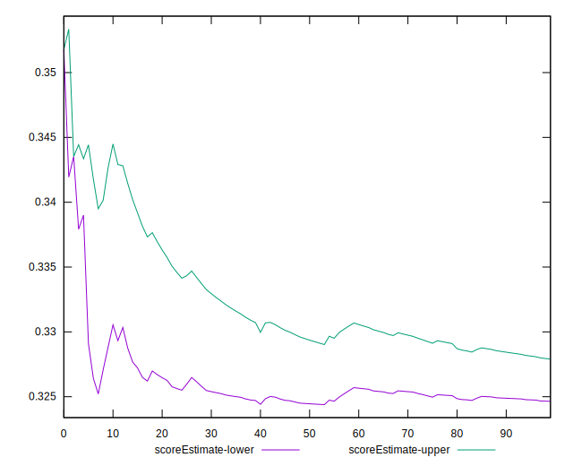
## P Score


```yaml
p90min: 0.31882352941176473
p90max: 0.35058823529411764
p90range: 0.03176470588235292
p90mean: 0.3262703379224031
p90median: 0.32352941176470584
p90stdev: 0.008049739173075209
p90skewness: 1.5321029020670514
p90eccentricity: 0.9999999999999987
p90discretization: 7.230769230769231
outlandishness: 1.010268274841144
confidence: 0.00638392943462732
p90confidence: 0.00325458762299073

```

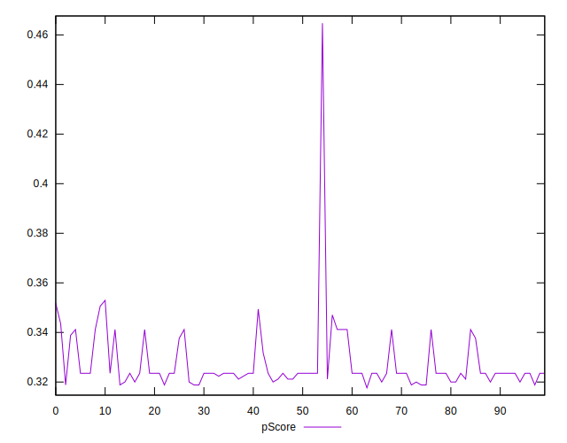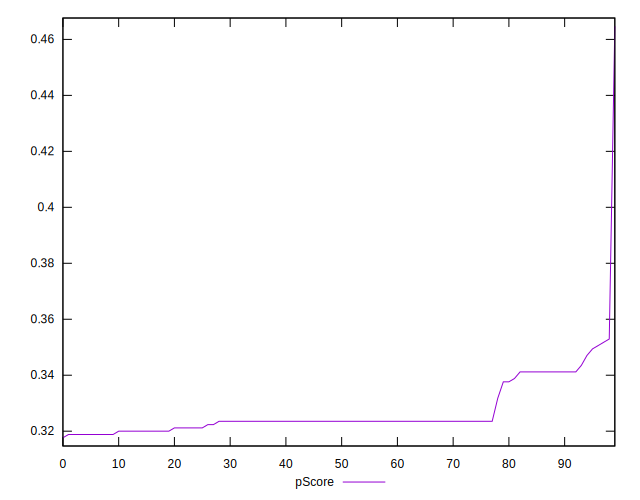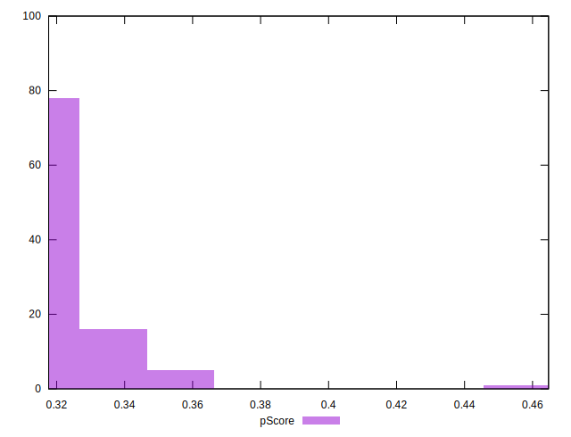
## Score Difference


```yaml
p90min: 0
p90max: 5.551115123125783e-17
p90range: 5.551115123125783e-17
p90mean: 1.1810883240693154e-18
p90median: 0
p90stdev: 8.010530753054493e-18
p90skewness: 6.634888026970373
p90eccentricity: 0.9999999999999988
p90discretization: 47
outlandishness: 5.522500000000001
confidence: 4.7424758240429744e-18
p90confidence: 3.2387352784895233e-18

```

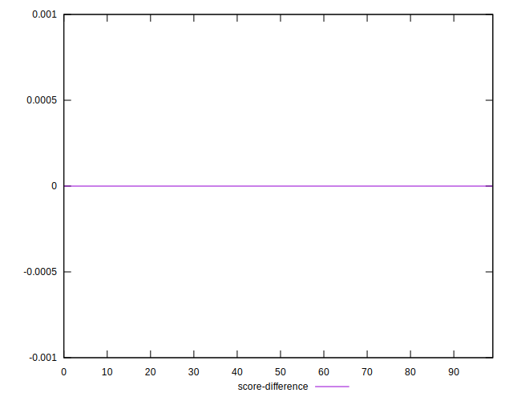
## P Score Difference


```yaml
p90min: -0.002352941176470613
p90max: 0.0035294117647058365
p90range: 0.00588235294117645
p90mean: 0.0020212765957446557
p90median: 0.0035294117647058365
p90stdev: 0.0017741891844728918
p90skewness: -0.6768658622333779
p90eccentricity: 1.0000000000000002
p90discretization: 8.545454545454545
outlandishness: 0.9223134507183994
confidence: 0.0007539074203919659
p90confidence: 0.0007173218953408121

```

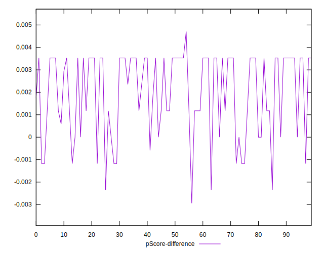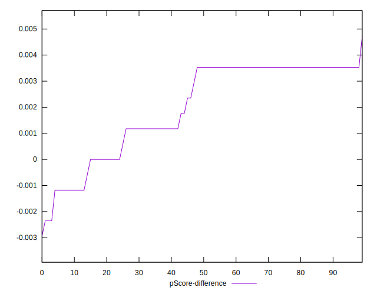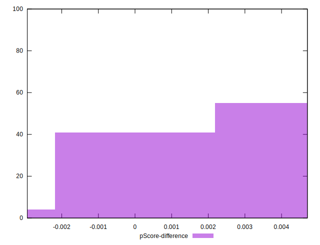