# //unused-javascript/samples/pages+cached+noadtech

[→ Parent](../..)


## Raw


```yaml
p90min: 1840
p90max: 2290
p90range: 450
p90mean: 2104.148936170213
p90median: 2100
p90stdev: 92.6375868579718
p90skewness: -0.9052746449926488
p90eccentricity: 0.9999999999999979
p90discretization: 5.875
outlandishness: 1.0017602157411365
confidence: 47.09789784503781
p90confidence: 37.45427486894634

```

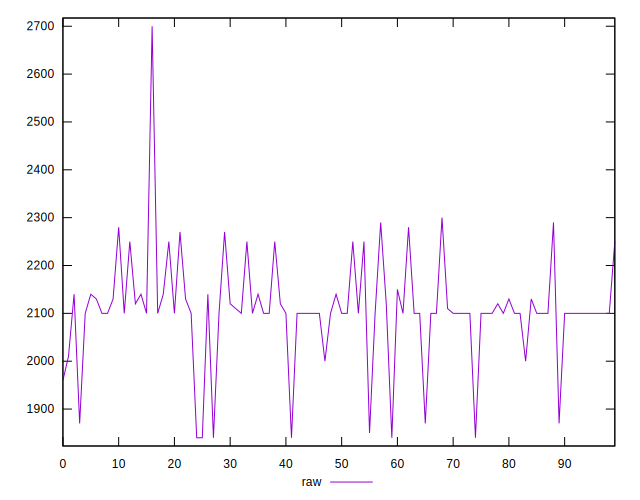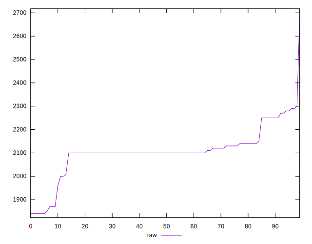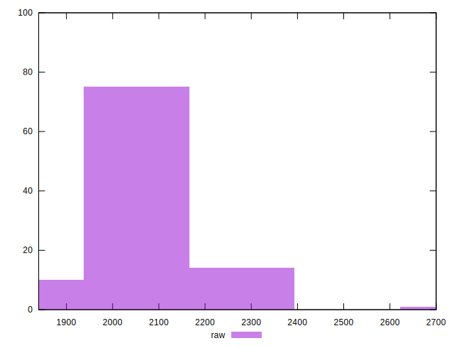
## Score


```yaml
p90min: 0.32
p90max: 0.37
p90range: 0.04999999999999999
p90mean: 0.3402127659574468
p90median: 0.34
p90stdev: 0.011202082196670796
p90skewness: 0.730075359689219
p90eccentricity: 1.0000000000000002
p90discretization: 18.8
outlandishness: 0.9987496093751536
confidence: 0.005571264423020014
p90confidence: 0.004529110482356364

```

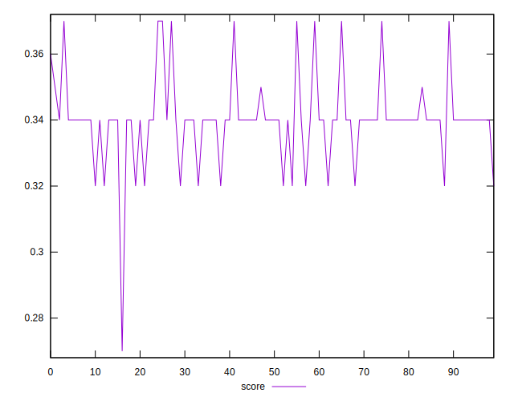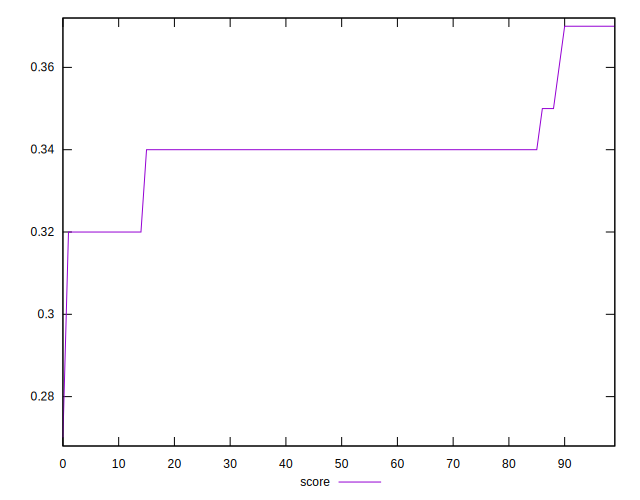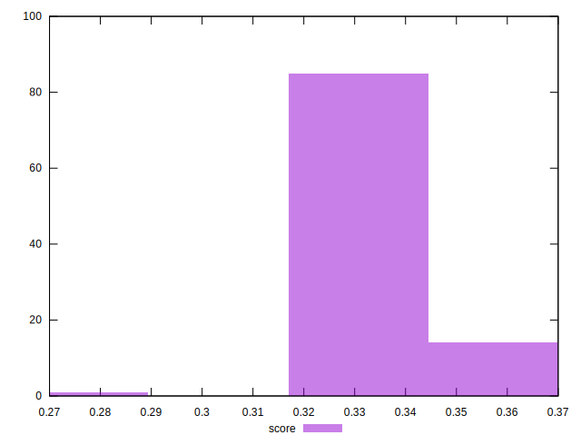
## Raw Estimate

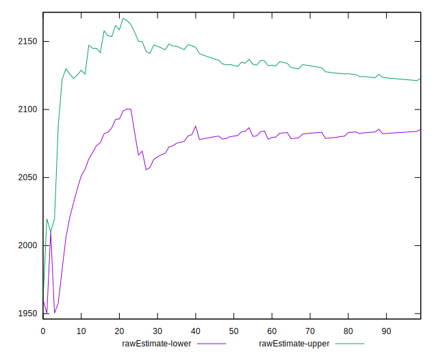
## Score Estimate

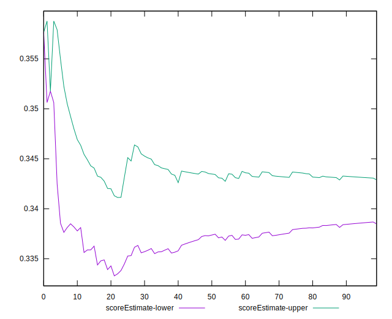
## P Score


```yaml
p90min: 0.31882352941176473
p90max: 0.37176470588235294
p90range: 0.052941176470588214
p90mean: 0.34068836045056283
p90median: 0.3411764705882353
p90stdev: 0.010898539630349629
p90skewness: 0.9052746449927285
p90eccentricity: 0.9999999999999979
p90discretization: 5.875
outlandishness: 0.9987219838468576
confidence: 0.0055409291582397425
p90confidence: 0.004406385278699572

```

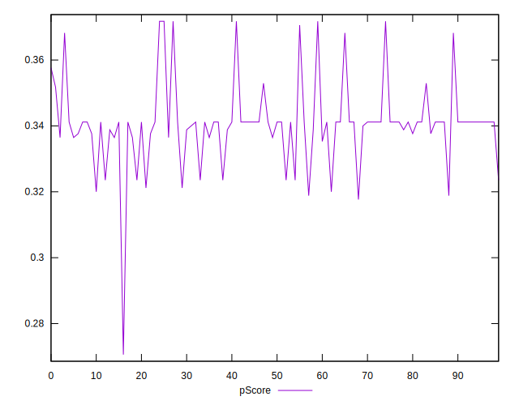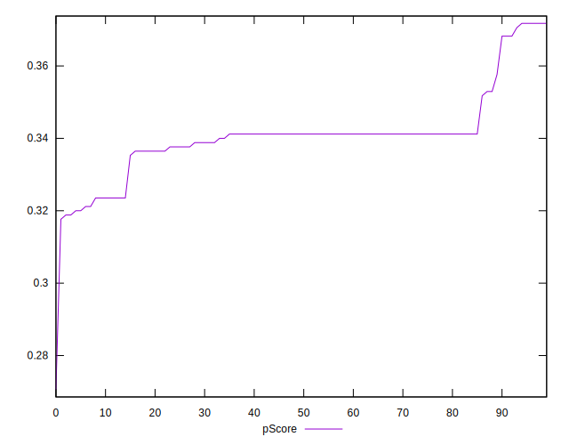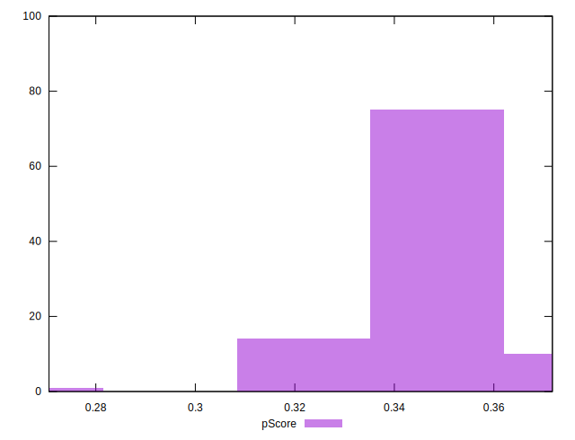
## Score Difference


```yaml
p90min: 0
p90max: 0
p90range: 0
p90mean: 0
p90median: 0
p90stdev: 0
p90skewness: .nan
p90eccentricity: .nan
p90discretization: 94
outlandishness: .inf
confidence: 3.7119730574155316e-18
p90confidence: 0

```

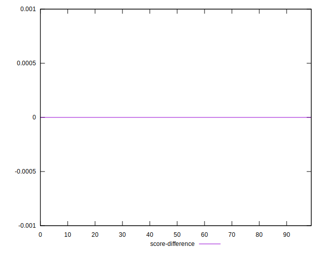
## P Score Difference


```yaml
p90min: -0.0035294117647059475
p90max: 0.0035294117647058365
p90range: 0.007058823529411784
p90mean: 0.0005131414267834608
p90median: 0.0011764705882352788
p90stdev: 0.0016576497559320647
p90skewness: -0.9279183241261538
p90eccentricity: 0.9999999999999992
p90discretization: 6.714285714285714
outlandishness: 0.8410232004758965
confidence: 0.0007284410906640674
p90confidence: 0.0006702038740528639

```

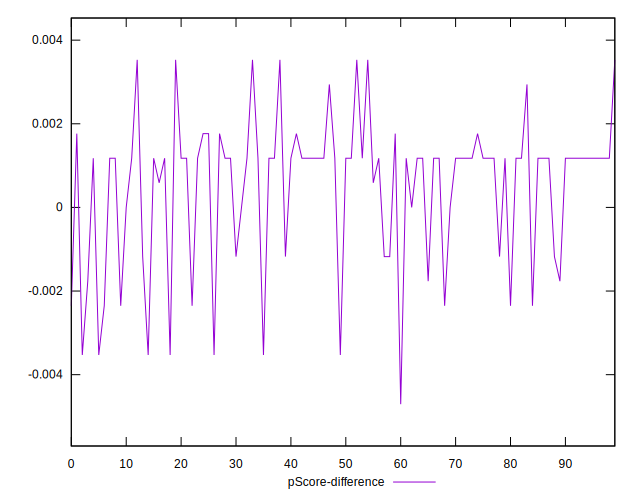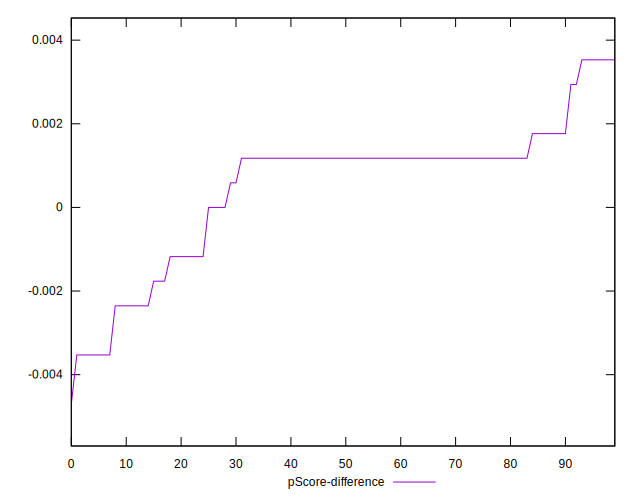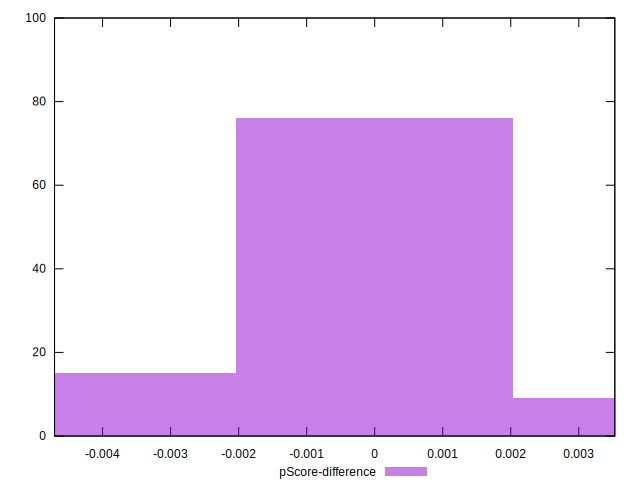