# //unused-javascript/samples/pages

[→ Parent](../..)


## Raw


```yaml
p90min: 5380
p90max: 6040
p90range: 660
p90mean: 5901.063829787234
p90median: 5895
p90stdev: 108.92578075456842
p90skewness: -2.136454790471964
p90eccentricity: 0.9999999999999994
p90discretization: 3.1333333333333333
outlandishness: 0.993177711462001
confidence: 99.78522164291769
p90confidence: 44.03974964234634

```

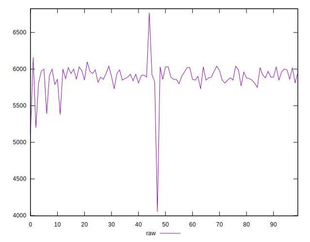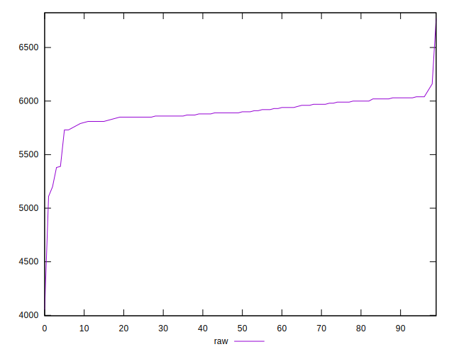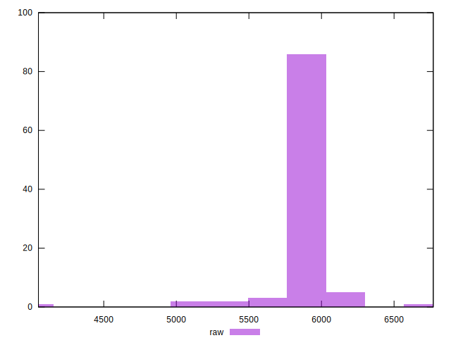
## Score


```yaml
p90min: 0
p90max: 0
p90range: 0
p90mean: 0
p90median: 0
p90stdev: 0
p90skewness: .nan
p90eccentricity: .nan
p90discretization: 94
outlandishness: .inf
confidence: 0.004290306991957331
p90confidence: 0

```

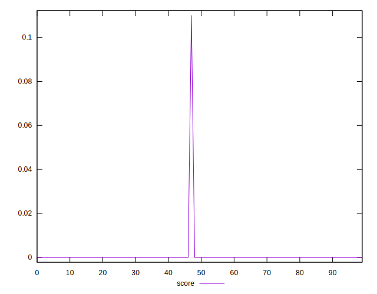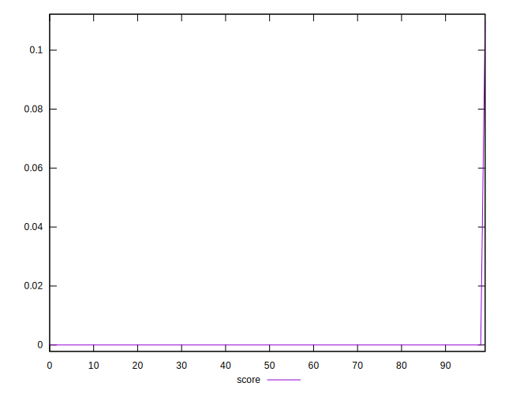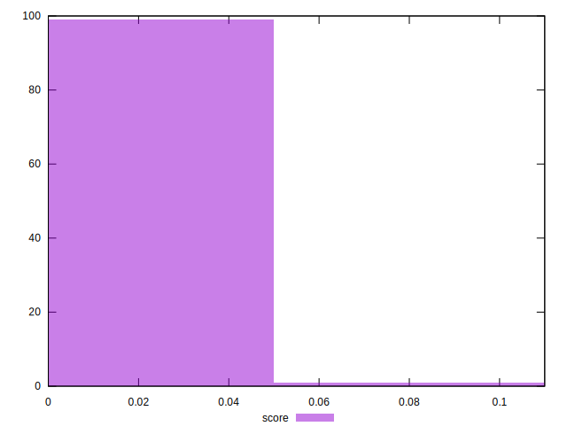
## Raw Estimate

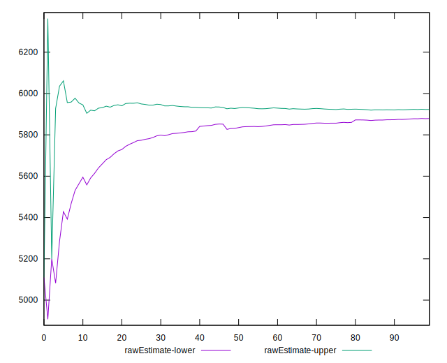
## Score Estimate


## P Score


```yaml
p90min: 0
p90max: 0
p90range: 0
p90mean: 0
p90median: 0
p90stdev: 0
p90skewness: .nan
p90eccentricity: .nan
p90discretization: 94
outlandishness: .inf
confidence: 0.004359135446373755
p90confidence: 0

```

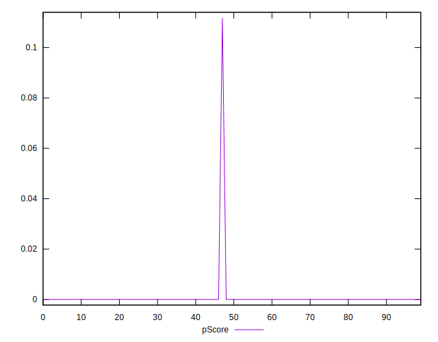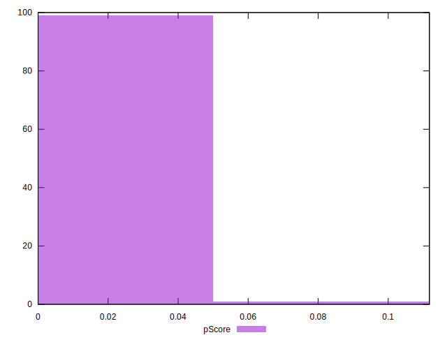
## Score Difference


```yaml
p90min: 0
p90max: 0
p90range: 0
p90mean: 0
p90median: 0
p90stdev: 0
p90skewness: .nan
p90eccentricity: .nan
p90discretization: 94
outlandishness: .nan
confidence: 0
p90confidence: 0

```


## P Score Difference


```yaml
p90min: 0
p90max: 0
p90range: 0
p90mean: 0
p90median: 0
p90stdev: 0
p90skewness: .nan
p90eccentricity: .nan
p90discretization: 94
outlandishness: .inf
confidence: 0.00006882845441642753
p90confidence: 0

```

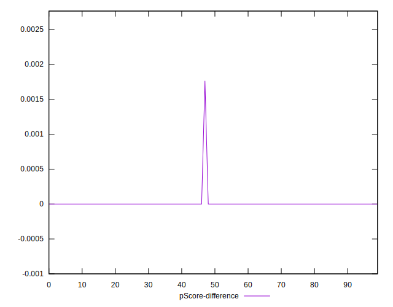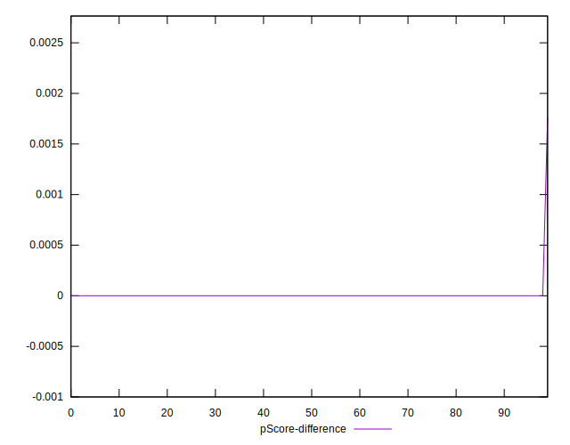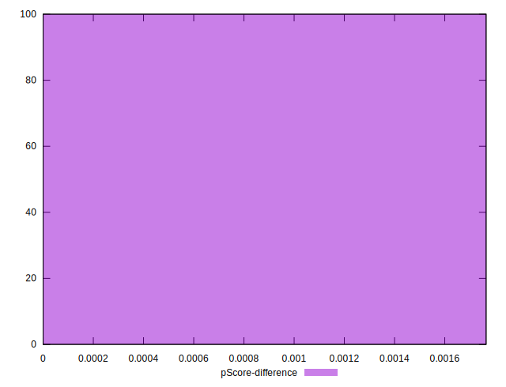