# //uses-http2/samples/pages+cached+noadtech+nomedia+nocss

[→ Parent](../..)


## Raw


```yaml
p90min: 0
p90max: 150
p90range: 150
p90mean: 9.574468085106384
p90median: 0
p90stdev: 36.66742114811514
p90skewness: 3.568591947091791
p90eccentricity: 0.9999999999999967
p90discretization: 47
outlandishness: 1.9880999999999998
confidence: 16.82717830396303
p90confidence: 14.824994011582877

```

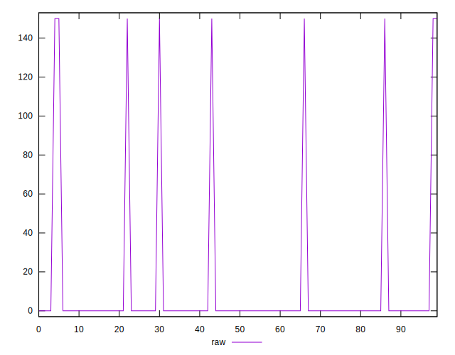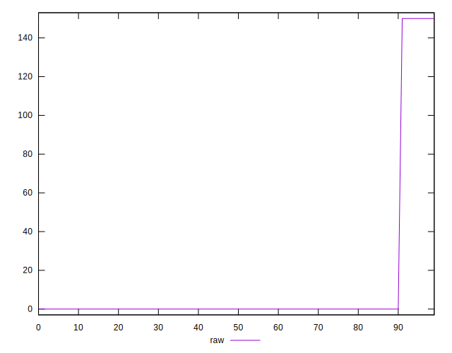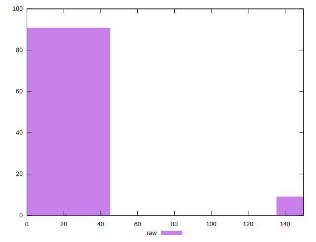
## Score


```yaml
p90min: 0.88
p90max: 1
p90range: 0.12
p90mean: 0.9923404255319149
p90median: 1
p90stdev: 0.02933393691849205
p90skewness: -3.568591947091769
p90eccentricity: 0.9999999999999983
p90discretization: 47
outlandishness: 0.9936806840615608
confidence: 0.013461742643170418
p90confidence: 0.011859995209266278

```

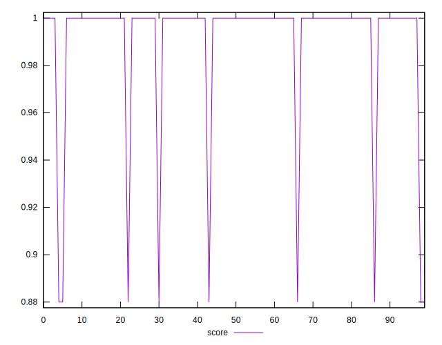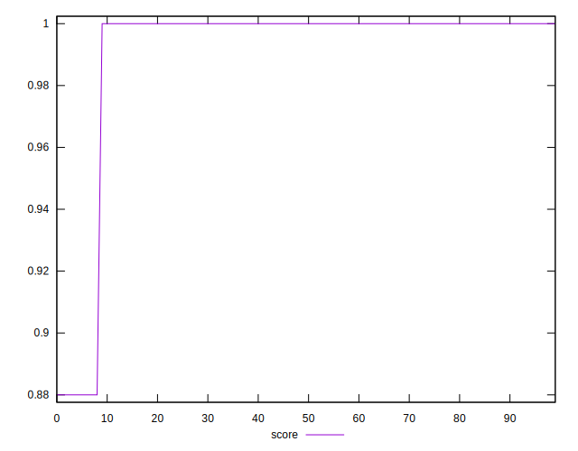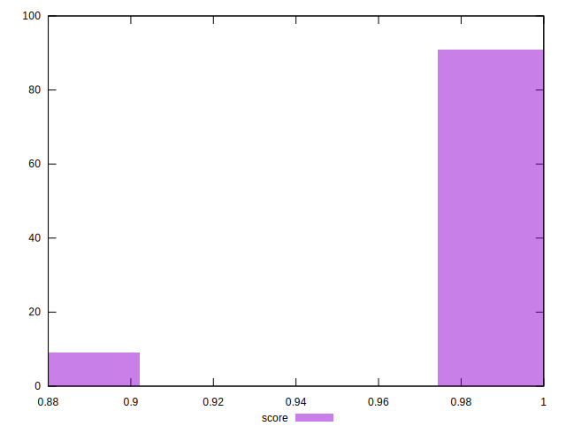
## Raw Estimate

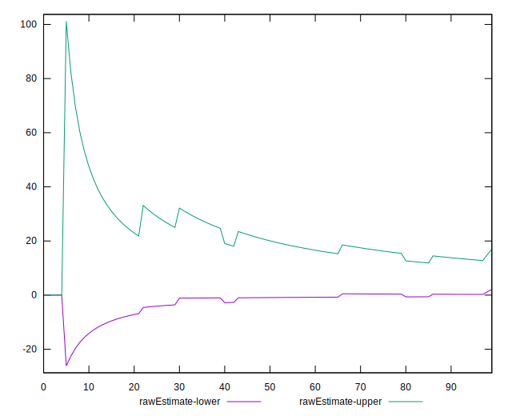
## Score Estimate

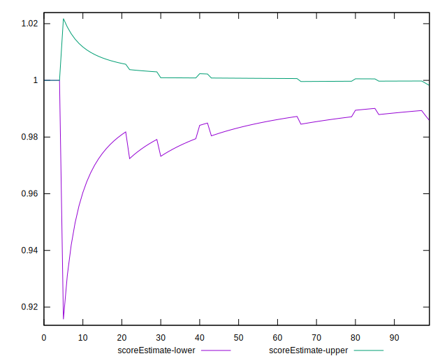
## P Score


```yaml
p90min: 0.875
p90max: 1
p90range: 0.125
p90mean: 0.9920212765957447
p90median: 1
p90stdev: 0.0305561842900959
p90skewness: -3.5685919470917997
p90eccentricity: 0.9999999999999972
p90discretization: 47
outlandishness: 0.9934156998181544
confidence: 0.014022648586635848
p90confidence: 0.012354161676319045

```

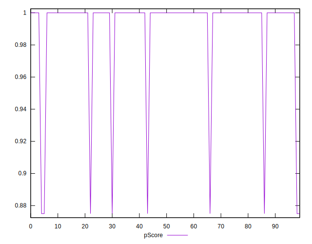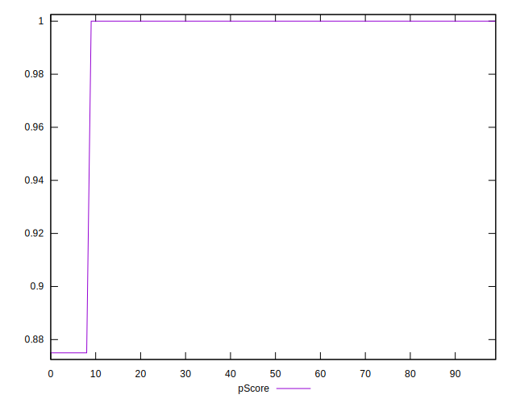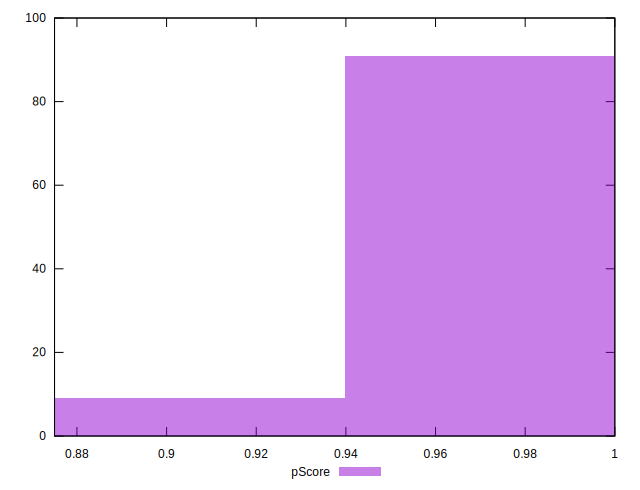
## Score Difference


```yaml
p90min: 0
p90max: 0
p90range: 0
p90mean: 0
p90median: 0
p90stdev: 0
p90skewness: .nan
p90eccentricity: .nan
p90discretization: 94
outlandishness: .nan
confidence: 0
p90confidence: 0

```


## P Score Difference


```yaml
p90min: -0.0050000000000000044
p90max: 0
p90range: 0.0050000000000000044
p90mean: -0.0003191489361702131
p90median: 0
p90stdev: 0.0012222473716038368
p90skewness: -3.5685919470918006
p90eccentricity: 0.9999999999999974
p90discretization: 47
outlandishness: 1.9880999999999998
confidence: 0.0005609059434654347
p90confidence: 0.0004941664670527621

```

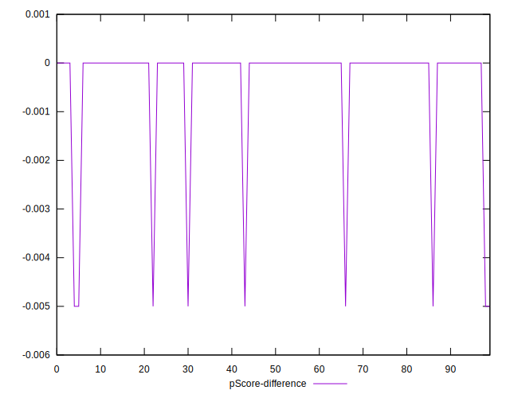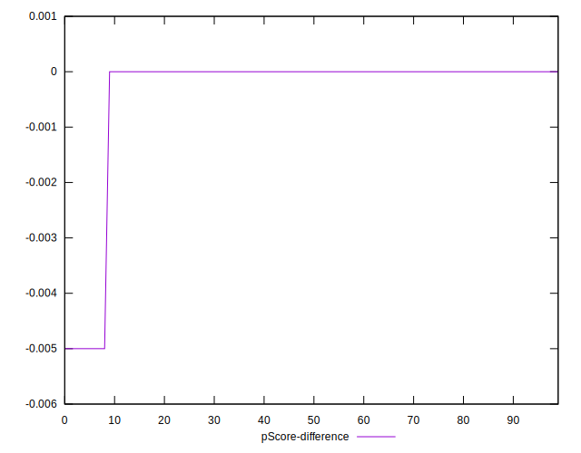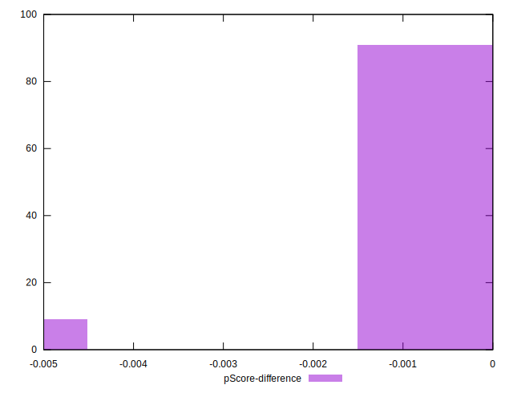