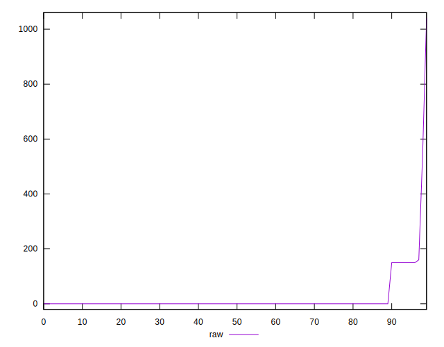

# //uses-http2/samples/pages+cached+noadtech+nomedia

[→ Parent](../..)


## Raw


```yaml
p90min: 0
p90max: 150
p90range: 150
p90mean: 11.170212765957446
p90median: 0
p90stdev: 39.37966812527576
p90skewness: 3.241763593892435
p90eccentricity: 0.9999999999999987
p90discretization: 47
outlandishness: 6.283377777777779
confidence: 47.8295469025138
p90confidence: 15.921581770834303

```


## Score


```yaml
p90min: 0.88
p90max: 1
p90range: 0.12
p90mean: 0.991063829787234
p90median: 1
p90stdev: 0.031503734500220607
p90skewness: -3.2417635938924265
p90eccentricity: 0.9999999999999978
p90discretization: 47
outlandishness: 0.9799937340957011
confidence: 0.02813020172001787
p90confidence: 0.012737265416667443

```


## Raw Estimate


## Score Estimate


## P Score


```yaml
p90min: 0.875
p90max: 1
p90range: 0.125
p90mean: 0.9906914893617021
p90median: 1
p90stdev: 0.03281639010439647
p90skewness: -3.241763593892435
p90eccentricity: 0.9999999999999987
p90discretization: 47
outlandishness: 0.9799042002260779
confidence: 0.028439564219338565
p90confidence: 0.013267984809028589

```


## Score Difference


```yaml
p90min: 0
p90max: 0
p90range: 0
p90mean: 0
p90median: 0
p90stdev: 0
p90skewness: .nan
p90eccentricity: .nan
p90discretization: 94
outlandishness: .inf
confidence: 2.165089820536967e-18
p90confidence: 0

```


## P Score Difference


```yaml
p90min: -0.0050000000000000044
p90max: 0
p90range: 0.0050000000000000044
p90mean: -0.00029203170629954066
p90median: 0
p90stdev: 0.001130098714237662
p90skewness: -3.680575907437392
p90eccentricity: 1.000000000000006
p90discretization: 23.5
outlandishness: 2.003909878117911
confidence: 0.0005363442047356208
p90confidence: 0.00045690987111953087

```

