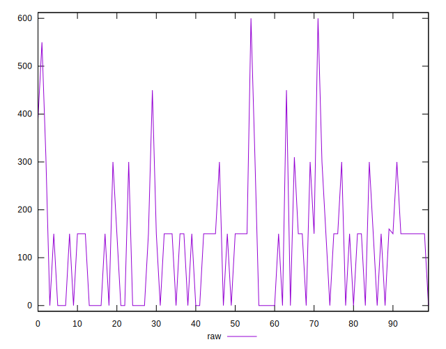

# //uses-http2/samples/pages+cached+noadtech

[→ Parent](../..)


## Raw


```yaml
p90min: 0
p90max: 450
p90range: 450
p90mean: 121.06382978723404
p90median: 150
p90stdev: 113.1414863158438
p90skewness: 0.7030988740338896
p90eccentricity: 0.9999999999999987
p90discretization: 13.428571428571429
outlandishness: 1.1762527052362701
confidence: 53.740639887214
p90confidence: 45.744200289367555

```


## Score


```yaml
p90min: 0.67
p90max: 1
p90range: 0.32999999999999996
p90mean: 0.9026595744680849
p90median: 0.88
p90stdev: 0.09053241492973897
p90skewness: -0.6186417005862144
p90eccentricity: 0.9999999999999983
p90discretization: 13.428571428571429
outlandishness: 0.9857388947447557
confidence: 0.04089813222150625
p90confidence: 0.036603133440064904

```


## Raw Estimate


## Score Estimate


## P Score


```yaml
p90min: 0.6666666666666666
p90max: 1
p90range: 0.33333333333333337
p90mean: 0.9003546099290781
p90median: 0.875
p90stdev: 0.09109737438480042
p90skewness: -0.5383087669469457
p90eccentricity: 1.0000000000000033
p90discretization: 13.428571428571429
outlandishness: 0.9861791098451049
confidence: 0.04093720687150818
p90confidence: 0.03683155202735091

```


## Score Difference


```yaml
p90min: 0
p90max: 0
p90range: 0
p90mean: 0
p90median: 0
p90stdev: 0
p90skewness: .nan
p90eccentricity: .nan
p90discretization: 94
outlandishness: .inf
confidence: 4.330179641073934e-18
p90confidence: 0

```


## P Score Difference


```yaml
p90min: -0.0050000000000000044
p90max: 0.0033333333333334103
p90range: 0.008333333333333415
p90mean: -0.0022044917257683224
p90median: 0
p90stdev: 0.0025784921562239244
p90skewness: -0.012648951847283634
p90eccentricity: 0.9999999999999996
p90discretization: 15.666666666666666
outlandishness: 0.8978705632901831
confidence: 0.0010945683478194483
p90confidence: 0.0010425093878438214

```

