# //uses-http2/samples/pages+cached

[→ Parent](../..)


## Raw


```yaml
p90min: 0
p90max: 300
p90range: 300
p90mean: 91.27659574468085
p90median: 150
p90stdev: 79.81673213579079
p90skewness: -0.00693860535084113
p90eccentricity: 0.9999999999999989
p90discretization: 18.8
outlandishness: 1.0855308376937747
confidence: 34.30998549154432
p90confidence: 32.270678953871254

```

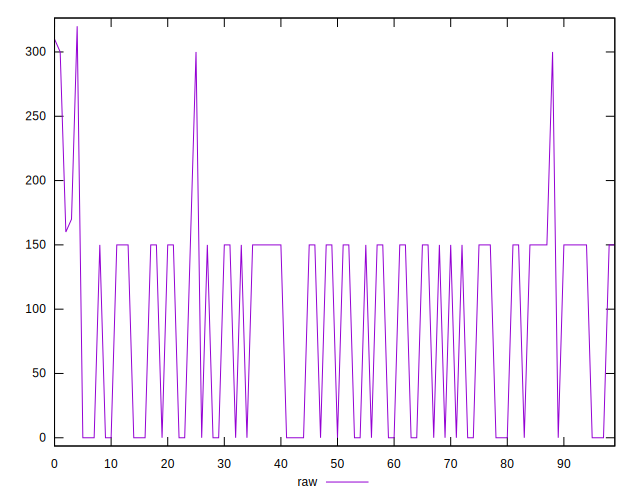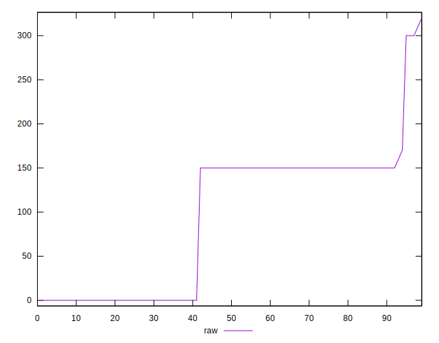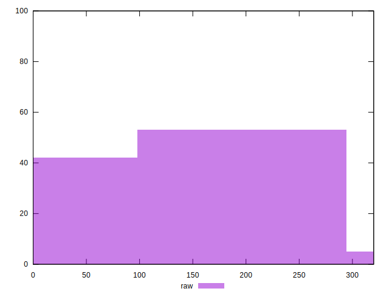
## Score


```yaml
p90min: 0.75
p90max: 1
p90range: 0.25
p90mean: 0.926702127659574
p90median: 0.88
p90stdev: 0.06448467239737263
p90skewness: -0.05357673020179086
p90eccentricity: 0.9999999999999983
p90discretization: 18.8
outlandishness: 0.992886075670518
confidence: 0.02790713424567914
p90confidence: 0.02607177849427446

```

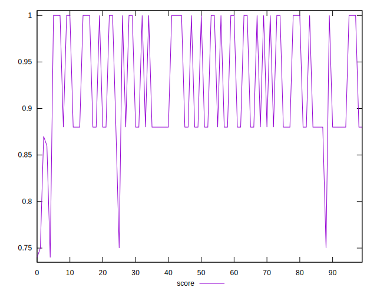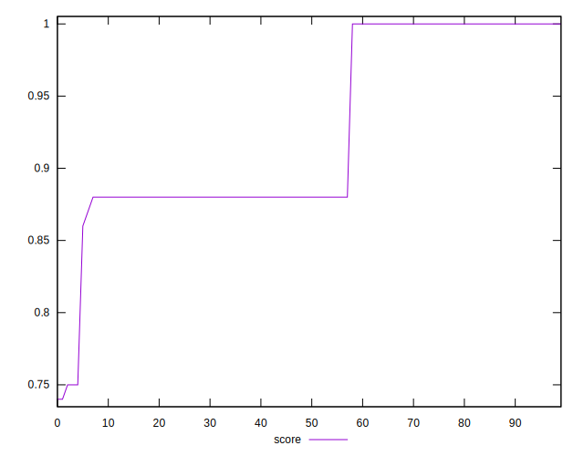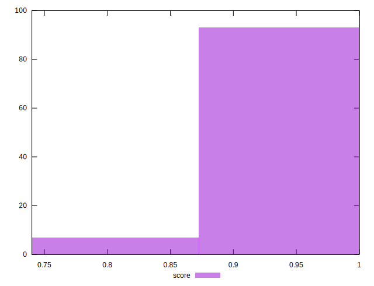
## Raw Estimate

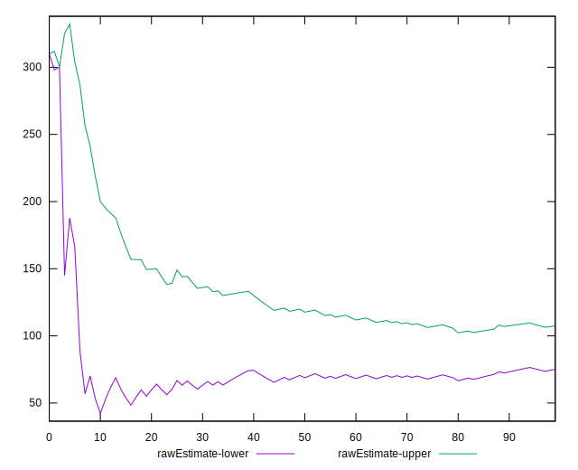
## Score Estimate

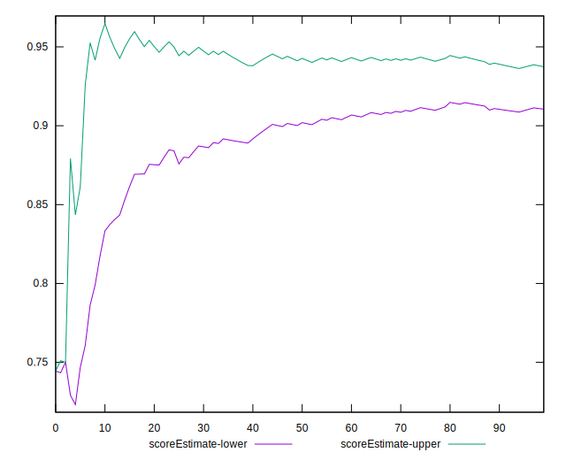
## P Score


```yaml
p90min: 0.75
p90max: 1
p90range: 0.25
p90mean: 0.9239361702127659
p90median: 0.875
p90stdev: 0.06651394344649231
p90skewness: 0.006938605350845793
p90eccentricity: 1
p90discretization: 18.8
outlandishness: 0.9932947169276162
confidence: 0.02850986451833767
p90confidence: 0.026892232461559373

```

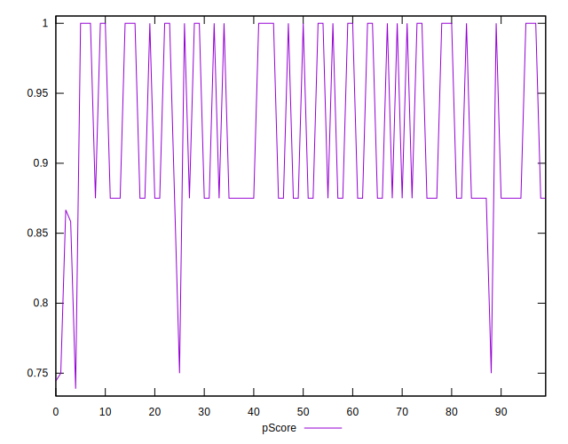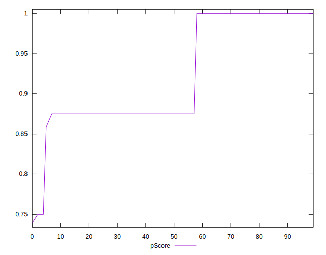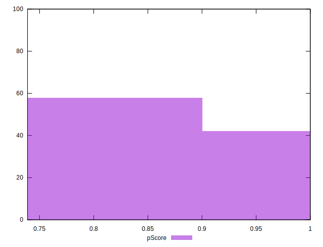
## Score Difference


```yaml
p90min: 0
p90max: 0
p90range: 0
p90mean: 0
p90median: 0
p90stdev: 0
p90skewness: .nan
p90eccentricity: .nan
p90discretization: 94
outlandishness: .nan
confidence: 0
p90confidence: 0

```


## P Score Difference


```yaml
p90min: -0.0050000000000000044
p90max: 0
p90range: 0.0050000000000000044
p90mean: -0.002618203309692672
p90median: -0.0050000000000000044
p90stdev: 0.0024641137786465287
p90skewness: 0.09037562668902488
p90eccentricity: 0.9999999999999991
p90discretization: 18.8
outlandishness: 0.9610195129656711
confidence: 0.0010002337917931392
p90confidence: 0.000996265100420662

```

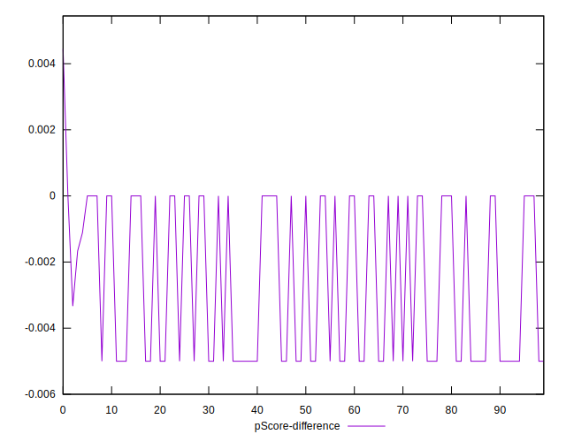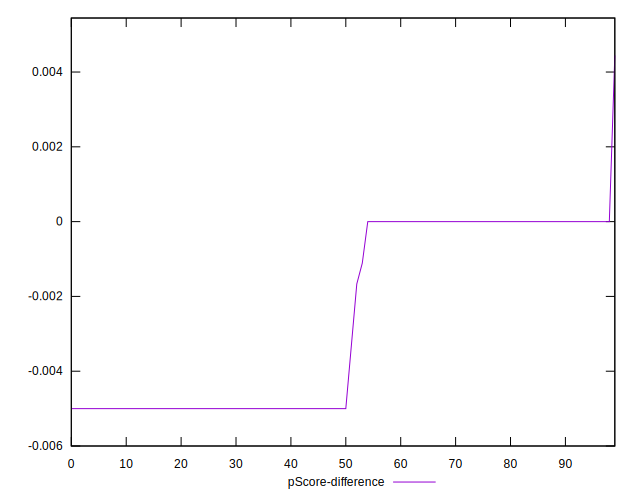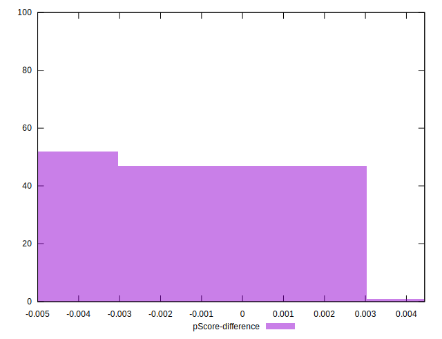