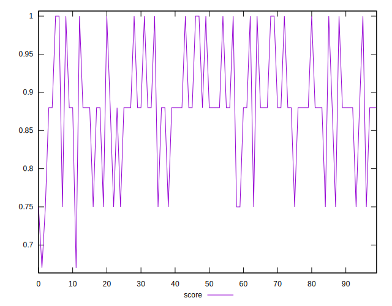
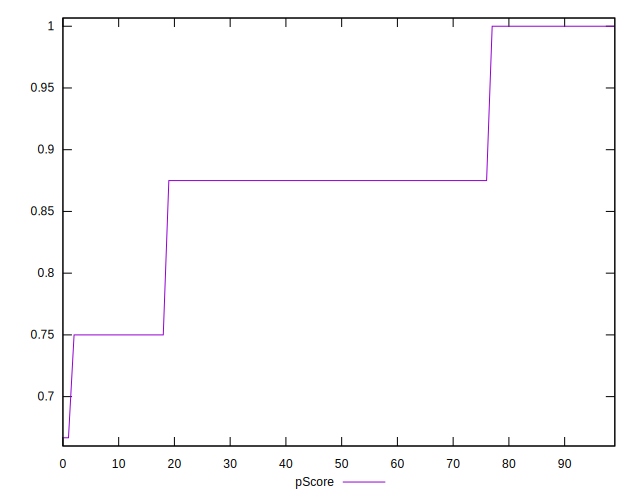

# //uses-http2/samples/pages

[→ Parent](../..)


## Raw


```yaml
p90min: 0
p90max: 300
p90range: 300
p90mean: 143.61702127659575
p90median: 150
p90stdev: 92.60820082051222
p90skewness: 0.026276462101114072
p90eccentricity: 0.9999999999999987
p90discretization: 31.333333333333332
outlandishness: 1.047665975308642
confidence: 40.72010910305144
p90confidence: 37.442393808982985

```


## Score


```yaml
p90min: 0.75
p90max: 1
p90range: 0.25
p90mean: 0.8834042553191487
p90median: 0.88
p90stdev: 0.07699893880851175
p90skewness: -0.14651714114962525
p90eccentricity: 1.0000000000000016
p90discretization: 31.333333333333332
outlandishness: 0.9952417046790829
confidence: 0.032949110713607094
p90confidence: 0.03113141778156115

```


## Raw Estimate


## Score Estimate


## P Score


```yaml
p90min: 0.75
p90max: 1
p90range: 0.25
p90mean: 0.8803191489361702
p90median: 0.875
p90stdev: 0.07717350068376014
p90skewness: -0.02627646210111581
p90eccentricity: 0.9999999999999994
p90discretization: 31.333333333333332
outlandishness: 0.9954935075234596
confidence: 0.03304604933984953
p90confidence: 0.031201994840819137

```


## Score Difference


```yaml
p90min: 0
p90max: 0
p90range: 0
p90mean: 0
p90median: 0
p90stdev: 0
p90skewness: .nan
p90eccentricity: .nan
p90discretization: 94
outlandishness: .nan
confidence: 0
p90confidence: 0

```


## P Score Difference


```yaml
p90min: -0.0050000000000000044
p90max: 0
p90range: 0.0050000000000000044
p90mean: -0.0029964539007092243
p90median: -0.0050000000000000044
p90stdev: 0.0024259699533955366
p90skewness: 0.41207180672329063
p90eccentricity: 0.9999999999999994
p90discretization: 31.333333333333332
outlandishness: 0.9802171632645913
confidence: 0.0009538491391428274
p90confidence: 0.0009808431819104783

```

