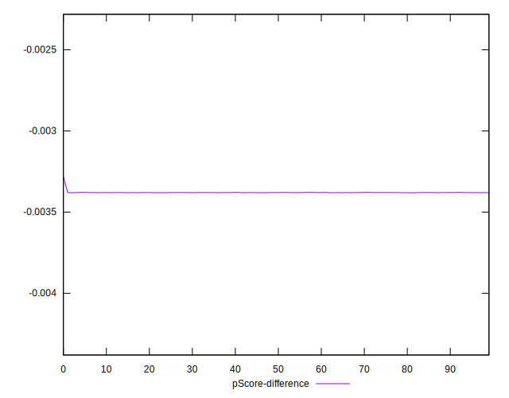
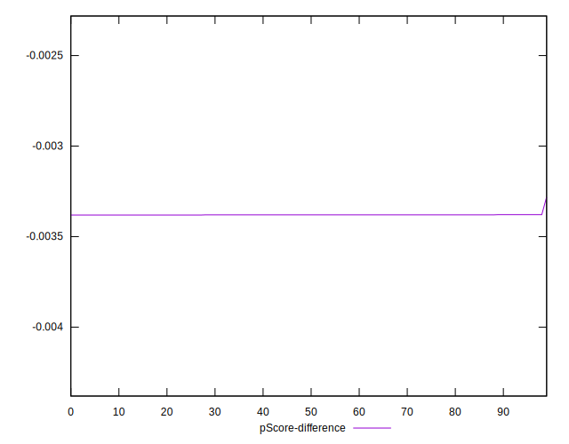

# //uses-long-cache-ttl/samples/pages+cached+noadtech+nomedia+nocss

[→ Parent](../..)


## Raw


```yaml
p90min: 238691.71666666665
p90max: 238693.48333333334
p90range: 1.76666666669189
p90mean: 238692.75975177318
p90median: 238692.6
p90stdev: 0.49840412917241095
p90skewness: 0.012306032465584291
p90eccentricity: 1.0000000000000004
p90discretization: 31.333333333333332
outlandishness: 0.9999933645484108
confidence: 3.098760464661865
p90confidence: 0.20150962350154228

```


## Score


```yaml
p90min: 0.31
p90max: 0.31
p90range: 0
p90mean: 0.3099999999999995
p90median: 0.31
p90stdev: 4.996003610813204e-16
p90skewness: 1
p90eccentricity: 1
p90discretization: 94
outlandishness: 0.9999999999999996
confidence: 2.175997143072433e-16
p90confidence: 2.0199327166470086e-16

```


## Raw Estimate


## Score Estimate


## P Score


```yaml
p90min: 0.3066193348092728
p90max: 0.30662152605636617
p90range: 0.0000021912470933860284
p90mean: 0.3066202322862589
p90median: 0.30662043042992815
p90stdev: 6.181842661705602e-7
p90skewness: -0.012297898014537793
p90eccentricity: 1.0000000000000022
p90discretization: 31.333333333333332
outlandishness: 1.0000064084009779
confidence: 0.00000384438388054136
p90confidence: 2.4993789465077796e-7

```


## Score Difference


```yaml
p90min: 0
p90max: 0
p90range: 0
p90mean: 0
p90median: 0
p90stdev: 0
p90skewness: .nan
p90eccentricity: .nan
p90discretization: 94
outlandishness: .nan
confidence: 0
p90confidence: 0

```


## P Score Difference


```yaml
p90min: -0.0033806651907272167
p90max: -0.0033784739436338307
p90range: 0.0000021912470933860284
p90mean: -0.003379767713740786
p90median: -0.0033795695700718498
p90stdev: 6.181842661705605e-7
p90skewness: -0.01229789899739488
p90eccentricity: 0.9999999999999988
p90discretization: 31.333333333333332
outlandishness: 0.9994187006864834
confidence: 0.00000384438388054136
p90confidence: 2.4993789465077807e-7

```

