# //uses-long-cache-ttl/samples/pages+cached+noadtech+nomedia

[→ Parent](../..)


## Raw


```yaml
p90min: 571111.7166666667
p90max: 571113.4833333334
p90range: 1.7666666667209938
p90mean: 571112.618794327
p90median: 571112.6
p90stdev: 0.5463300838823465
p90skewness: -0.013312598138637527
p90eccentricity: 0.9999999999999978
p90discretization: 31.333333333333332
outlandishness: 0.9999821555162342
confidence: 14.081015349900804
p90confidence: 0.22088655182993958

```

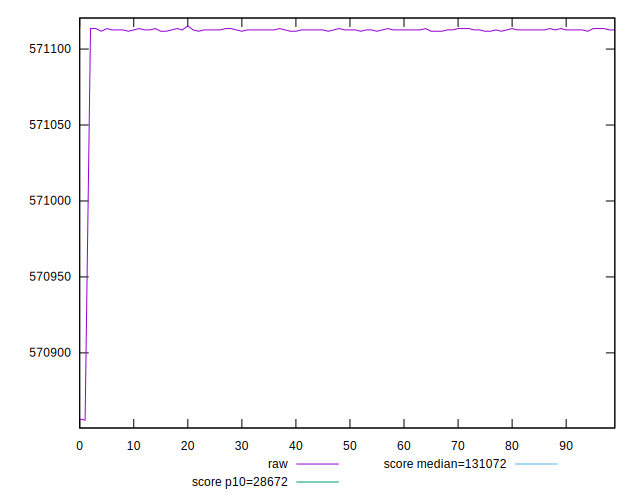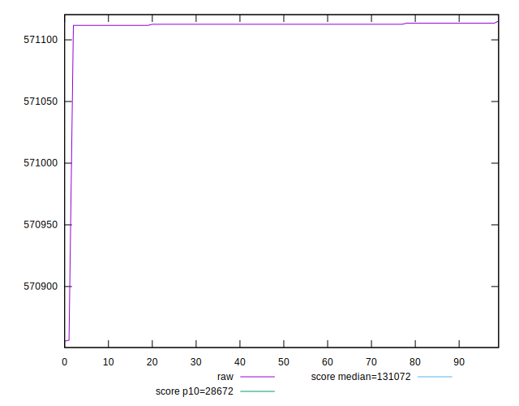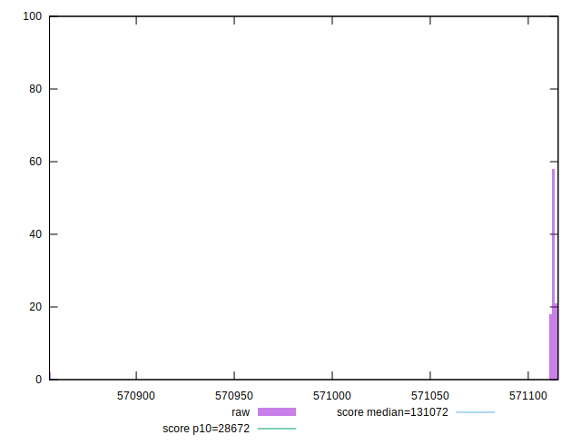
## Score


```yaml
p90min: 0.11
p90max: 0.11
p90range: 0
p90mean: 0.10999999999999997
p90median: 0.11
p90stdev: 2.7755575615628914e-17
p90skewness: 1
p90eccentricity: 1
p90discretization: 94
outlandishness: 0.9999999999999996
confidence: 2.1759971430724333e-17
p90confidence: 1.1221848425816715e-17

```

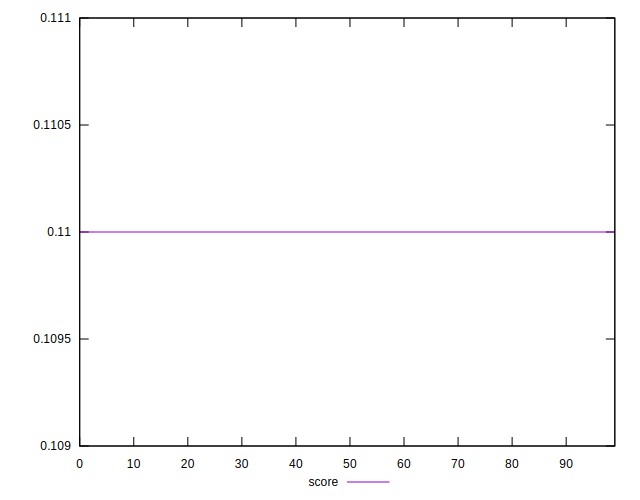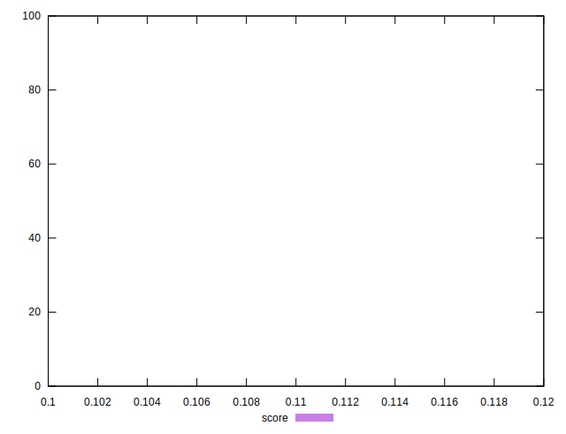
## Raw Estimate

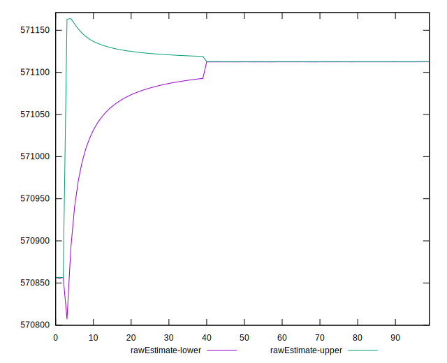
## Score Estimate

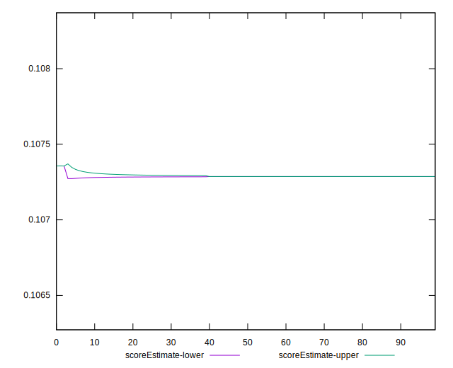
## P Score


```yaml
p90min: 0.10728634683261751
p90max: 0.1072868285729982
p90range: 4.817403806978149e-7
p90mean: 0.10728658257767504
p90median: 0.1072865877024266
p90stdev: 1.4897504620241242e-7
p90skewness: 0.013317326001675135
p90eccentricity: 0.9999999999999978
p90discretization: 31.333333333333332
outlandishness: 1.0000259145986827
confidence: 0.000003841421159227913
p90confidence: 6.023205610519396e-8

```

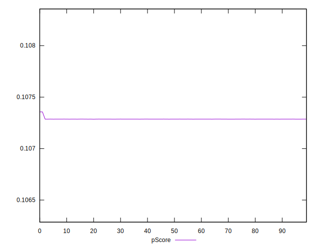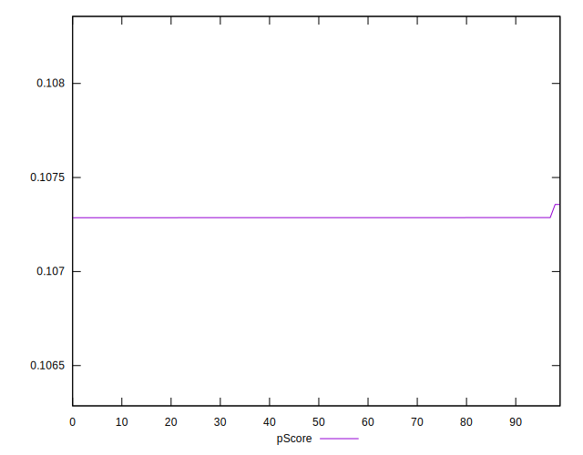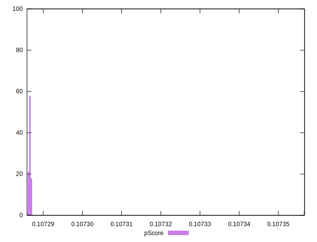
## Score Difference


```yaml
p90min: 0
p90max: 0
p90range: 0
p90mean: 0
p90median: 0
p90stdev: 0
p90skewness: .nan
p90eccentricity: .nan
p90discretization: 94
outlandishness: .nan
confidence: 0
p90confidence: 0

```


## P Score Difference


```yaml
p90min: -0.002713653167382493
p90max: -0.0027131714270017954
p90range: 4.817403806978149e-7
p90mean: -0.0027134174223250444
p90median: -0.002713412297573395
p90stdev: 1.4897504620241237e-7
p90skewness: 0.013317327652266977
p90eccentricity: 1.0000000000000002
p90discretization: 31.333333333333332
outlandishness: 0.998975624427156
confidence: 0.000003841421159227913
p90confidence: 6.023205610519393e-8

```

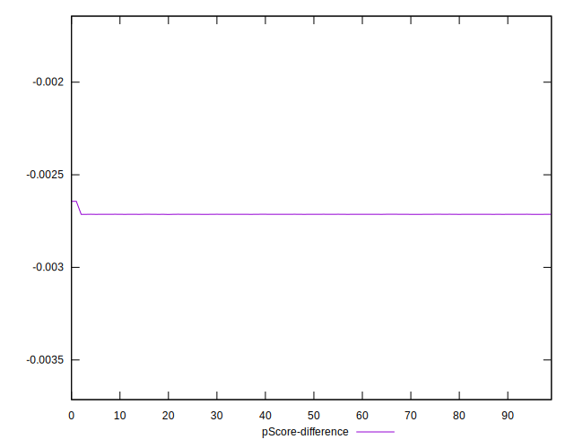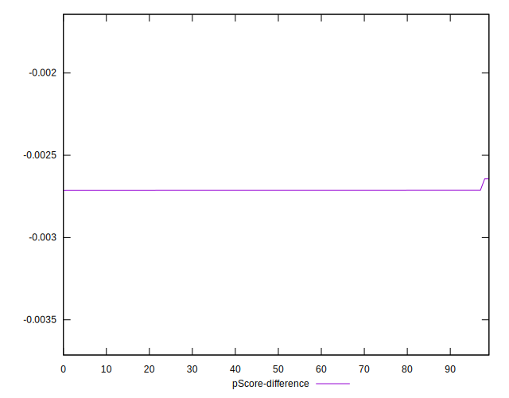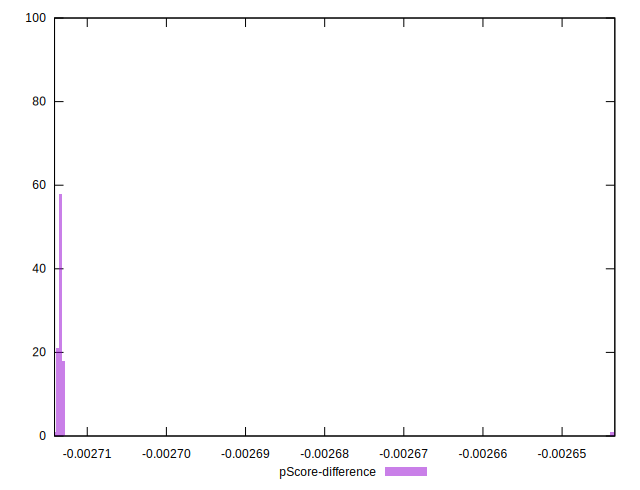