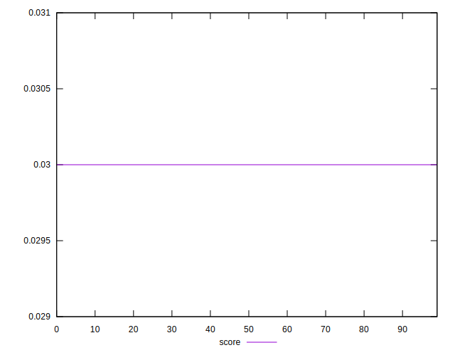

# //uses-long-cache-ttl/samples/pages+cached

[→ Parent](../..)


## Raw


```yaml
p90min: 1310602.9148797335
p90max: 1310606.480987741
p90range: 3.5661080074496567
p90mean: 1310605.2470947567
p90median: 1310605.4979337372
p90stdev: 0.8177959617975947
p90skewness: -1.0374026235783382
p90eccentricity: 1.0000000000000007
p90discretization: 4.2727272727272725
outlandishness: 0.9999957813952255
confidence: 7.758126117171729
p90confidence: 0.33064283924884685

```


## Score


```yaml
p90min: 0.03
p90max: 0.03
p90range: 0
p90mean: 0.02999999999999996
p90median: 0.03
p90stdev: 3.8163916471489756e-17
p90skewness: 1
p90eccentricity: 1
p90discretization: 94
outlandishness: 0.9999999999999993
confidence: 1.903997500188379e-17
p90confidence: 1.5430041585497983e-17

```


## Raw Estimate


## Score Estimate


## P Score


```yaml
p90min: 0.02609761184787701
p90max: 0.026097750856180102
p90range: 1.3900830309054868e-7
p90mean: 0.026097659945427724
p90median: 0.026097650167611952
p90stdev: 3.1878002599315035e-8
p90skewness: 1.0374068440350162
p90eccentricity: 1.0000000000000009
p90discretization: 4.7
outlandishness: 1.000008259415492
confidence: 3.024580493539302e-7
p90confidence: 1.2888585639199281e-8

```


## Score Difference


```yaml
p90min: 0
p90max: 0
p90range: 0
p90mean: 0
p90median: 0
p90stdev: 0
p90skewness: .nan
p90eccentricity: .nan
p90discretization: 94
outlandishness: .nan
confidence: 0
p90confidence: 0

```


## P Score Difference


```yaml
p90min: -0.0039023881521229875
p90max: -0.003902249143819897
p90range: 1.3900830309054868e-7
p90mean: -0.0039023400545722727
p90median: -0.0039023498323880468
p90stdev: 3.187800259931506e-8
p90skewness: 1.0374068431371246
p90eccentricity: 0.9999999999999983
p90discretization: 4.7
outlandishness: 0.999944764425391
confidence: 3.024580493539302e-7
p90confidence: 1.2888585639199291e-8

```

