# //uses-long-cache-ttl/samples/pages

[→ Parent](../..)


## Raw


```yaml
p90min: 1310377.8282216012
p90max: 1395745.3737895715
p90range: 85367.54556797026
p90mean: 1379822.6272899935
p90median: 1394184.6728220049
p90stdev: 31736.113367742917
p90skewness: -1.6945854537829808
p90eccentricity: 1.0000000000000007
p90discretization: 1
outlandishness: 1.0009515243708502
confidence: 14807.870746948698
p90confidence: 12831.218446675219

```

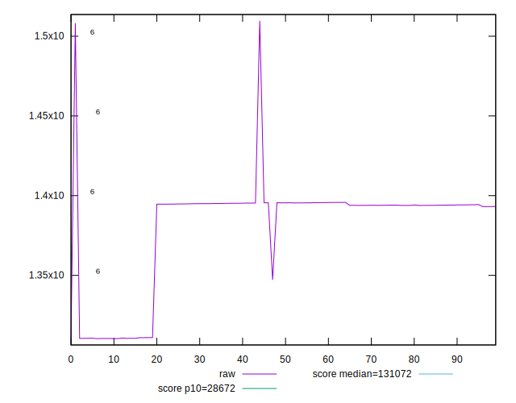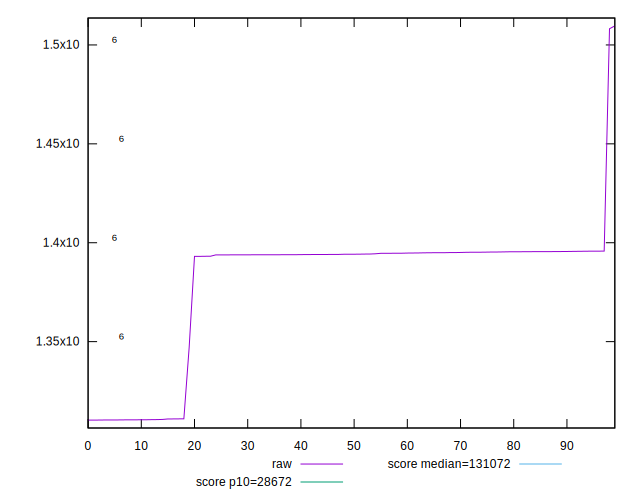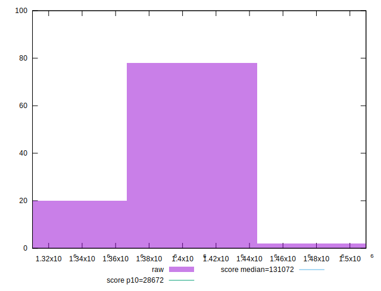
## Score


```yaml
p90min: 0.02
p90max: 0.03
p90range: 0.009999999999999998
p90mean: 0.021702127659574483
p90median: 0.02
p90stdev: 0.0037581961133309988
p90skewness: 1.755029402924103
p90eccentricity: 0.9999999999999961
p90discretization: 47
outlandishness: 1.0183184256055366
confidence: 0.0015377912894860943
p90confidence: 0.0015194751397822287

```

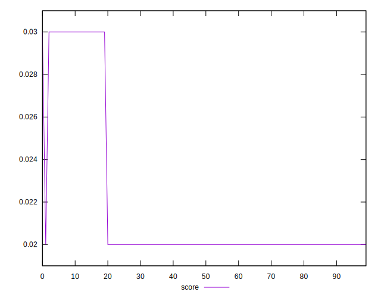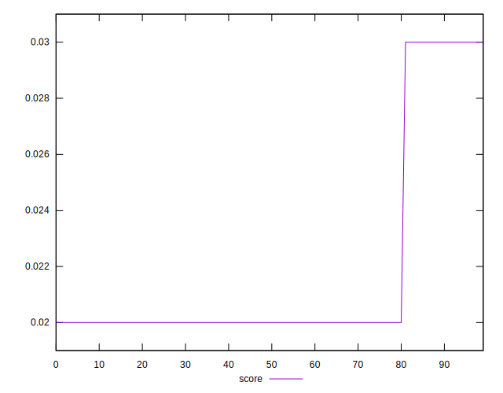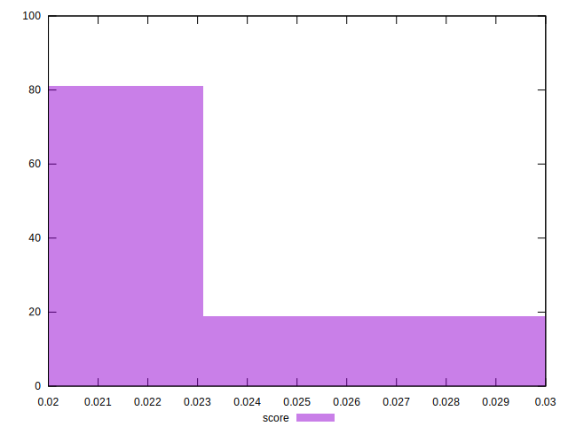
## Raw Estimate

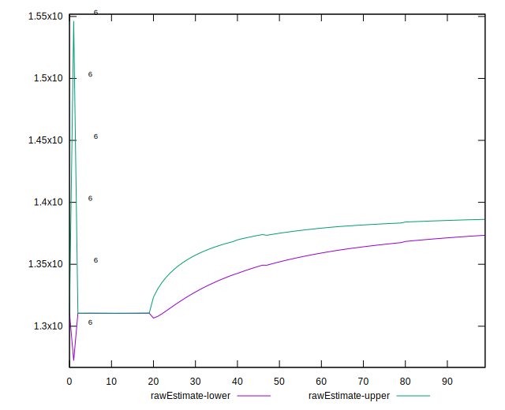
## Score Estimate

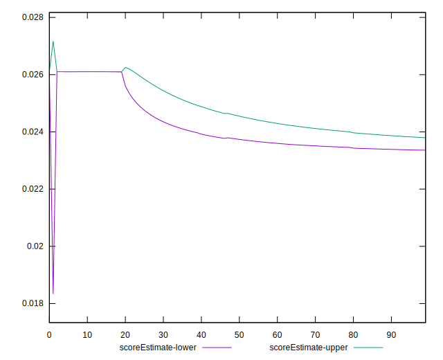
## P Score


```yaml
p90min: 0.023043726141145304
p90max: 0.026106526842079425
p90range: 0.0030628007009341207
p90mean: 0.02361160693688332
p90median: 0.023095263343104938
p90stdev: 0.001138876605265337
p90skewness: 1.6977769736245731
p90eccentricity: 0.9999999999999994
p90discretization: 1
outlandishness: 0.9992090831075724
confidence: 0.0005137912795429576
p90confidence: 0.00046045885759976216

```

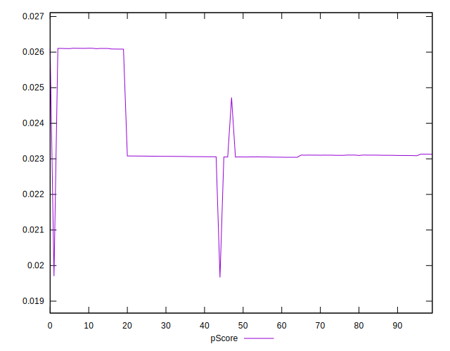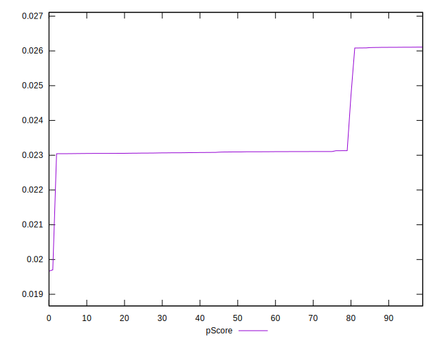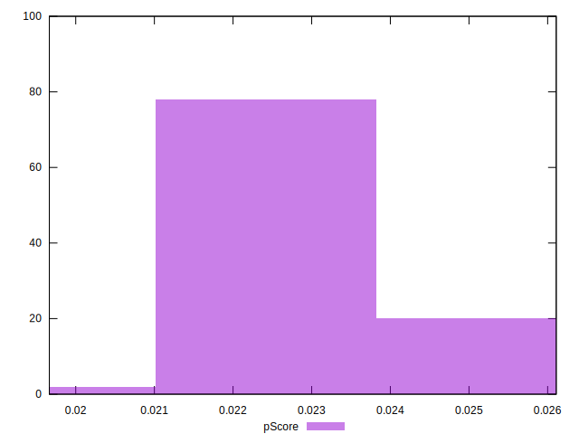
## Score Difference


```yaml
p90min: 0
p90max: 0
p90range: 0
p90mean: 0
p90median: 0
p90stdev: 0
p90skewness: .nan
p90eccentricity: .nan
p90discretization: 94
outlandishness: .nan
confidence: 0
p90confidence: 0

```


## P Score Difference


```yaml
p90min: -0.003913885859361282
p90max: 0.0031293926115464506
p90range: 0.007043278470907733
p90mean: 0.0018190328198818529
p90median: 0.0030674534863593846
p90stdev: 0.0026348499644331474
p90skewness: -1.6610764655474883
p90eccentricity: 1.0000000000000004
p90discretization: 1
outlandishness: 0.8757388922800646
confidence: 0.0010818989379460056
p90confidence: 0.0010652953963234664

```

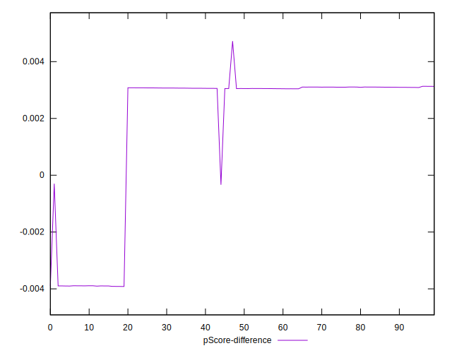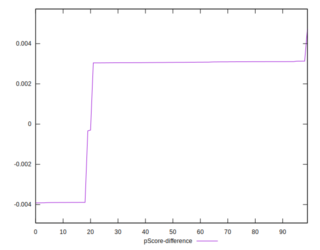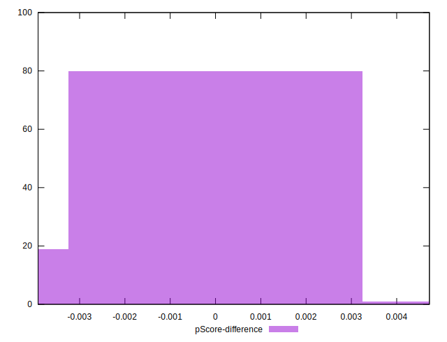