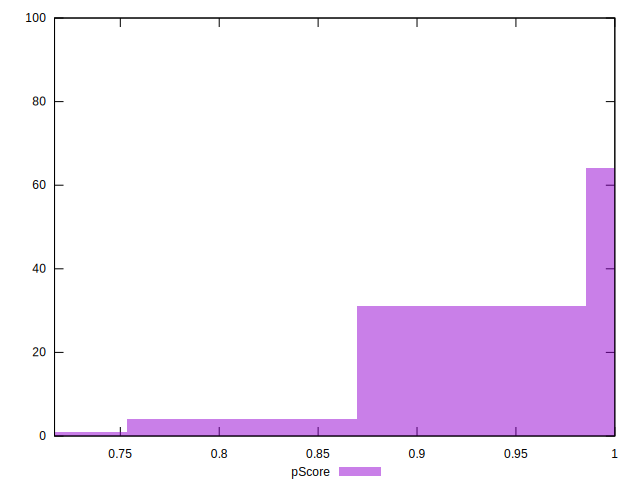

# //uses-rel-preconnect/samples/pages+cached+noadtech+nomedia+nocss

[→ Parent](../..)


## Raw


```yaml
p90min: 0
p90max: 190.92300033569336
p90range: 190.92300033569336
p90mean: 39.799808522488206
p90median: 0
p90stdev: 56.53889417438333
p90skewness: 0.922401014553213
p90eccentricity: 1.0000000000000007
p90discretization: 2.764705882352941
outlandishness: 1.3034811060752023
confidence: 26.890720696701173
p90confidence: 22.859223291732295

```


## Score


```yaml
p90min: 0.84
p90max: 1
p90range: 0.16000000000000003
p90mean: 0.9665957446808512
p90median: 1
p90stdev: 0.0475249809224527
p90skewness: -0.9284398280688556
p90eccentricity: 1.0000000000000002
p90discretization: 9.4
outlandishness: 0.99071940963859
confidence: 0.022190358737260822
p90confidence: 0.019214810737028583

```


## Raw Estimate


## Score Estimate


## P Score


```yaml
p90min: 0.8408974997202555
p90max: 1
p90range: 0.15910250027974449
p90mean: 0.9668334928979264
p90median: 1
p90stdev: 0.047115745145319445
p90skewness: -0.9224010145532087
p90eccentricity: 0.9999999999999996
p90discretization: 2.764705882352941
outlandishness: 0.9906441249033286
confidence: 0.022117613471016418
p90confidence: 0.019049352743110246

```


## Score Difference


```yaml
p90min: 0
p90max: 0
p90range: 0
p90mean: 0
p90median: 0
p90stdev: 0
p90skewness: .nan
p90eccentricity: .nan
p90discretization: 94
outlandishness: .inf
confidence: 7.423946114831063e-18
p90confidence: 0

```


## P Score Difference


```yaml
p90min: -0.004092499812443973
p90max: 0.00439249992370605
p90range: 0.008484999736150023
p90mean: 0.00020385045519392934
p90median: 0
p90stdev: 0.0015042483205345198
p90skewness: 0.2324116876502349
p90eccentricity: 0.9999999999999997
p90discretization: 3.032258064516129
outlandishness: 0.9633282130080343
confidence: 0.0007245982768066687
p90confidence: 0.0006081821858640363

```

