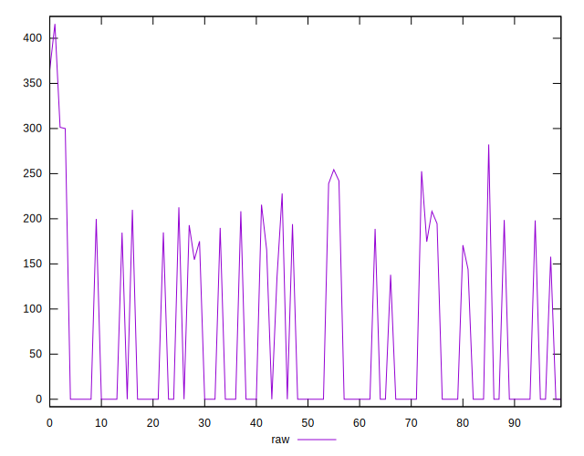

# //uses-rel-preconnect/samples/pages+cached+noadtech+nomedia

[→ Parent](../..)


## Raw


```yaml
p90min: 0
p90max: 300
p90range: 300
p90mean: 65.90245744015309
p90median: 0
p90stdev: 96.54002317814052
p90skewness: 0.9005826241315306
p90eccentricity: 0.999999999999997
p90discretization: 2.9375
outlandishness: 1.219272937031737
confidence: 42.06828854967324
p90confidence: 39.032067723354885

```


## Score


```yaml
p90min: 0.75
p90max: 1
p90range: 0.25
p90mean: 0.9451063829787234
p90median: 1
p90stdev: 0.08048714289887261
p90skewness: -0.9057493727893272
p90eccentricity: 1.0000000000000007
p90discretization: 6.714285714285714
outlandishness: 0.9890127869973917
confidence: 0.034479749698118324
p90confidence: 0.03254173252777386

```


## Raw Estimate


## Score Estimate


## P Score


```yaml
p90min: 0.75
p90max: 1
p90range: 0.25
p90mean: 0.9450812854665392
p90median: 1
p90stdev: 0.08045001931511704
p90skewness: -0.9005826241315346
p90eccentricity: 0.9999999999999992
p90discretization: 2.9375
outlandishness: 0.9889903637957824
confidence: 0.03448239953117813
p90confidence: 0.03252672310279572

```


## Score Difference


```yaml
p90min: 0
p90max: 1.1102230246251565e-16
p90range: 1.1102230246251565e-16
p90mean: 7.086529944415892e-18
p90median: 0
p90stdev: 2.7139343474843184e-17
p90skewness: 3.568591947091804
p90eccentricity: 0.9999999999999991
p90discretization: 47
outlandishness: 1.9881000000000004
confidence: 1.2454613861688433e-17
p90confidence: 1.0972699794392905e-17

```


## P Score Difference


```yaml
p90min: -0.004056666692097921
p90max: 0.0044425002733866625
p90range: 0.008499166965484584
p90mean: -0.00003674054803014337
p90median: 0
p90stdev: 0.001360584567705736
p90skewness: 0.24715711104498647
p90eccentricity: 0.9999999999999982
p90discretization: 3.357142857142857
outlandishness: 0.9396095270182939
confidence: 0.0006887180739097506
p90confidence: 0.000550097537184626

```

