# //uses-rel-preconnect/samples/pages+cached+noadtech

[→ Parent](../..)


## Raw


```yaml
p90min: 0
p90max: 301.082
p90range: 301.082
p90mean: 72.75751063906893
p90median: 0
p90stdev: 101.11313827482786
p90skewness: 0.8187956227498573
p90eccentricity: 1.0000000000000009
p90discretization: 2.6857142857142855
outlandishness: 1.1783389611706019
confidence: 43.168940059176485
p90confidence: 40.88102251209803

```

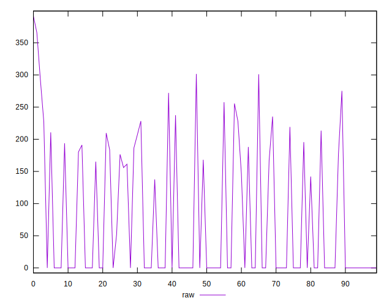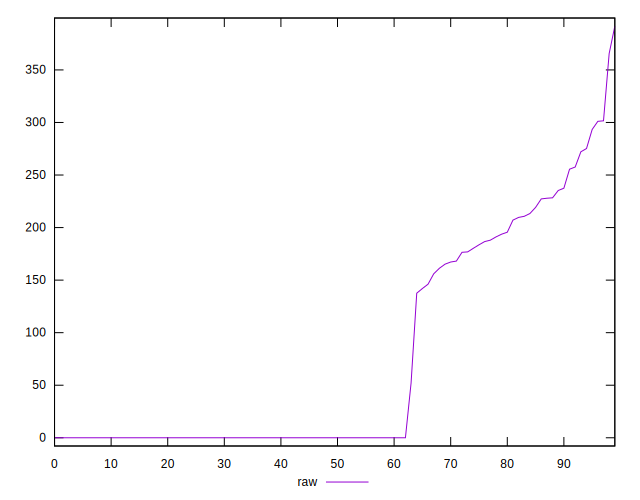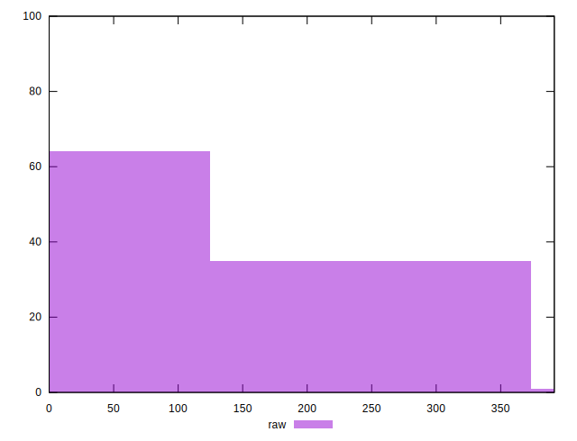
## Score


```yaml
p90min: 0.75
p90max: 1
p90range: 0.25
p90mean: 0.9394680851063828
p90median: 1
p90stdev: 0.08417771248562116
p90skewness: -0.8178580435177522
p90eccentricity: 1.0000000000000016
p90discretization: 5.875
outlandishness: 0.989875152879225
confidence: 0.035511410453623424
p90confidence: 0.0340338656069416

```

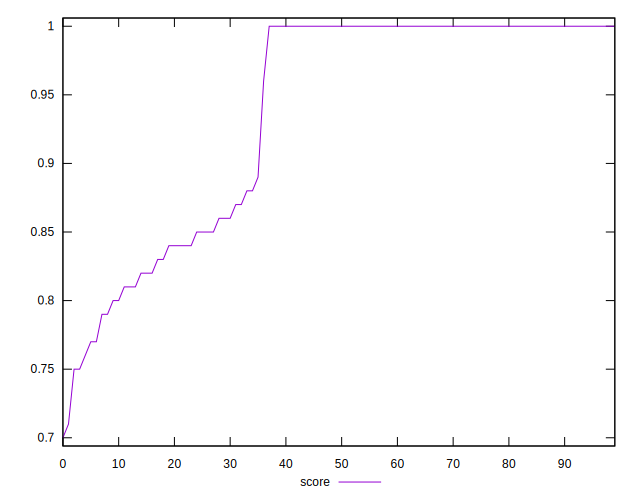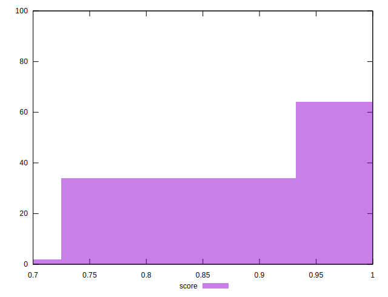
## Raw Estimate

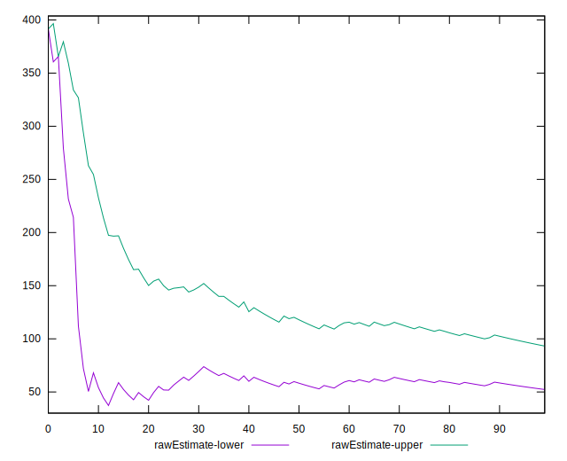
## Score Estimate

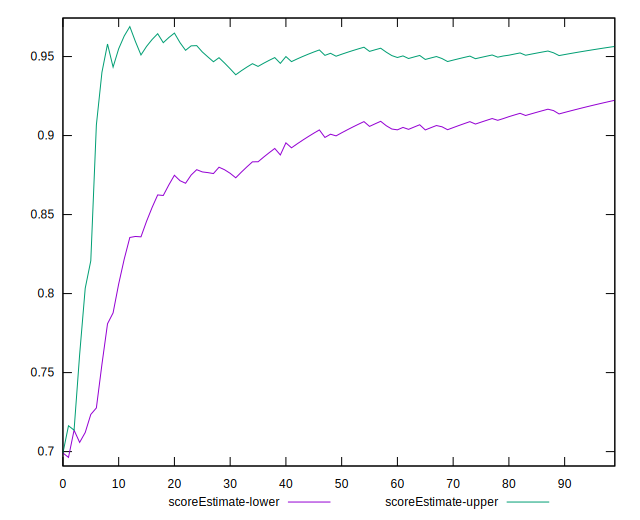
## P Score


```yaml
p90min: 0.749398888888889
p90max: 1
p90range: 0.25060111111111105
p90mean: 0.9393719385336364
p90median: 1
p90stdev: 0.0842537338186092
p90skewness: -0.8185401280052585
p90eccentricity: 1.0000000000000007
p90discretization: 2.6857142857142855
outlandishness: 0.9899249629844684
confidence: 0.035517034100976244
p90confidence: 0.03406460176920804

```

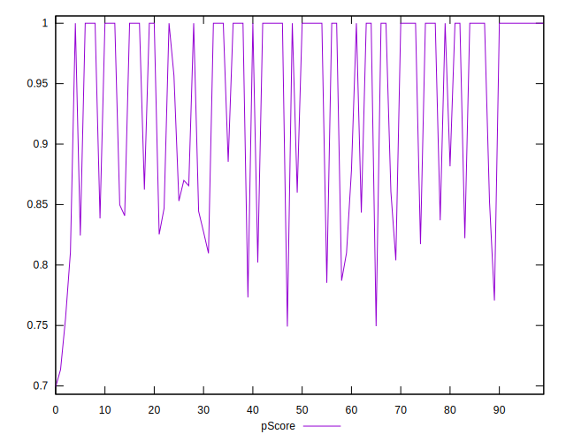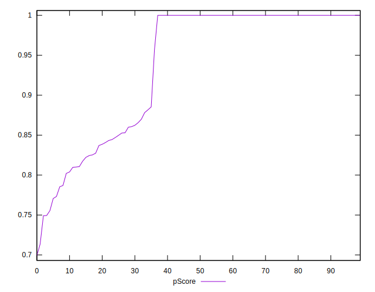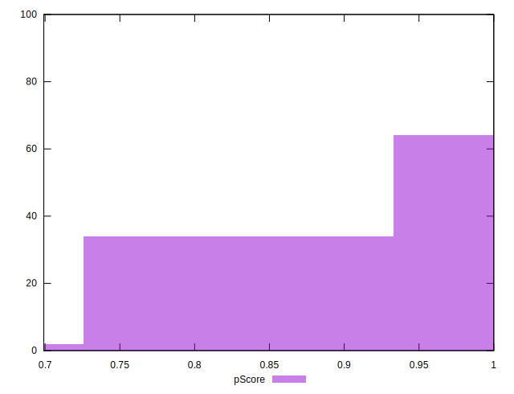
## Score Difference


```yaml
p90min: 0
p90max: 1.1102230246251565e-16
p90range: 1.1102230246251565e-16
p90mean: 3.543264972207946e-18
p90median: 0
p90stdev: 1.9514781802162982e-17
p90skewness: 5.326002287485477
p90eccentricity: 1.0000000000000027
p90discretization: 47
outlandishness: 3.5344000000000007
confidence: 1.0335413782903705e-17
p90confidence: 7.890015558655788e-18

```

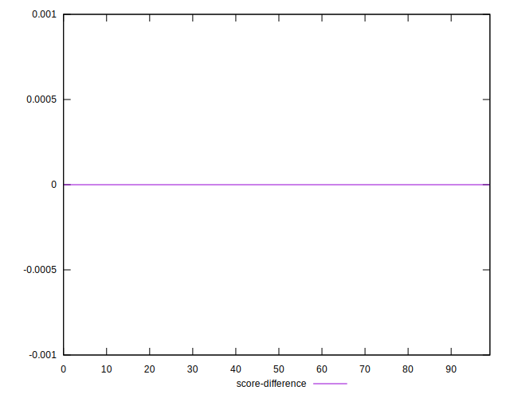
## P Score Difference


```yaml
p90min: -0.004475000301996879
p90max: 0.0035677777777778363
p90range: 0.008042778079774715
p90mean: -0.00006307919425603931
p90median: 0
p90stdev: 0.00133444450800474
p90skewness: -0.49168260322836044
p90eccentricity: 1.0000000000000009
p90discretization: 2.9375
outlandishness: 1.3080776331136381
confidence: 0.000664659835877438
p90confidence: 0.0005395288575121642

```

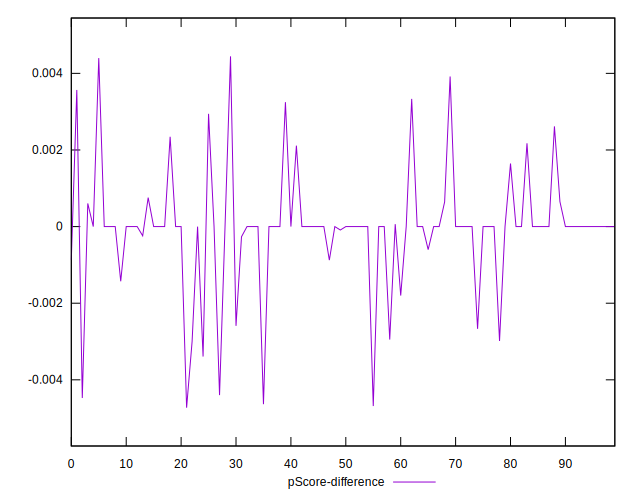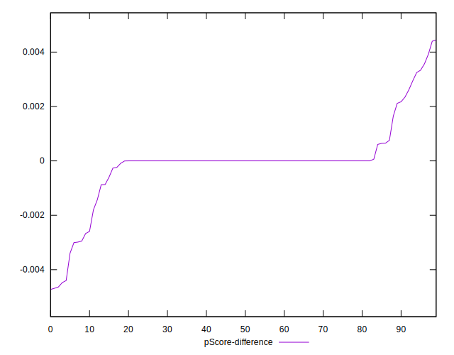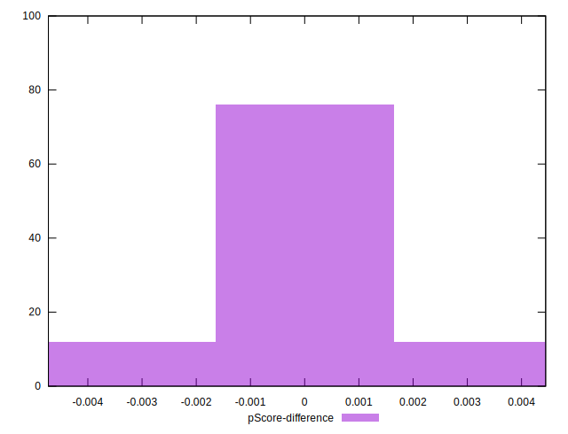