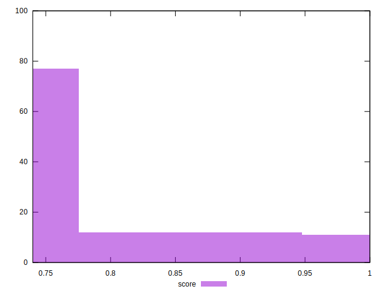

# //uses-rel-preconnect/samples/pages+cached

[→ Parent](../..)


## Raw


```yaml
p90min: 0
p90max: 309.6259994506836
p90range: 309.6259994506836
p90mean: 263.9725106350513
p90median: 300
p90stdev: 84.18650062862484
p90skewness: -2.610382081280087
p90eccentricity: 0.9999999999999999
p90discretization: 1.2702702702702702
outlandishness: 0.9520123818677081
confidence: 36.7460761239686
p90confidence: 34.03741873839516

```


## Score


```yaml
p90min: 0.74
p90max: 1
p90range: 0.26
p90mean: 0.7801063829787236
p90median: 0.75
p90stdev: 0.070037902821244
p90skewness: 2.619396370556805
p90eccentricity: 0.9999999999999979
p90discretization: 9.4
outlandishness: 1.013875703981611
confidence: 0.030567270551317333
p90confidence: 0.028317003416045785

```


## Raw Estimate


## Score Estimate


## P Score


```yaml
p90min: 0.744652222527398
p90max: 1
p90range: 0.25534777747260196
p90mean: 0.7801912647764961
p90median: 0.75
p90stdev: 0.0700747013920074
p90skewness: 2.613865155024547
p90eccentricity: 0.9999999999999987
p90discretization: 1.2702702702702702
outlandishness: 1.0140234060702609
confidence: 0.030563420366675243
p90confidence: 0.02833188143511886

```


## Score Difference


```yaml
p90min: 0
p90max: 0
p90range: 0
p90mean: 0
p90median: 0
p90stdev: 0
p90skewness: .nan
p90eccentricity: .nan
p90discretization: 94
outlandishness: .inf
confidence: 4.3301796410739334e-18
p90confidence: 0

```


## P Score Difference


```yaml
p90min: -0.0028908336162567494
p90max: 0.004456666666666664
p90range: 0.007347500282923414
p90mean: 0.00013329492023367778
p90median: -0.00007666666666666933
p90stdev: 0.0014036997928959132
p90skewness: 1.385041748436453
p90eccentricity: 0.9999999999999997
p90discretization: 1.3428571428571427
outlandishness: 1.1459168889567344
confidence: 0.0006869518883884319
p90confidence: 0.0005675294409083839

```

