# //uses-rel-preconnect/samples/pages

[→ Parent](../..)


## Raw


```yaml
p90min: 0
p90max: 308.71999999999997
p90range: 308.71999999999997
p90mean: 286.9340531997274
p90median: 300.366
p90stdev: 60.705792545437355
p90skewness: -4.481932923050596
p90eccentricity: 0.9999999999999991
p90discretization: 1.2702702702702702
outlandishness: 0.947784826407092
confidence: 30.1482276250055
p90confidence: 24.543940718360638

```

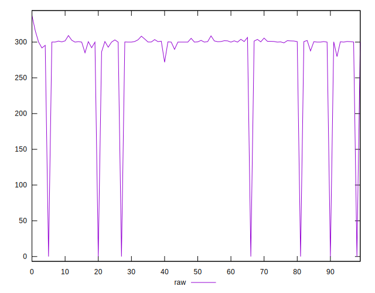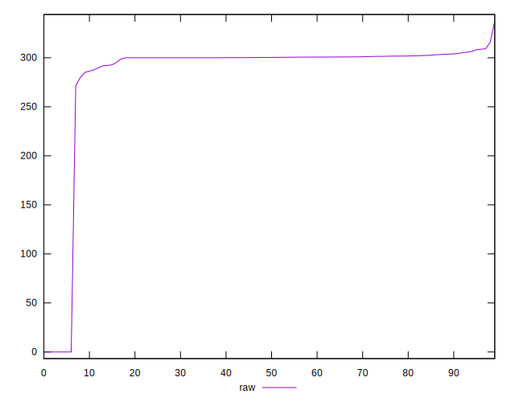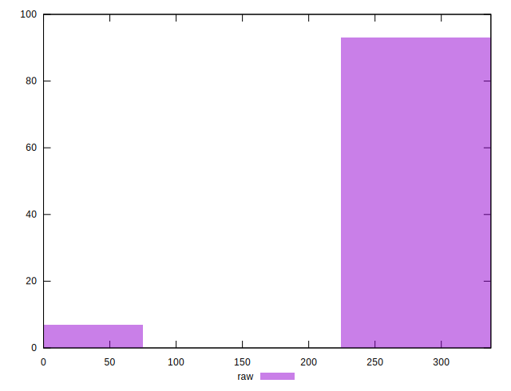
## Score


```yaml
p90min: 0.75
p90max: 1
p90range: 0.25
p90mean: 0.7618085106382979
p90median: 0.75
p90stdev: 0.05035961667247703
p90skewness: 4.491581124597005
p90eccentricity: 0.9999999999999984
p90discretization: 23.5
outlandishness: 1.0168501696092704
confidence: 0.024991685142066473
p90confidence: 0.020360881464211143

```

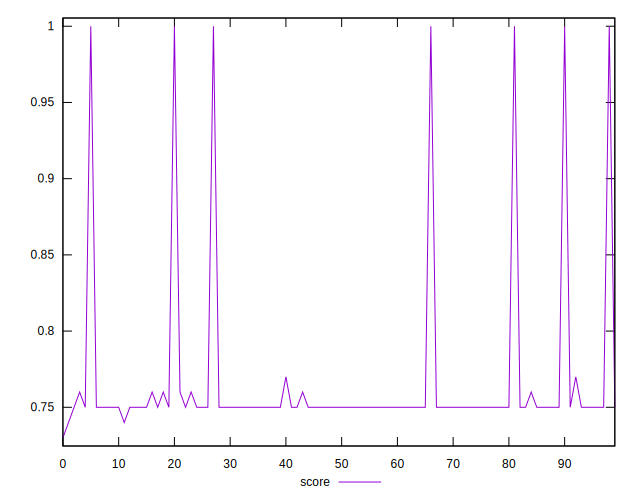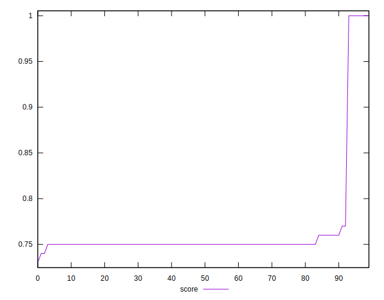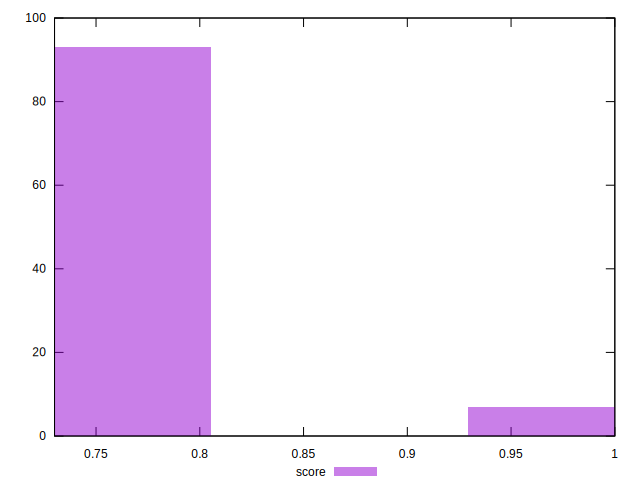
## Raw Estimate

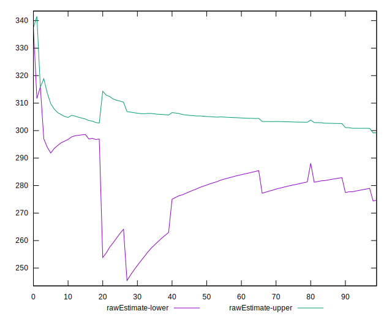
## Score Estimate

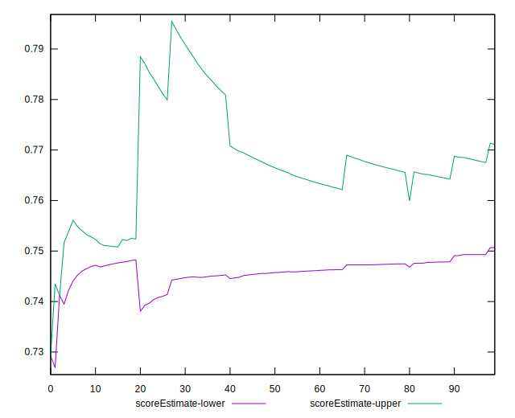
## P Score


```yaml
p90min: 0.7451555555555556
p90max: 1
p90range: 0.25484444444444443
p90mean: 0.7611833185510544
p90median: 0.7497966666666667
p90stdev: 0.05050789722859393
p90skewness: 4.487106486016276
p90eccentricity: 0.9999999999999996
p90discretization: 1.2702702702702702
outlandishness: 1.0171041023160774
confidence: 0.025050258530986386
p90confidence: 0.020420832731238826

```

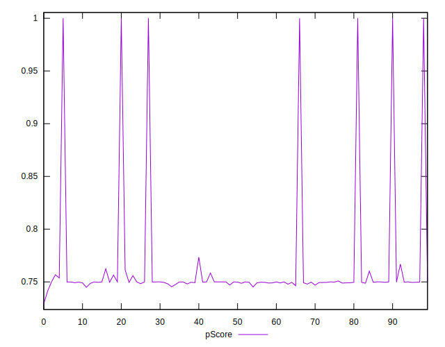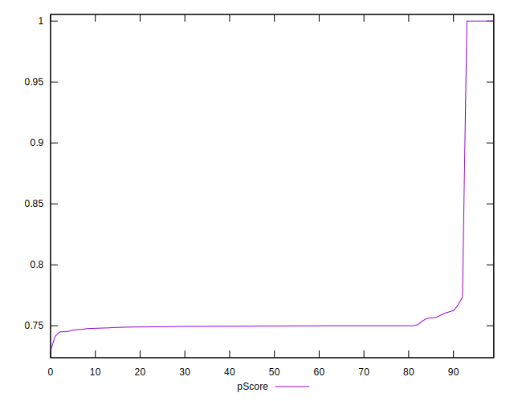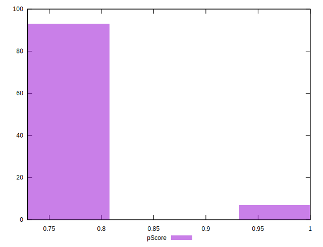
## Score Difference


```yaml
p90min: 0
p90max: 0
p90range: 0
p90mean: 0
p90median: 0
p90stdev: 0
p90skewness: .nan
p90eccentricity: .nan
p90discretization: 94
outlandishness: .nan
confidence: 0
p90confidence: 0

```


## P Score Difference


```yaml
p90min: -0.003626666666666667
p90max: 0.0024433334668476636
p90range: 0.0060700001335143305
p90mean: -0.0005538741233162889
p90median: -0.0002572222222221865
p90stdev: 0.0009908001730587273
p90skewness: -1.0600537452521979
p90eccentricity: 1.0000000000000002
p90discretization: 1.3428571428571427
outlandishness: 0.9316231701890014
confidence: 0.0005595663353331935
p90confidence: 0.00040059011984882844

```

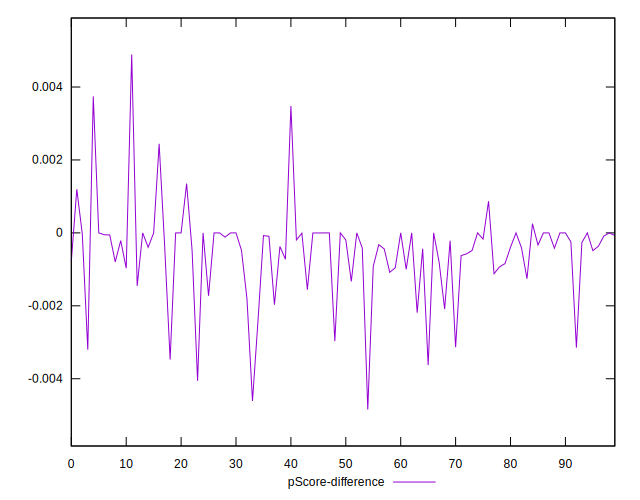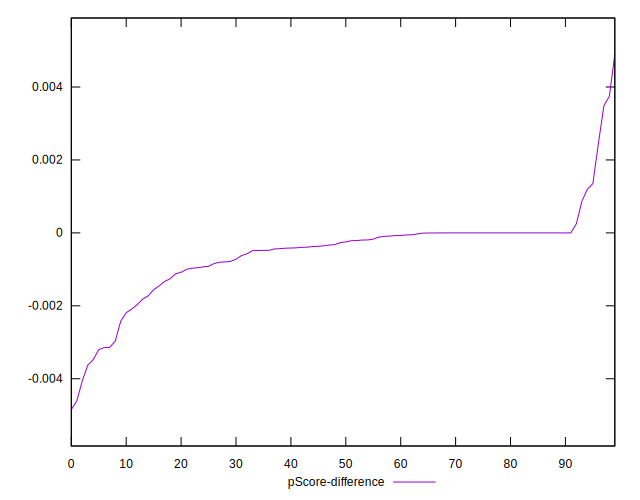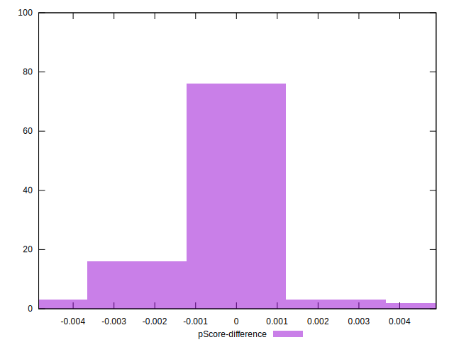