# //uses-rel-preload/samples/pages+cached+noadtech+nomedia+nocss

[→ Parent](../..)


## Raw


```yaml
p90min: 905
p90max: 1058
p90range: 153
p90mean: 1041.8829787234042
p90median: 1054
p90stdev: 40.58609351578306
p90skewness: -2.9853259095164804
p90eccentricity: 1.0000000000000002
p90discretization: 7.833333333333333
outlandishness: 0.9937270539770335
confidence: 18.138290342724883
p90confidence: 16.409351257470583

```

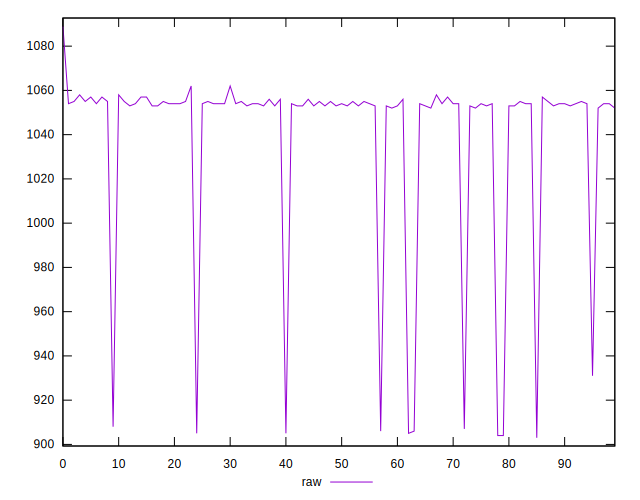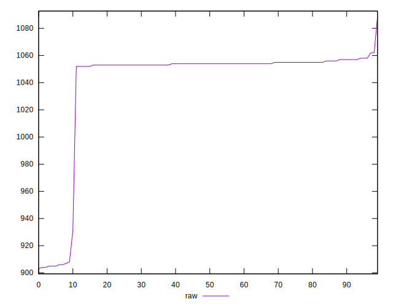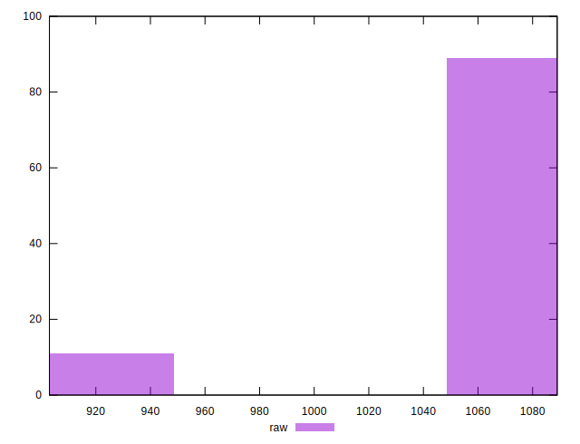
## Score


```yaml
p90min: 0.46
p90max: 0.48
p90range: 0.019999999999999962
p90mean: 0.46170212765957497
p90median: 0.46
p90stdev: 0.005580798744086793
p90skewness: 2.973722121485452
p90eccentricity: 1.000000000000001
p90discretization: 47
outlandishness: 1.0021578448469919
confidence: 0.0024530106189609674
p90confidence: 0.0022563710610226237

```

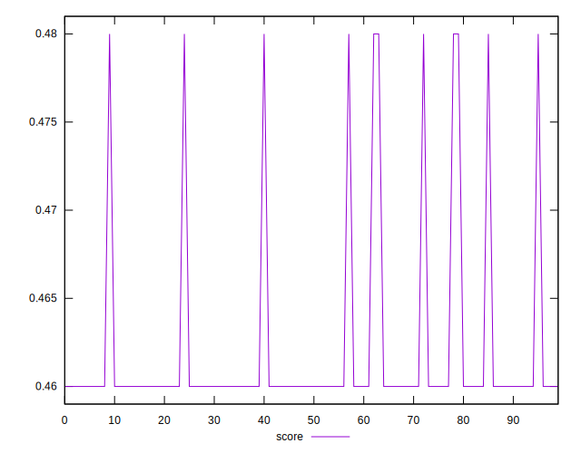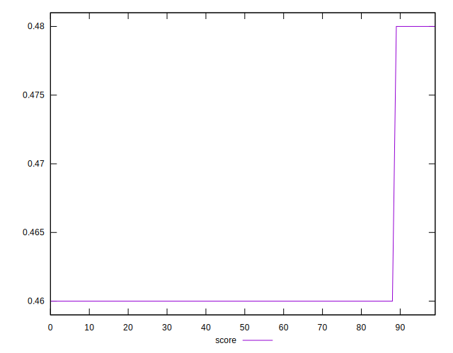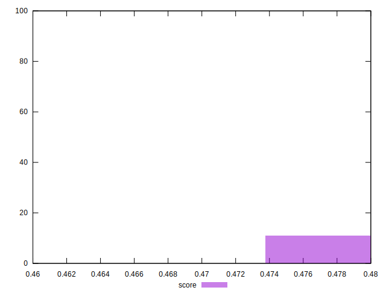
## Raw Estimate

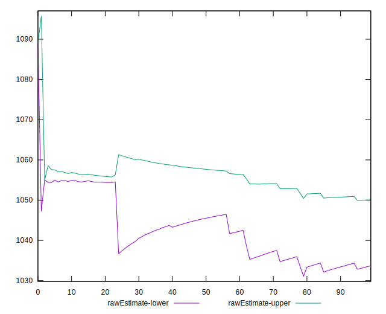
## Score Estimate

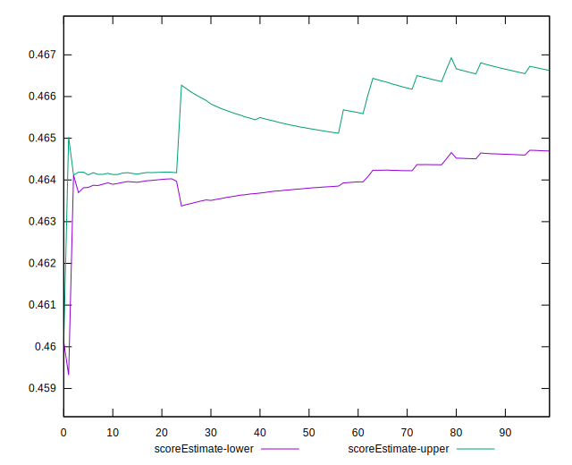
## P Score


```yaml
p90min: 0.46376470588235297
p90max: 0.48176470588235293
p90range: 0.01799999999999996
p90mean: 0.46566082603254094
p90median: 0.4642352941176471
p90stdev: 0.0047748345312685955
p90skewness: 2.9853259095164217
p90eccentricity: 0.9999999999999999
p90discretization: 7.833333333333333
outlandishness: 1.0016544897099904
confidence: 0.00213391651090881
p90confidence: 0.0019305119126435976

```

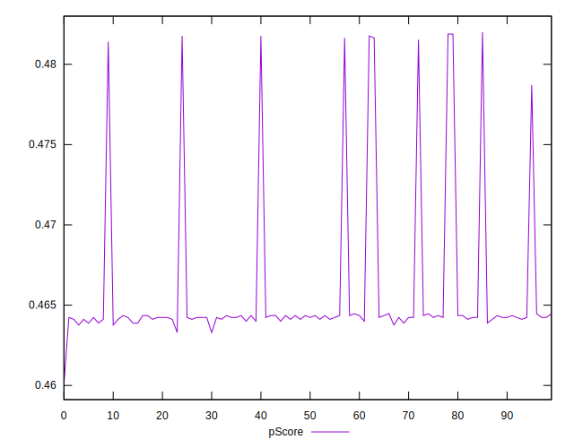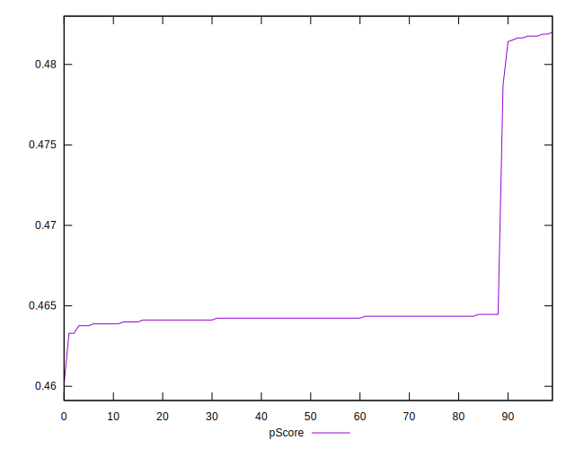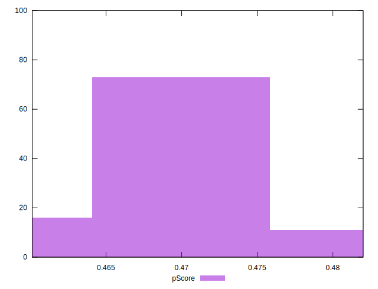
## Score Difference


```yaml
p90min: 0
p90max: 0
p90range: 0
p90mean: 0
p90median: 0
p90stdev: 0
p90skewness: .nan
p90eccentricity: .nan
p90discretization: 94
outlandishness: .nan
confidence: 0
p90confidence: 0

```


## P Score Difference


```yaml
p90min: 0.0015294117647058902
p90max: 0.004470588235294115
p90range: 0.002941176470588225
p90mean: 0.0039461827284105
p90median: 0.004235294117647059
p90stdev: 0.0007386361882363502
p90skewness: -2.440684141193681
p90eccentricity: 1.0000000000000022
p90discretization: 7.230769230769231
outlandishness: 0.9498119008683782
confidence: 0.0003912974441450095
p90confidence: 0.000298637775018579

```

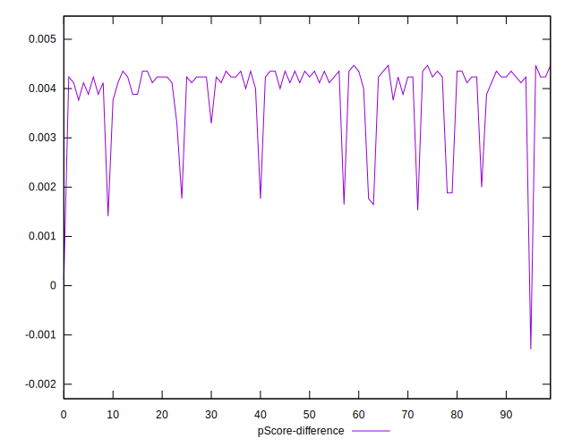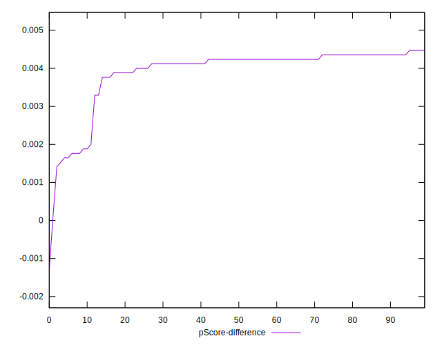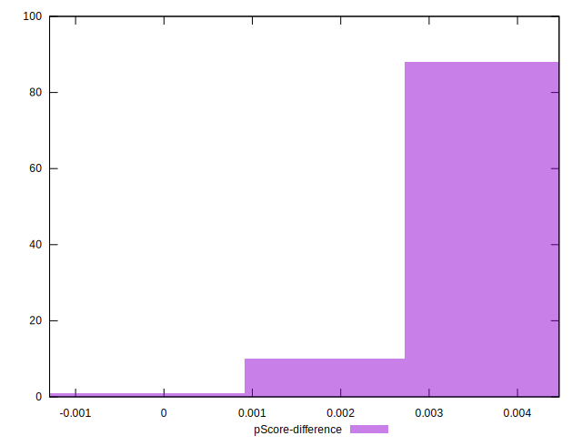