# //uses-rel-preload/samples/pages+cached+noadtech+nomedia

[→ Parent](../..)


## Raw


```yaml
p90min: 755
p90max: 780
p90range: 25
p90mean: 760.6063829787234
p90median: 760
p90stdev: 3.9979198982598096
p90skewness: 1.8454450117322214
p90eccentricity: 1.0000000000000027
p90discretization: 5.529411764705882
outlandishness: 0.9693774985399533
confidence: 42.78509906301671
p90confidence: 1.6163977911366256

```

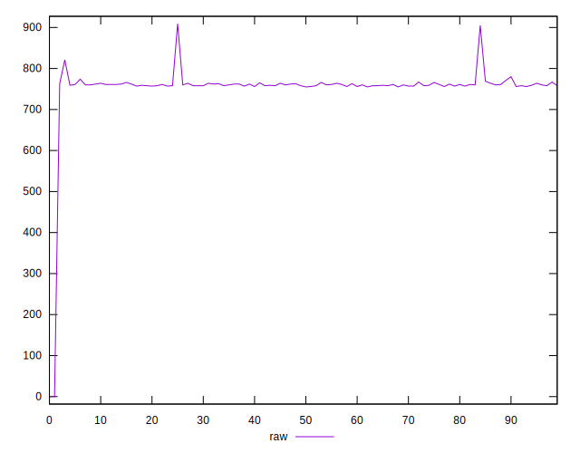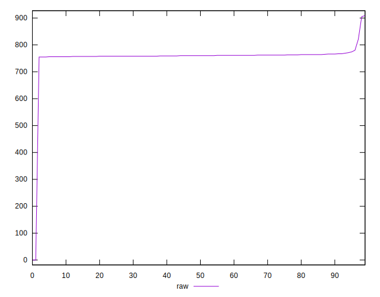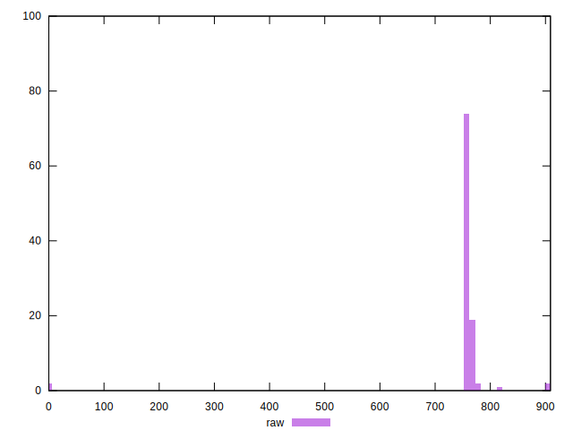
## Score


```yaml
p90min: 0.5
p90max: 0.5
p90range: 0
p90mean: 0.5
p90median: 0.5
p90stdev: 0
p90skewness: .nan
p90eccentricity: .nan
p90discretization: 94
outlandishness: 1.0383609999999999
confidence: 0.0274919446924289
p90confidence: 0

```

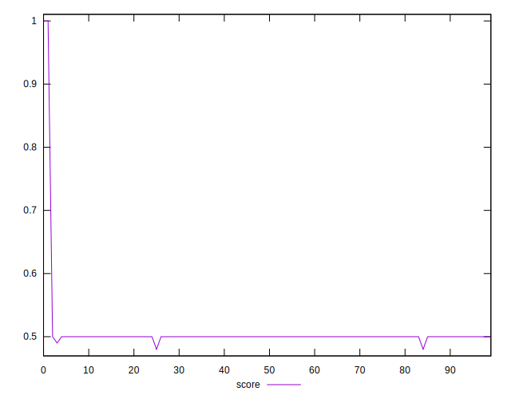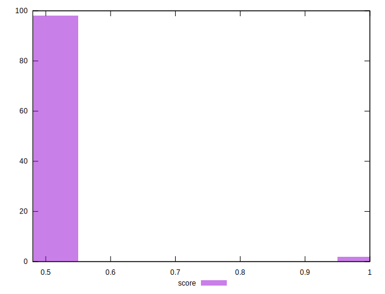
## Raw Estimate

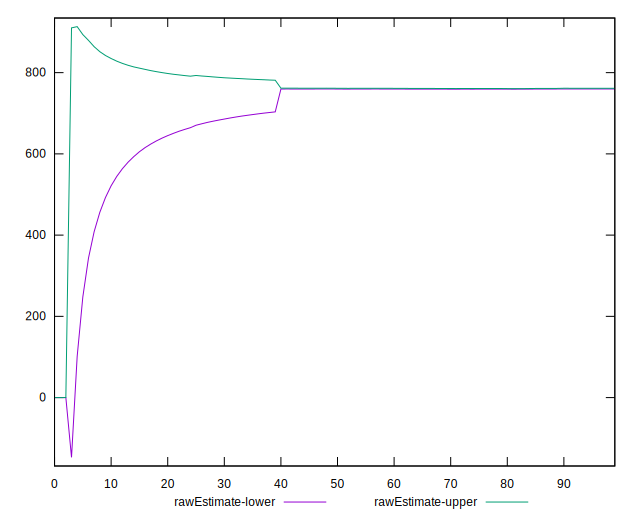
## Score Estimate

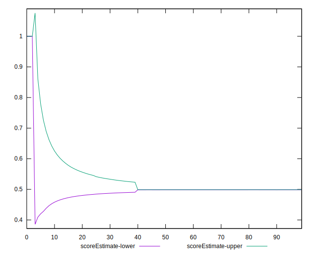
## P Score


```yaml
p90min: 0.4964705882352941
p90max: 0.49941176470588233
p90range: 0.002941176470588225
p90mean: 0.4987521902377972
p90median: 0.4988235294117647
p90stdev: 0.0004703435174423298
p90skewness: -1.845445011732046
p90eccentricity: 1.0000000000000009
p90discretization: 5.529411764705882
outlandishness: 1.0389321386932135
confidence: 0.027548950711001385
p90confidence: 0.00019016444601607327

```

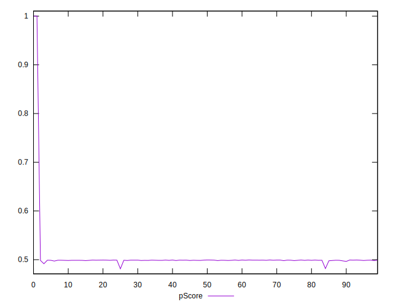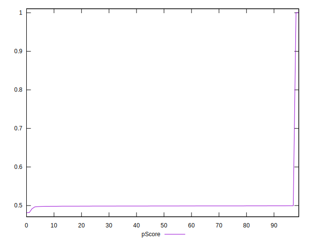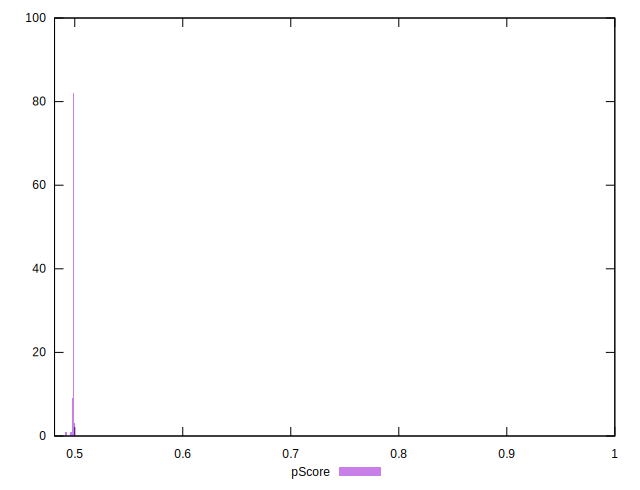
## Score Difference


```yaml
p90min: 0
p90max: 0
p90range: 0
p90mean: 0
p90median: 0
p90stdev: 0
p90skewness: .nan
p90eccentricity: .nan
p90discretization: 94
outlandishness: .nan
confidence: 0
p90confidence: 0

```


## P Score Difference


```yaml
p90min: -0.0022352941176470575
p90max: 0
p90range: 0.0022352941176470575
p90mean: -0.001160200250312887
p90median: -0.0011764705882352788
p90stdev: 0.00039192356742146633
p90skewness: -0.02073695274381805
p90eccentricity: 0.9999999999999994
p90discretization: 6.266666666666667
outlandishness: 0.9515823606558138
confidence: 0.00026849167479464197
p90confidence: 0.00015845849961881238

```

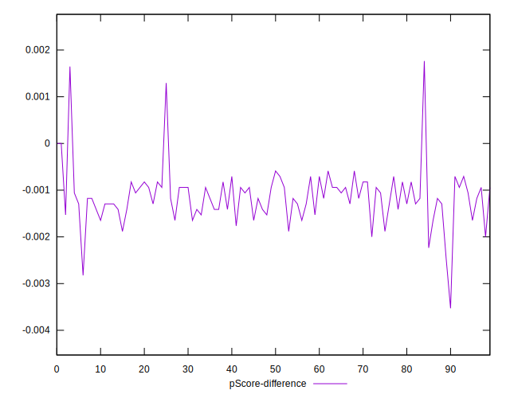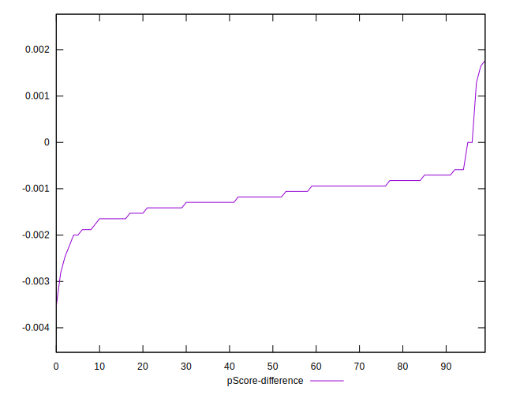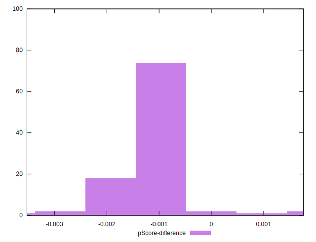