# //uses-rel-preload/samples/pages+cached+noadtech

[→ Parent](../..)


## Raw


```yaml
p90min: 755
p90max: 908
p90range: 153
p90mean: 765.3936170212766
p90median: 760
p90stdev: 26.11888453725288
p90skewness: 5.038733154880302
p90eccentricity: 1.000000000000001
p90discretization: 4.7
outlandishness: 0.9714280948759598
confidence: 44.49778815975076
p90confidence: 10.560118348380302

```

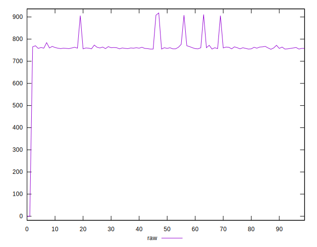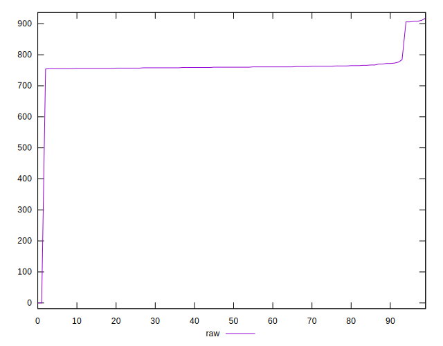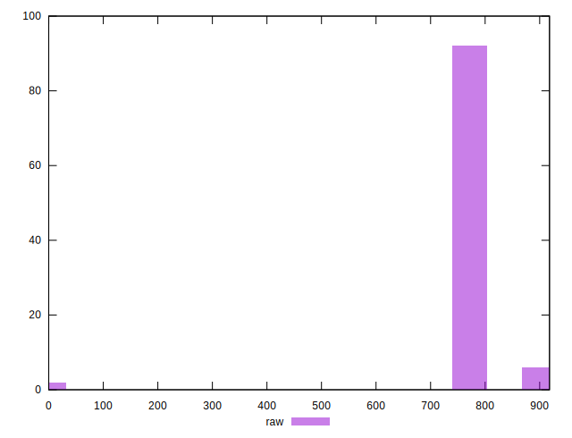
## Score


```yaml
p90min: 0.48
p90max: 0.5
p90range: 0.020000000000000018
p90mean: 0.49936170212765957
p90median: 0.5
p90stdev: 0.0035154705620975136
p90skewness: -5.326002287485476
p90eccentricity: 1.0000000000000022
p90discretization: 47
outlandishness: 1.0381586860380188
confidence: 0.027569553165833312
p90confidence: 0.0014213388451963865

```

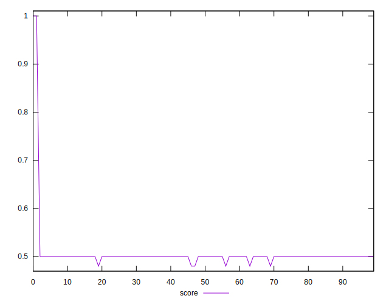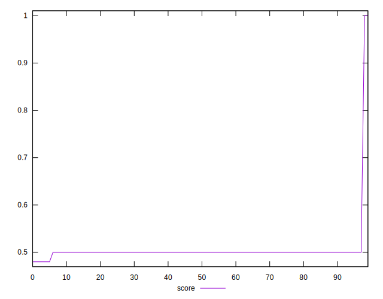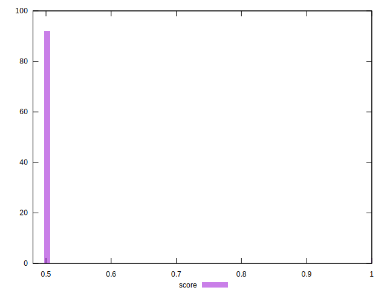
## Raw Estimate

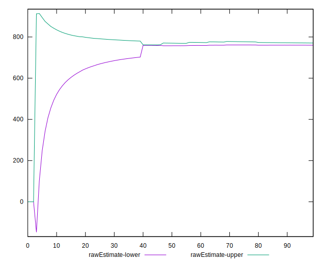
## Score Estimate

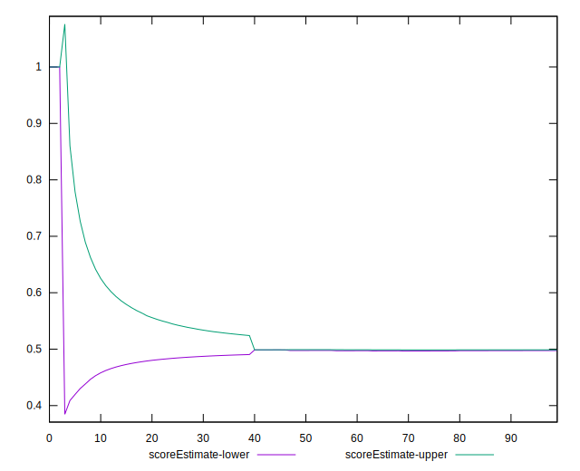
## P Score


```yaml
p90min: 0.4814117647058824
p90max: 0.49941176470588233
p90range: 0.01799999999999996
p90mean: 0.49818898623279095
p90median: 0.4988235294117647
p90stdev: 0.0030728099455591623
p90skewness: -5.038733154880139
p90eccentricity: 0.9999999999999994
p90discretization: 4.7
outlandishness: 1.0386286508871423
confidence: 0.0276161965449884
p90confidence: 0.0012423668645153295

```

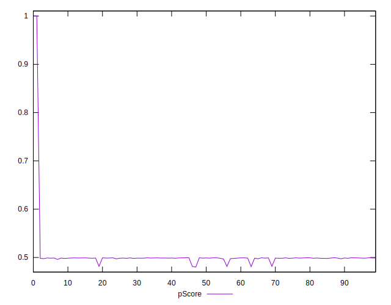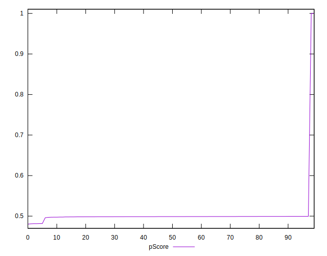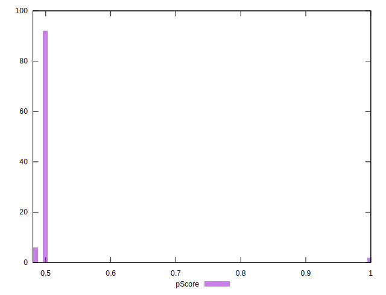
## Score Difference


```yaml
p90min: 0
p90max: 0
p90range: 0
p90mean: 0
p90median: 0
p90stdev: 0
p90skewness: .nan
p90eccentricity: .nan
p90discretization: 94
outlandishness: .nan
confidence: 0
p90confidence: 0

```


## P Score Difference


```yaml
p90min: -0.002588235294117669
p90max: 0.0014117647058823901
p90range: 0.004000000000000059
p90mean: -0.0010951188986232793
p90median: -0.0010588235294117787
p90stdev: 0.0006072100101208692
p90skewness: 0.8207391420413985
p90eccentricity: 0.9999999999999999
p90discretization: 4.7
outlandishness: 0.9725791691755088
confidence: 0.0003299449949168492
p90confidence: 0.0002455008964893567

```

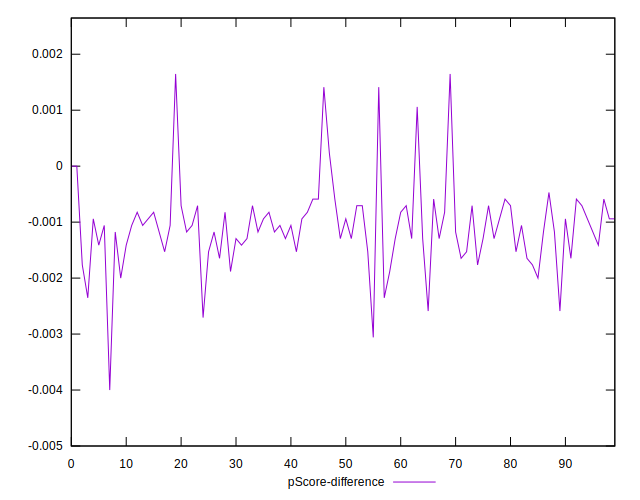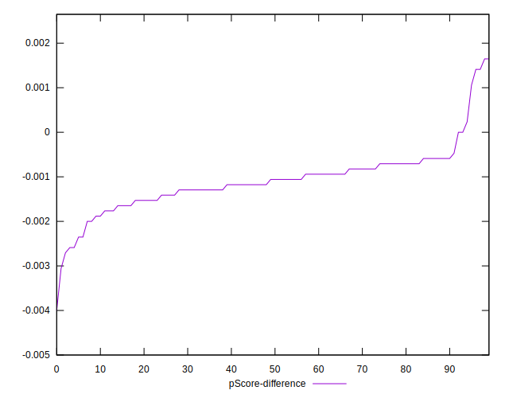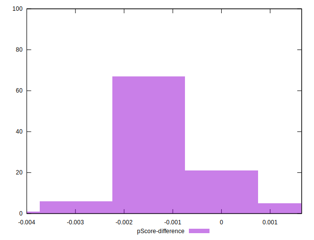