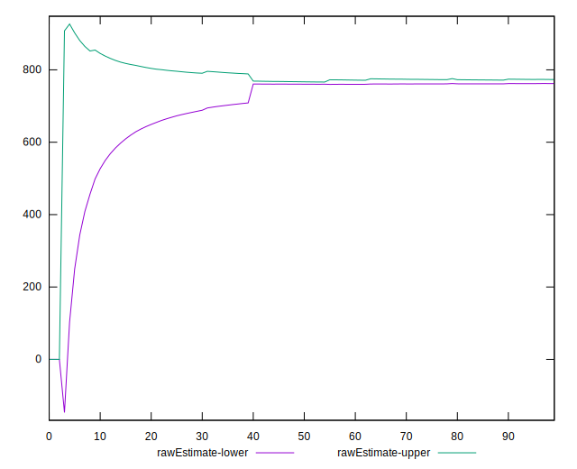
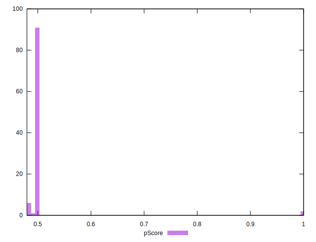

# //uses-rel-preload/samples/pages+cached

[→ Parent](../..)


## Raw


```yaml
p90min: 756
p90max: 913
p90range: 157
p90mean: 767.6489361702128
p90median: 761
p90stdev: 27.372414848035373
p90skewness: 4.5990912975684175
p90eccentricity: 0.9999999999999994
p90discretization: 3.9166666666666665
outlandishness: 0.9715748122679558
confidence: 44.76362838451798
p90confidence: 11.066932811159703

```


## Score


```yaml
p90min: 0.48
p90max: 0.5
p90range: 0.020000000000000018
p90mean: 0.4992553191489362
p90median: 0.5
p90stdev: 0.00364351995522207
p90skewness: -4.876863729774672
p90eccentricity: 1.0000000000000013
p90discretization: 31.333333333333332
outlandishness: 1.038192946710691
confidence: 0.02757721563599172
p90confidence: 0.0014731104568019642

```


## Raw Estimate


## Score Estimate


## P Score


```yaml
p90min: 0.4808235294117647
p90max: 0.49929411764705883
p90range: 0.018470588235294128
p90mean: 0.4979236545682102
p90median: 0.49870588235294117
p90stdev: 0.0032202840997688663
p90skewness: -4.599091297568265
p90eccentricity: 1.0000000000000007
p90discretization: 3.9166666666666665
outlandishness: 1.0386375441530775
confidence: 0.02763442791199647
p90confidence: 0.0013019920954305529

```


## Score Difference


```yaml
p90min: 0
p90max: 0
p90range: 0
p90mean: 0
p90median: 0
p90stdev: 0
p90skewness: .nan
p90eccentricity: .nan
p90discretization: 94
outlandishness: .nan
confidence: 0
p90confidence: 0

```


## P Score Difference


```yaml
p90min: -0.0028235294117647247
p90max: 0.0008235294117647229
p90range: 0.0036470588235294477
p90mean: -0.0012415519399249042
p90median: -0.0011764705882352788
p90stdev: 0.0006005266581760021
p90skewness: 0.3615884218742215
p90eccentricity: 0.9999999999999999
p90discretization: 4.2727272727272725
outlandishness: 1.0107951064158416
confidence: 0.000338064451962341
p90confidence: 0.00024279875247547233

```

