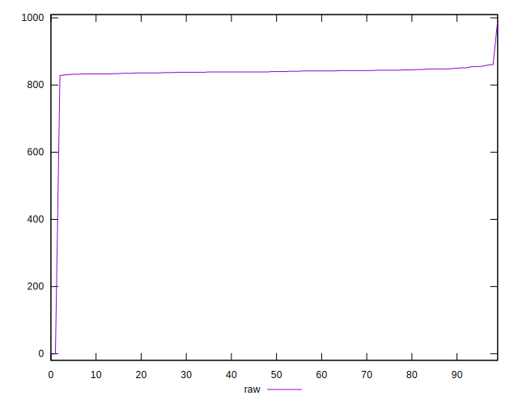
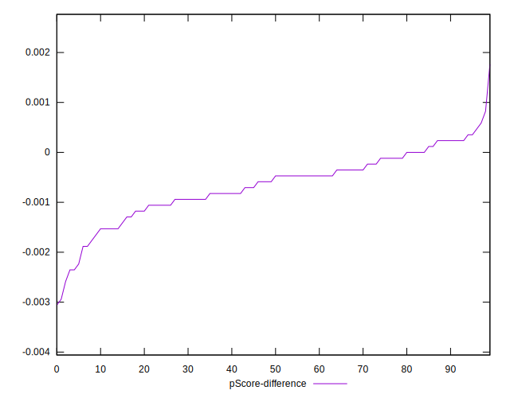

# //uses-rel-preload/samples/pages

[→ Parent](../..)


## Raw


```yaml
p90min: 830
p90max: 857
p90range: 27
p90mean: 840.7553191489362
p90median: 840
p90stdev: 5.637424661406799
p90skewness: 0.5860212996274081
p90eccentricity: 1.0000000000000002
p90discretization: 3.76
outlandishness: 0.9645068623837444
confidence: 46.66652433176018
p90confidence: 2.2792654686161784

```


## Score


```yaml
p90min: 0.49
p90max: 0.49
p90range: 0
p90mean: 0.4900000000000001
p90median: 0.49
p90stdev: 1.1102230246251565e-16
p90skewness: -1
p90eccentricity: 1
p90discretization: 94
outlandishness: 1.0412328196584766
confidence: 0.028010347187040874
p90confidence: 4.488739370326686e-17

```


## Raw Estimate


## Score Estimate


## P Score


```yaml
p90min: 0.4874117647058824
p90max: 0.49058823529411766
p90range: 0.0031764705882352806
p90mean: 0.4893229036295369
p90median: 0.4894117647058824
p90stdev: 0.0006632264307537425
p90skewness: -0.5860212996283157
p90eccentricity: 1.0000000000000007
p90discretization: 3.76
outlandishness: 1.041317596706675
confidence: 0.0280468548347638
p90confidence: 0.00026814887866072746

```


## Score Difference


```yaml
p90min: 0
p90max: 0
p90range: 0
p90mean: 0
p90median: 0
p90stdev: 0
p90skewness: .nan
p90eccentricity: .nan
p90discretization: 94
outlandishness: .inf
confidence: 2.165089820536967e-18
p90confidence: 0

```


## P Score Difference


```yaml
p90min: -0.0023529411764705577
p90max: 0.00047058823529411153
p90range: 0.002823529411764669
p90mean: -0.0006558197747183901
p90median: -0.0005294117647058616
p90stdev: 0.0006271224696786842
p90skewness: -0.554511545055497
p90eccentricity: 0.9999999999999991
p90discretization: 4.086956521739131
outlandishness: 1.045545277081755
confidence: 0.0003068413762331494
p90confidence: 0.00025355169702174346

```

