# //uses-text-compression/samples/pages+cached+noadtech+nomedia+nocss

[→ Parent](../..)


## Raw


```yaml
p90min: 1350
p90max: 1510
p90range: 160
p90mean: 1399.2553191489362
p90median: 1350
p90stdev: 69.39310410436016
p90skewness: 0.7614704036687535
p90eccentricity: 1.000000000000001
p90discretization: 15.666666666666666
outlandishness: 1.0047863720786225
confidence: 28.872711027807984
p90confidence: 28.056305040835106

```

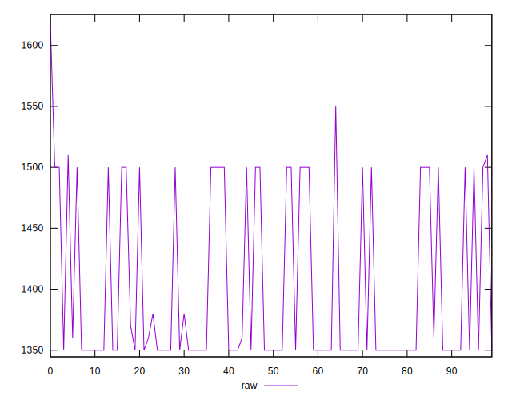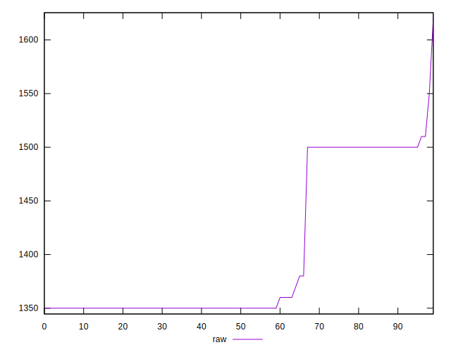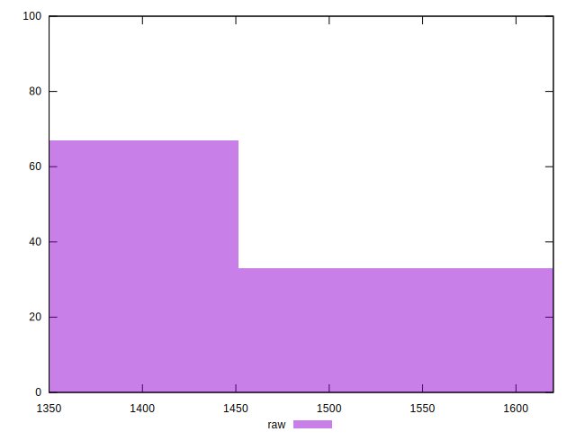
## Score


```yaml
p90min: 0.41
p90max: 0.43
p90range: 0.020000000000000018
p90mean: 0.42361702127659545
p90median: 0.43
p90stdev: 0.009322937149024116
p90skewness: -0.7759402897988745
p90eccentricity: 0.9999999999999997
p90discretization: 47
outlandishness: 0.9985038247452558
confidence: 0.0037621098972472162
p90confidence: 0.003769353913555788

```

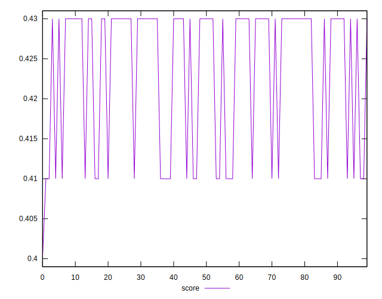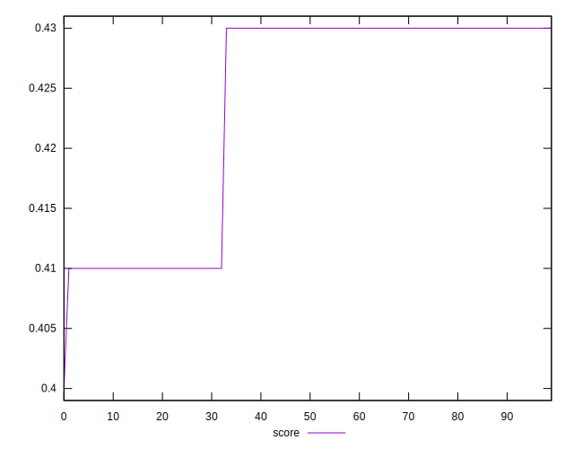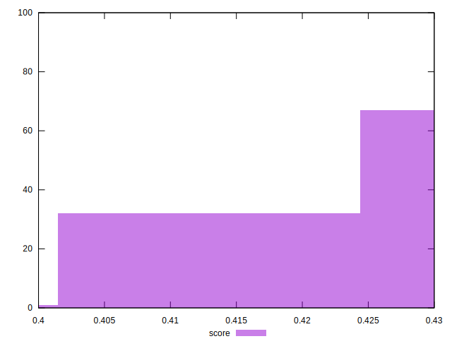
## Raw Estimate

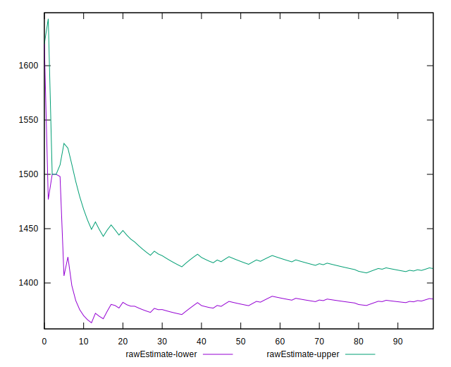
## Score Estimate

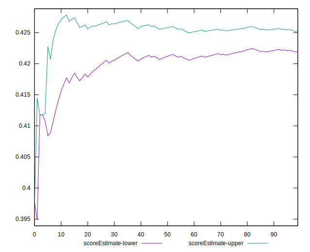
## P Score


```yaml
p90min: 0.41058823529411764
p90max: 0.4294117647058824
p90range: 0.01882352941176474
p90mean: 0.4236170212765959
p90median: 0.4294117647058824
p90stdev: 0.008163894600512984
p90skewness: -0.7614704036688061
p90eccentricity: 1
p90discretization: 15.666666666666666
outlandishness: 0.9981430910914324
confidence: 0.003396789532683299
p90confidence: 0.0033007417695100224

```

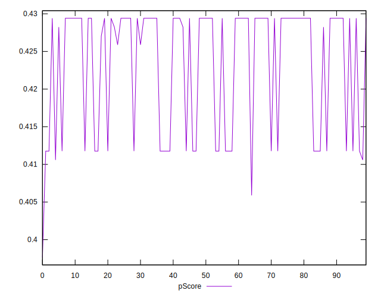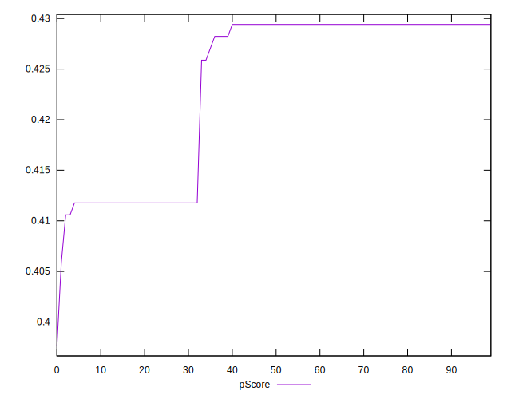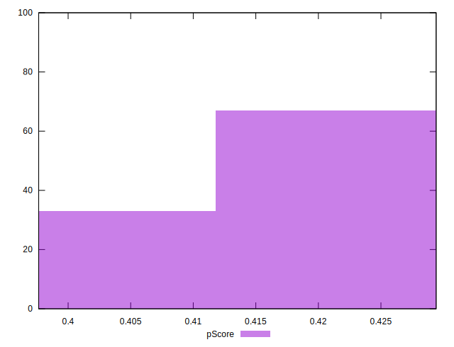
## Score Difference


```yaml
p90min: 0
p90max: 5.551115123125783e-17
p90range: 5.551115123125783e-17
p90mean: 1.7125780699005074e-17
p90median: 0
p90stdev: 2.5639411806541354e-17
p90skewness: 0.8291761914687812
p90eccentricity: 1.0000000000000002
p90discretization: 47
outlandishness: 1.0758696789536266
confidence: 1.0150507731660926e-17
p90confidence: 1.0366262872894235e-17

```

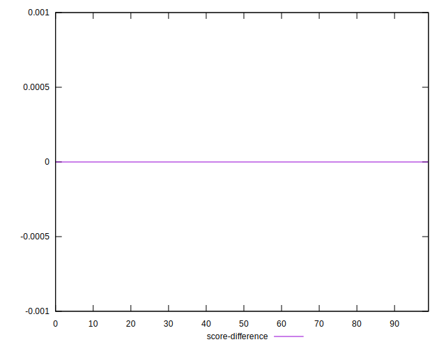
## P Score Difference


```yaml
p90min: -0.002941176470588225
p90max: 0.001764705882352946
p90range: 0.004705882352941171
p90mean: -0.000006257822277823311
p90median: -0.0005882352941176117
p90stdev: 0.0011717511121644311
p90skewness: 0.4830561244551565
p90eccentricity: 1.0000000000000016
p90discretization: 15.666666666666666
outlandishness: 149.32840000105364
confidence: 0.0005384568376597307
p90confidence: 0.00047375033959256825

```

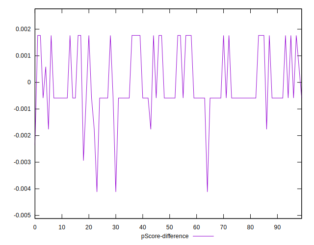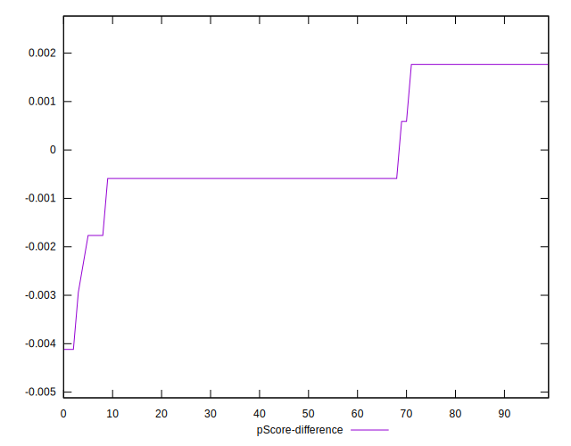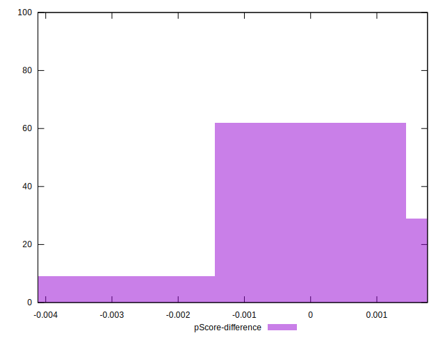