# //uses-text-compression/samples/pages+cached+noadtech+nomedia

[→ Parent](../..)


## Raw


```yaml
p90min: 2400
p90max: 2730
p90range: 330
p90mean: 2552.127659574468
p90median: 2550
p90stdev: 44.2640130576659
p90skewness: -1.0552219593832246
p90eccentricity: 0.9999999999999982
p90discretization: 6.714285714285714
outlandishness: 0.9923913518808467
confidence: 52.33102370583925
p90confidence: 17.896369800804916

```

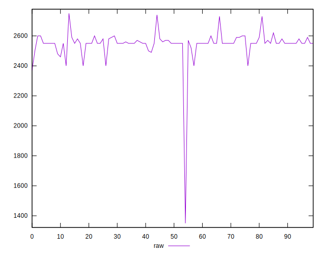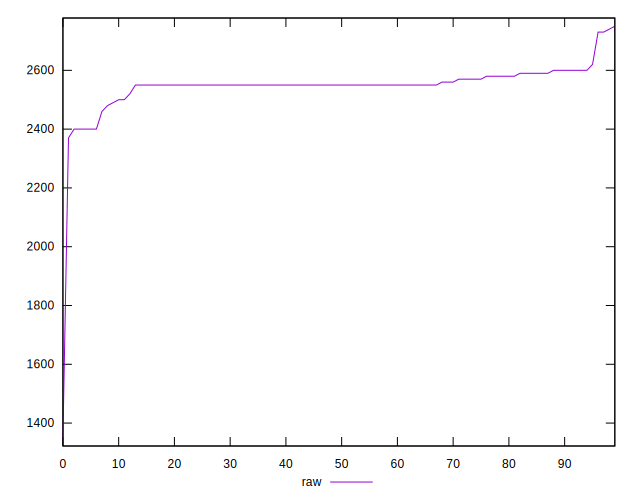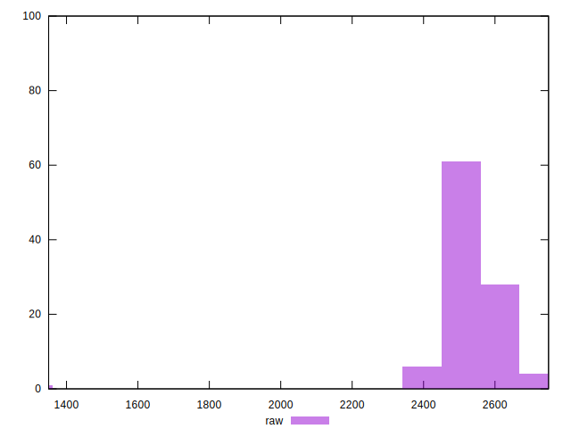
## Score


```yaml
p90min: 0.27
p90max: 0.31
p90range: 0.03999999999999998
p90mean: 0.2888297872340422
p90median: 0.29
p90stdev: 0.006661477533809894
p90skewness: 0.7843445772042669
p90eccentricity: 0.9999999999999979
p90discretization: 18.8
outlandishness: 1.008119545937073
confidence: 0.006369129072842686
p90confidence: 0.002693299977331568

```

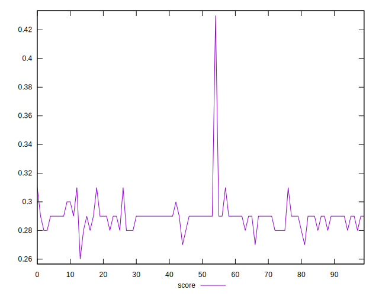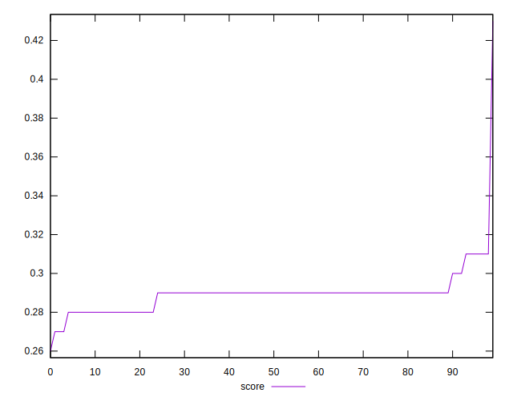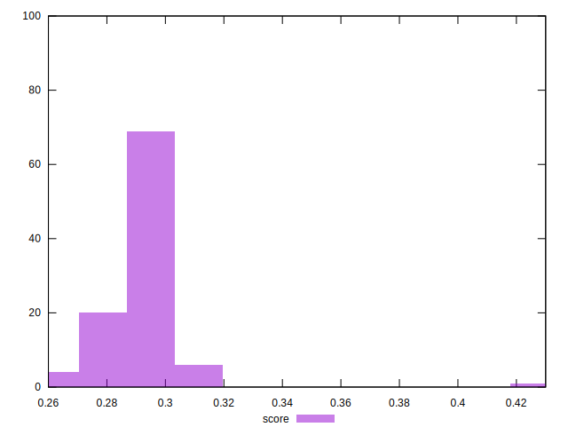
## Raw Estimate

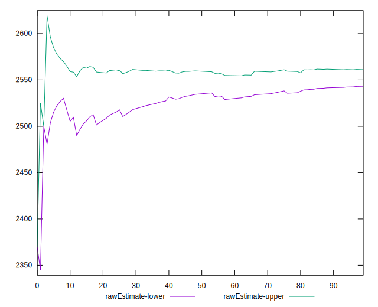
## Score Estimate

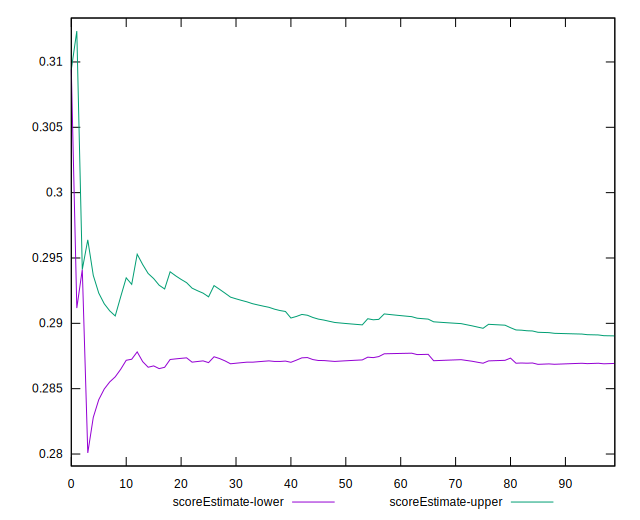
## P Score


```yaml
p90min: 0.2670588235294118
p90max: 0.3058823529411765
p90range: 0.0388235294117647
p90mean: 0.2879849812265335
p90median: 0.28823529411764703
p90stdev: 0.005207530947960697
p90skewness: 1.0552219593831158
p90eccentricity: 1.0000000000000007
p90discretization: 6.714285714285714
outlandishness: 1.007963640836391
confidence: 0.006156591024216384
p90confidence: 0.0021054552706829322

```

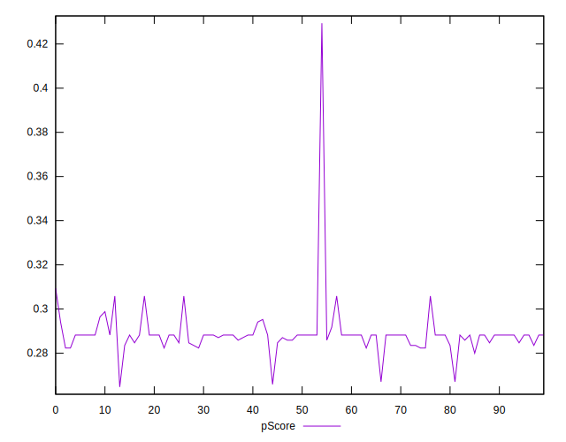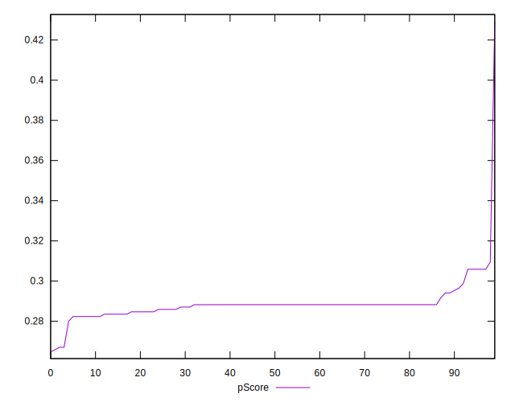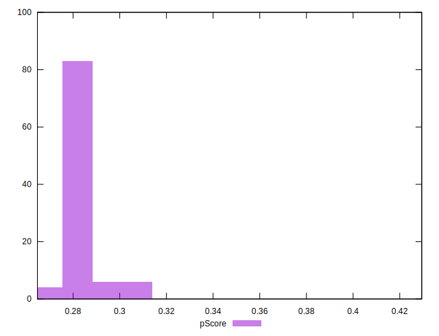
## Score Difference


```yaml
p90min: 0
p90max: 0
p90range: 0
p90mean: 0
p90median: 0
p90stdev: 0
p90skewness: .nan
p90eccentricity: .nan
p90discretization: 94
outlandishness: .nan
confidence: 0
p90confidence: 0

```


## P Score Difference


```yaml
p90min: -0.004117647058823504
p90max: 0.004705882352941115
p90range: 0.008823529411764619
p90mean: -0.0009386733416771031
p90median: -0.001764705882352946
p90stdev: 0.0023922239436803667
p90skewness: 1.0923710941398328
p90eccentricity: 1
p90discretization: 7.833333333333333
outlandishness: 0.8601944177777805
confidence: 0.0010127232399812234
p90confidence: 0.00096719934287633

```

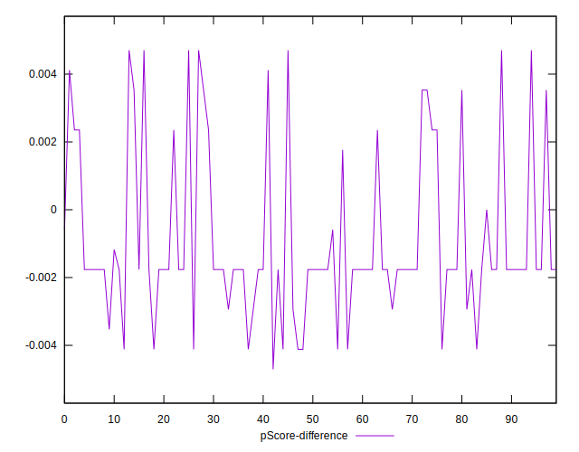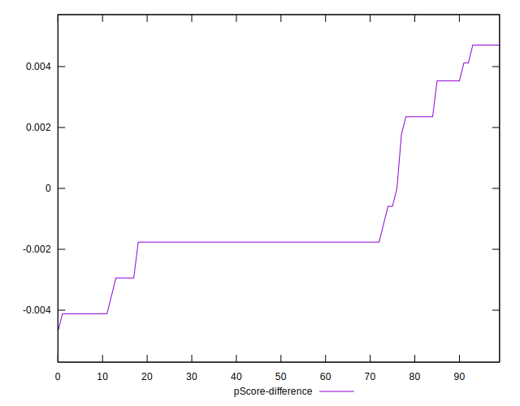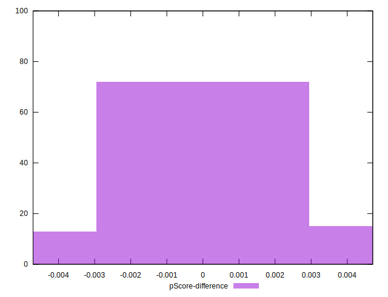