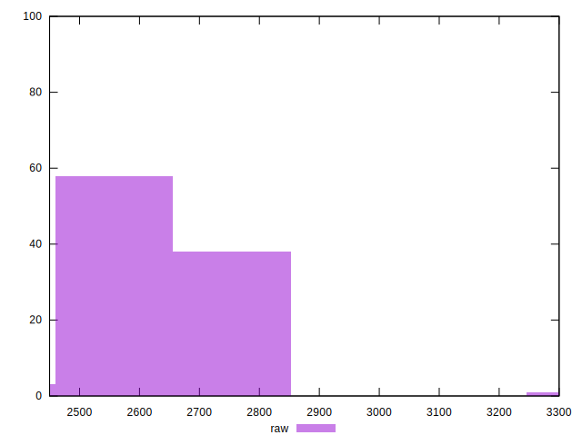

# //uses-text-compression/samples/pages+cached+noadtech

[→ Parent](../..)


## Raw


```yaml
p90min: 2460
p90max: 2740
p90range: 280
p90mean: 2610
p90median: 2590
p90stdev: 79.96009643113617
p90skewness: -0.028092215240575837
p90eccentricity: 0.9999999999999997
p90discretization: 6.714285714285714
outlandishness: 1.0044493827160497
confidence: 43.38628976009748
p90confidence: 32.328642528985654

```


## Score


```yaml
p90min: 0.27
p90max: 0.3
p90range: 0.02999999999999997
p90mean: 0.2812765957446806
p90median: 0.28
p90stdev: 0.010234905081536742
p90skewness: 0.21922010976340636
p90eccentricity: 0.9999999999999999
p90discretization: 23.5
outlandishness: 0.9951948935848817
confidence: 0.005340892867203598
p90confidence: 0.00413807139394915

```


## Raw Estimate


## Score Estimate


## P Score


```yaml
p90min: 0.26588235294117646
p90max: 0.2988235294117647
p90range: 0.03294117647058825
p90mean: 0.2811764705882354
p90median: 0.28352941176470586
p90stdev: 0.009407070168368961
p90skewness: 0.028092215240514657
p90eccentricity: 1.000000000000001
p90discretization: 6.714285714285714
outlandishness: 0.9951523327672835
confidence: 0.005104269383540881
p90confidence: 0.00380336970929243

```


## Score Difference


```yaml
p90min: 0
p90max: 0
p90range: 0
p90mean: 0
p90median: 0
p90stdev: 0
p90skewness: .nan
p90eccentricity: .nan
p90discretization: 94
outlandishness: .nan
confidence: 0
p90confidence: 0

```


## P Score Difference


```yaml
p90min: -0.004117647058823559
p90max: 0.004705882352941115
p90range: 0.008823529411764675
p90mean: -0.00011889862327911888
p90median: 0.0005882352941176117
p90stdev: 0.0019801335835164724
p90skewness: 0.28215072337216934
p90eccentricity: 1
p90discretization: 6.714285714285714
outlandishness: 0.7930371191136185
confidence: 0.0008734112780154438
p90confidence: 0.000800587213351786

```

