# //uses-webp-images/samples/pages+cached+noadtech

[→ Parent](../..)


## Raw


```yaml
p90min: 450
p90max: 620
p90range: 170
p90mean: 470.74468085106383
p90median: 450
p90stdev: 49.91992229480555
p90skewness: 2.3597145016407697
p90eccentricity: 0.9999999999999997
p90discretization: 18.8
outlandishness: 1.0228819619189888
confidence: 23.73997830492162
p90confidence: 20.183108762673843

```

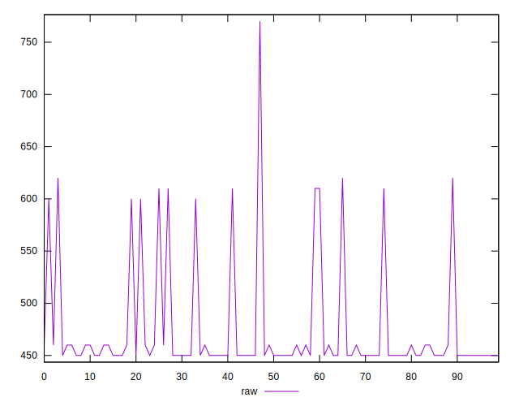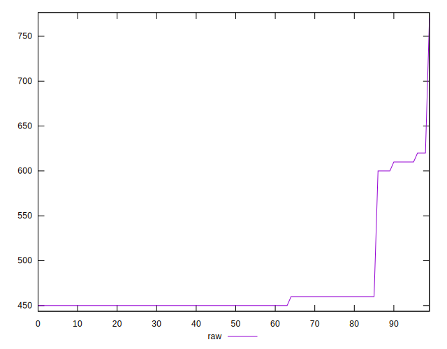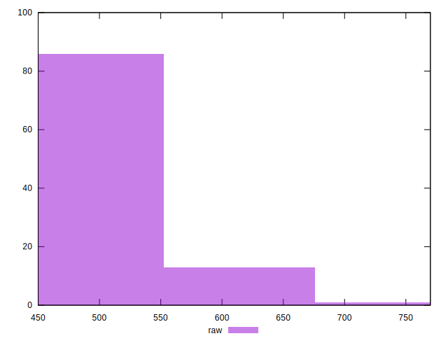
## Score


```yaml
p90min: 0.57
p90max: 0.67
p90range: 0.10000000000000009
p90mean: 0.6570212765957453
p90median: 0.67
p90stdev: 0.02868871033173093
p90skewness: -2.2951531644161163
p90eccentricity: 1.0000000000000007
p90discretization: 23.5
outlandishness: 0.9911272820348364
confidence: 0.013397841288426542
p90confidence: 0.011599123842114256

```

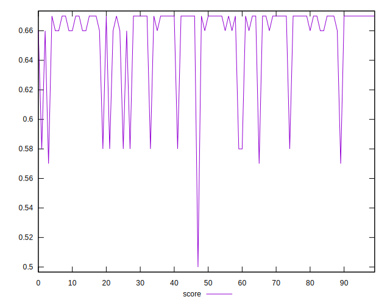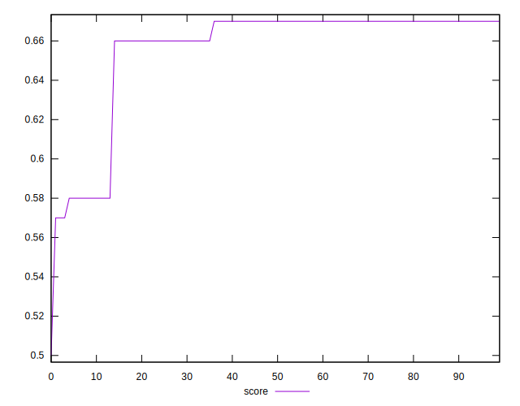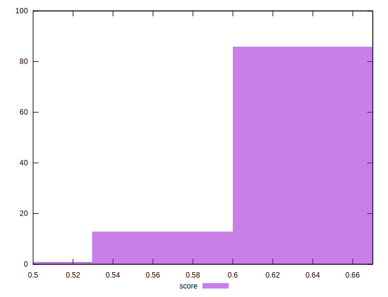
## Raw Estimate

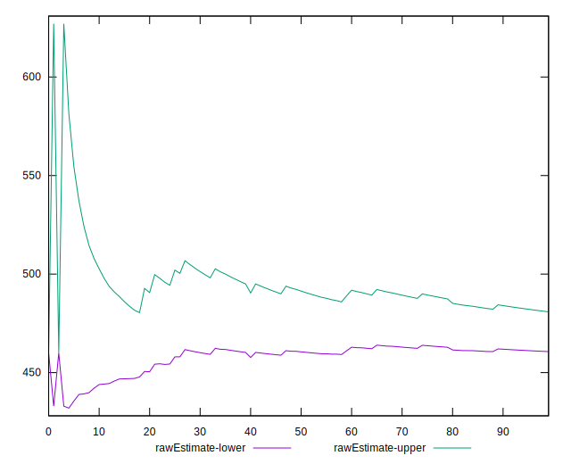
## Score Estimate

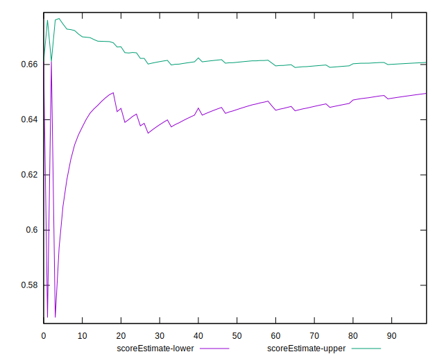
## P Score


```yaml
p90min: 0.5722222222222222
p90max: 0.6666666666666666
p90range: 0.09444444444444444
p90mean: 0.6551418439716307
p90median: 0.6666666666666666
p90stdev: 0.02773329016378084
p90skewness: -2.3597145016407453
p90eccentricity: 1
p90discretization: 18.8
outlandishness: 0.9912042499936397
confidence: 0.013025685567213573
p90confidence: 0.01121283820148546

```

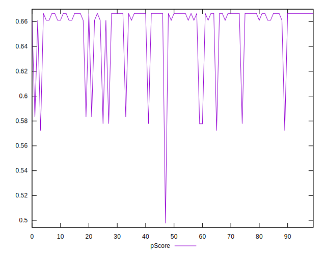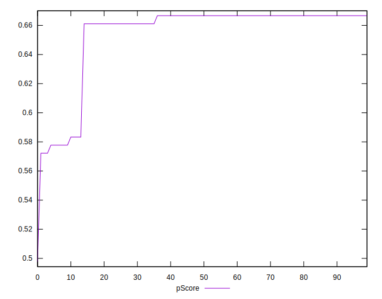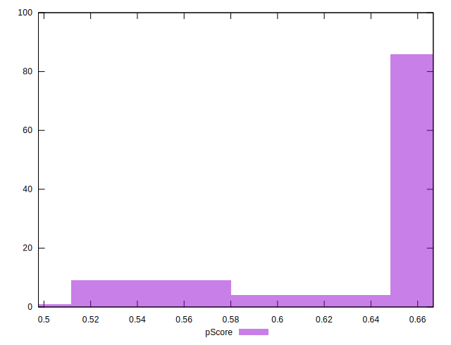
## Score Difference


```yaml
p90min: 0
p90max: 0
p90range: 0
p90mean: 0
p90median: 0
p90stdev: 0
p90skewness: .nan
p90eccentricity: .nan
p90discretization: 94
outlandishness: .inf
confidence: 7.42394611483106e-18
p90confidence: 0

```

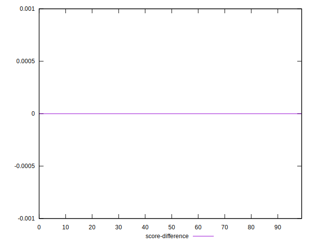
## P Score Difference


```yaml
p90min: -0.0033333333333334103
p90max: 0.0033333333333334103
p90range: 0.006666666666666821
p90mean: -0.0019635655680712615
p90median: -0.0033333333333334103
p90stdev: 0.0020721166169270348
p90skewness: 1.0177572786226707
p90eccentricity: 0.9999999999999997
p90discretization: 15.666666666666666
outlandishness: 0.8835999999999999
confidence: 0.0008694970325632427
p90confidence: 0.000837776845913358

```

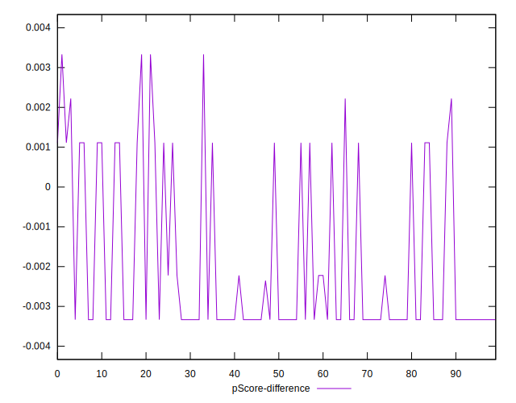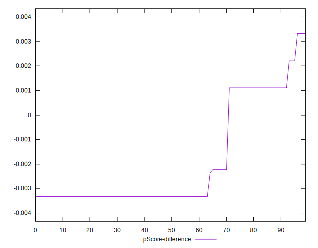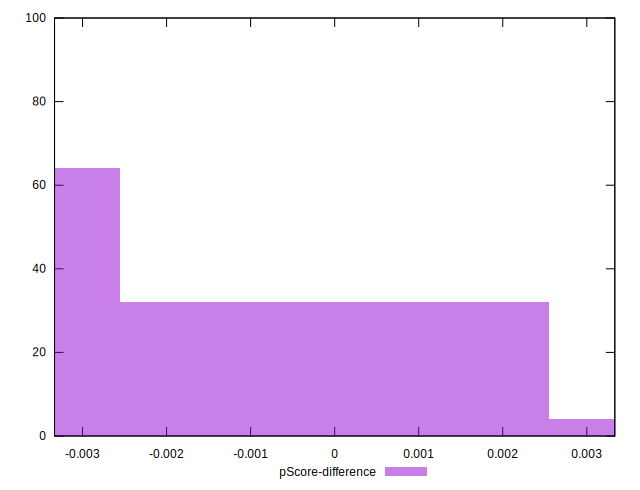