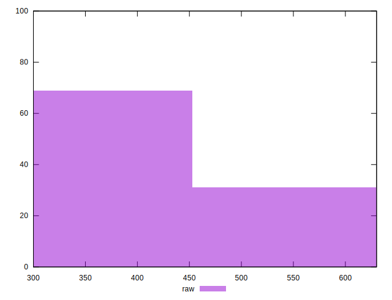

# //uses-webp-images/samples/pages+cached

[→ Parent](../..)


## Raw


```yaml
p90min: 300
p90max: 600
p90range: 300
p90mean: 414.1489361702128
p90median: 450
p90stdev: 73.6496822149127
p90skewness: -0.5198067398252669
p90eccentricity: 0.9999999999999999
p90discretization: 13.428571428571429
outlandishness: 1.0123574907216537
confidence: 32.03353528105551
p90confidence: 29.77728085595648

```


## Score


```yaml
p90min: 0.58
p90max: 0.75
p90range: 0.17000000000000004
p90mean: 0.6872340425531918
p90median: 0.67
p90stdev: 0.040275758384479846
p90skewness: 0.42291752886312955
p90eccentricity: 0.9999999999999996
p90discretization: 15.666666666666666
outlandishness: 0.9958309796509114
confidence: 0.01756705124615883
p90confidence: 0.0162838797539097

```


## Raw Estimate


## Score Estimate


## P Score


```yaml
p90min: 0.5833333333333334
p90max: 0.75
p90range: 0.16666666666666663
p90mean: 0.6865839243498815
p90median: 0.6666666666666666
p90stdev: 0.04091649011939596
p90skewness: 0.5198067398252901
p90eccentricity: 1.0000000000000004
p90discretization: 13.428571428571429
outlandishness: 0.9958758285190077
confidence: 0.017796408489475286
p90confidence: 0.016542933808864718

```


## Score Difference


```yaml
p90min: 0
p90max: 0
p90range: 0
p90mean: 0
p90median: 0
p90stdev: 0
p90skewness: .nan
p90eccentricity: .nan
p90discretization: 94
outlandishness: .inf
confidence: 4.330179641073934e-18
p90confidence: 0

```


## P Score Difference


```yaml
p90min: -0.0033333333333334103
p90max: 0.004444444444444473
p90range: 0.007777777777777883
p90mean: -0.000709219858156066
p90median: 0
p90stdev: 0.002381143989550008
p90skewness: 0.2908814494160003
p90eccentricity: 1.0000000000000002
p90discretization: 11.75
outlandishness: 0.797449000000008
confidence: 0.0009860223271941824
p90confidence: 0.0009627196099557173

```

