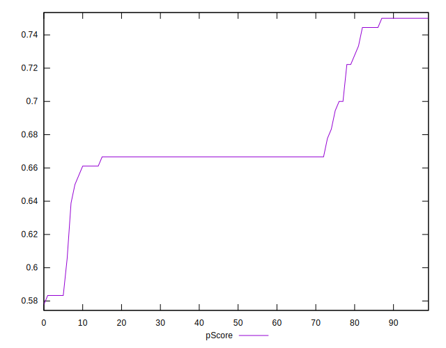

# //uses-webp-images/samples/pages

[→ Parent](../..)


## Raw


```yaml
p90min: 300
p90max: 600
p90range: 300
p90mean: 427.2340425531915
p90median: 450
p90stdev: 66.49914821593583
p90skewness: -0.434142275957241
p90eccentricity: 0.9999999999999979
p90discretization: 5.875
outlandishness: 1.006874323448239
confidence: 29.258816067859883
p90confidence: 26.886250606344802

```


## Score


```yaml
p90min: 0.58
p90max: 0.75
p90range: 0.17000000000000004
p90mean: 0.6809574468085113
p90median: 0.67
p90stdev: 0.035968933076652415
p90skewness: 0.23217351394907834
p90eccentricity: 1.0000000000000002
p90discretization: 7.230769230769231
outlandishness: 0.9971899163056973
confidence: 0.015990231364974097
p90confidence: 0.01454258850957693

```


## Raw Estimate


## Score Estimate


## P Score


```yaml
p90min: 0.5833333333333334
p90max: 0.75
p90range: 0.16666666666666663
p90mean: 0.679314420803782
p90median: 0.6666666666666666
p90stdev: 0.036943971231075436
p90skewness: 0.4341422759573003
p90eccentricity: 1.0000000000000016
p90discretization: 5.875
outlandishness: 0.9976036645775413
confidence: 0.01625489781547773
p90confidence: 0.014936805892413767

```


## Score Difference


```yaml
p90min: 0
p90max: 0
p90range: 0
p90mean: 0
p90median: 0
p90stdev: 0
p90skewness: .nan
p90eccentricity: .nan
p90discretization: 94
outlandishness: .inf
confidence: 7.42394611483106e-18
p90confidence: 0

```


## P Score Difference


```yaml
p90min: -0.0033333333333334103
p90max: 0.004444444444444473
p90range: 0.007777777777777883
p90mean: -0.0016075650118203767
p90median: -0.0033333333333334103
p90stdev: 0.00243980335945288
p90skewness: 1.0951441493360998
p90eccentricity: 1.0000000000000002
p90discretization: 10.444444444444445
outlandishness: 0.8706536548442902
confidence: 0.0010276984229837165
p90confidence: 0.0009864361621512079

```

