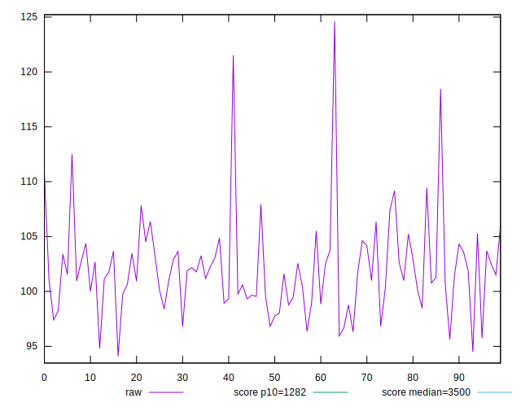
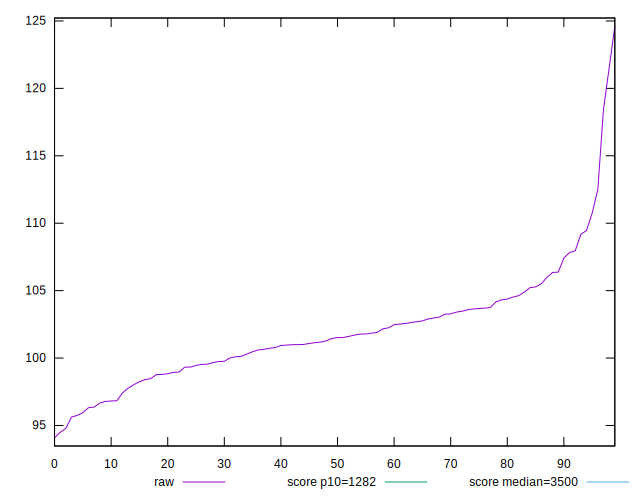
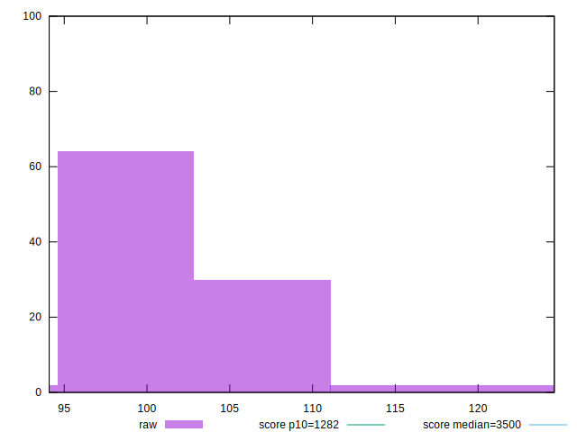
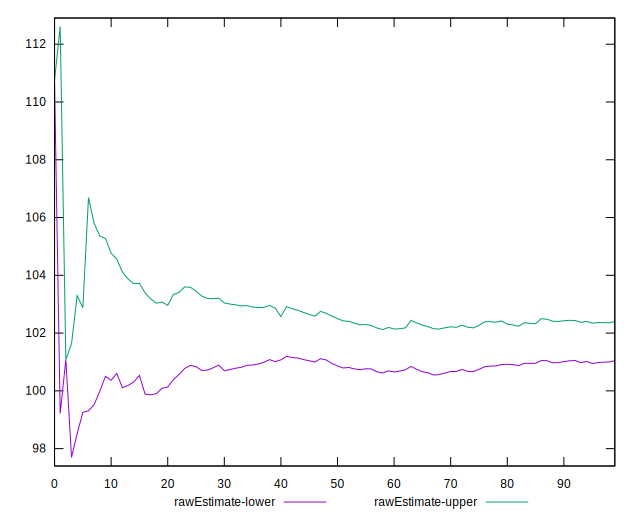
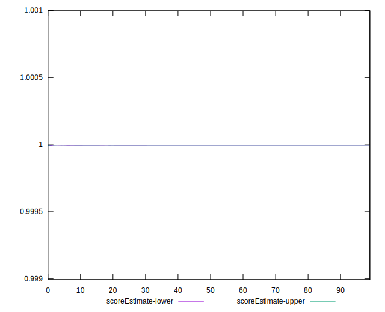
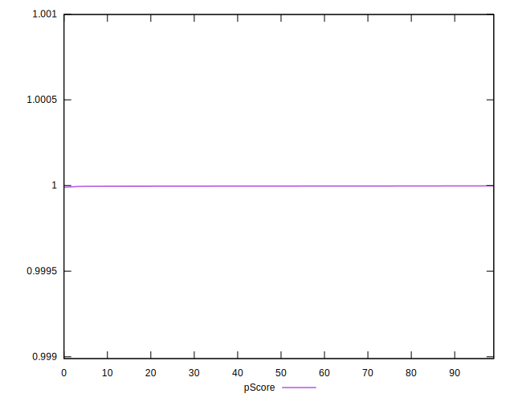
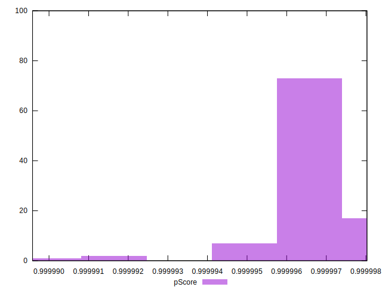
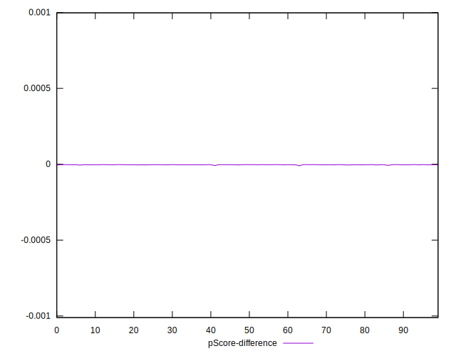
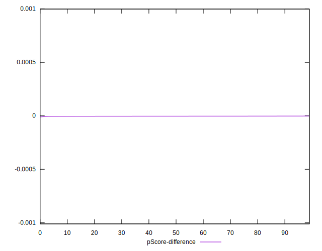
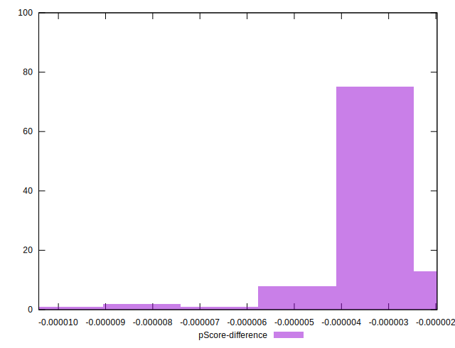

# //bootup-time/samples/pages+cached+noadtech+nomedia+nocss

[→ Parent](../..)


## Raw


```yaml
p90min: 95.62
p90max: 112.51600000000002
p90range: 16.896000000000015
p90mean: 101.72234042553191
p90median: 101.484
p90stdev: 3.343964186389432
p90skewness: 0.6187923218535136
p90eccentricity: 0.9999999999999997
p90discretization: 1
outlandishness: 1.0074106690037183
confidence: 1.916848137530075
p90confidence: 1.351997154038177

```


## Score


```yaml
p90min: 1
p90max: 1
p90range: 0
p90mean: 1
p90median: 1
p90stdev: 0
p90skewness: .nan
p90eccentricity: .nan
p90discretization: 94
outlandishness: 1
confidence: 0
p90confidence: 0

```


## Raw Estimate


## Score Estimate


## P Score


```yaml
p90min: 0.999994227752639
p90max: 0.9999978216922147
p90range: 0.000003593939575718963
p90mean: 0.9999967789988146
p90median: 0.9999968737941376
p90stdev: 6.692001406320302e-7
p90skewness: -1.1647619736986596
p90eccentricity: 0.9999999999999997
p90discretization: 1
outlandishness: 0.9999997207275448
confidence: 4.812631839154445e-7
p90confidence: 2.7056410750419634e-7

```


## Score Difference


```yaml
p90min: 0
p90max: 0
p90range: 0
p90mean: 0
p90median: 0
p90stdev: 0
p90skewness: .nan
p90eccentricity: .nan
p90discretization: 94
outlandishness: .nan
confidence: 0
p90confidence: 0

```


## P Score Difference


```yaml
p90min: -0.000005772247360980032
p90max: -0.000002178307785261069
p90range: 0.000003593939575718963
p90mean: -0.0000032210011859981683
p90median: -0.0000031262058624026423
p90stdev: 6.692001406320302e-7
p90skewness: -1.164761973179772
p90eccentricity: 1
p90discretization: 1
outlandishness: 1.0885827119271965
confidence: 4.812631839154447e-7
p90confidence: 2.7056410750419634e-7

```

