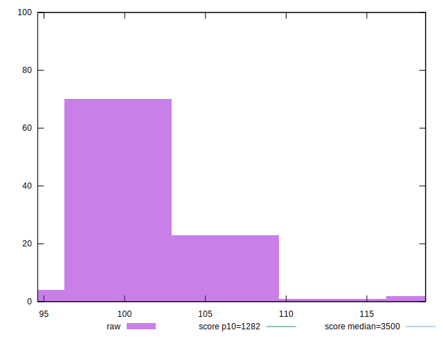

# //bootup-time/samples/pages+cached+noadtech+nomedia

[→ Parent](../..)


## Raw


```yaml
p90min: 95.98800000000001
p90max: 108.88
p90range: 12.891999999999982
p90mean: 101.29489361702122
p90median: 101.44
p90stdev: 2.6983651727859073
p90skewness: 0.35146210110959764
p90eccentricity: 1
p90discretization: 1.010752688172043
outlandishness: 1.0048951936062447
confidence: 1.4846579037129068
p90confidence: 1.090975211101564

```


## Score


```yaml
p90min: 1
p90max: 1
p90range: 0
p90mean: 1
p90median: 1
p90stdev: 0
p90skewness: .nan
p90eccentricity: .nan
p90discretization: 94
outlandishness: 1
confidence: 0
p90confidence: 0

```


## Raw Estimate


## Score Estimate


## P Score


```yaml
p90min: 0.9999952428078964
p90max: 0.9999977699344998
p90range: 0.0000025271266034243567
p90mean: 0.9999968768562365
p90median: 0.9999968819385223
p90stdev: 5.115078854575321e-7
p90skewness: -0.6559123264431634
p90eccentricity: 0.9999999999999999
p90discretization: 1.0444444444444445
outlandishness: 0.9999998374842413
confidence: 3.3089769633865366e-7
p90confidence: 2.068075992624078e-7

```


## Score Difference


```yaml
p90min: 0
p90max: 0
p90range: 0
p90mean: 0
p90median: 0
p90stdev: 0
p90skewness: .nan
p90eccentricity: .nan
p90discretization: 94
outlandishness: .nan
confidence: 0
p90confidence: 0

```


## P Score Difference


```yaml
p90min: -0.000004757192103577168
p90max: -0.0000022300655001528114
p90range: 0.0000025271266034243567
p90mean: -0.0000031231437631665307
p90median: -0.000003118061477735967
p90stdev: 5.115078854575318e-7
p90skewness: -0.6559123283688977
p90eccentricity: 1.0000000000000002
p90discretization: 1.0444444444444445
outlandishness: 1.0527127225179265
confidence: 3.3089769633865355e-7
p90confidence: 2.0680759926240772e-7

```

