# //bootup-time/samples/pages+cached+noadtech

[→ Parent](../..)


## Raw


```yaml
p90min: 94.60400000000003
p90max: 114.06
p90range: 19.455999999999975
p90mean: 101.42446808510645
p90median: 101.48400000000001
p90stdev: 3.1869657873646036
p90skewness: 0.8145460109203163
p90eccentricity: 0.9999999999999996
p90discretization: 1
outlandishness: 1.0052895659343744
confidence: 1.7119229500597832
p90confidence: 1.288521178567488

```

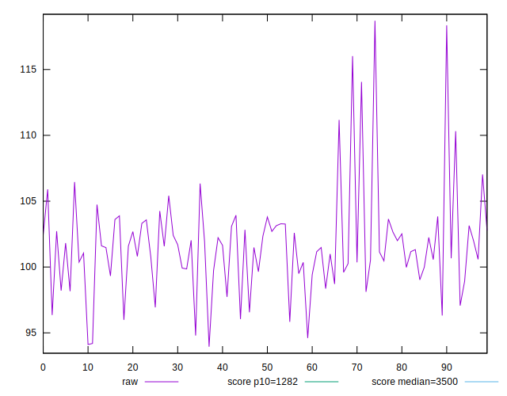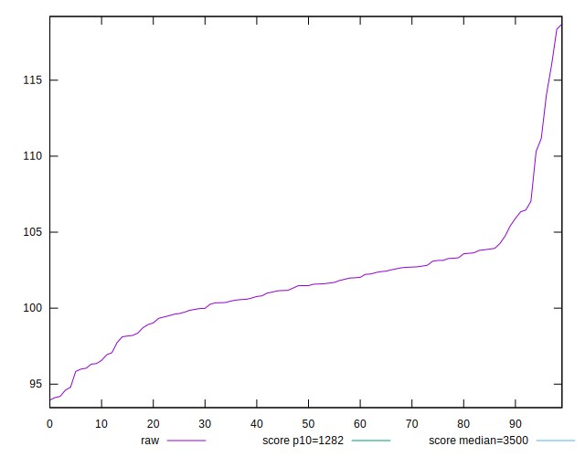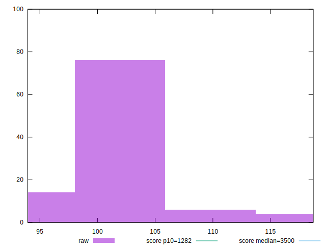
## Score


```yaml
p90min: 1
p90max: 1
p90range: 0
p90mean: 1
p90median: 1
p90stdev: 0
p90skewness: .nan
p90eccentricity: .nan
p90discretization: 94
outlandishness: 1
confidence: 0
p90confidence: 0

```


## Raw Estimate

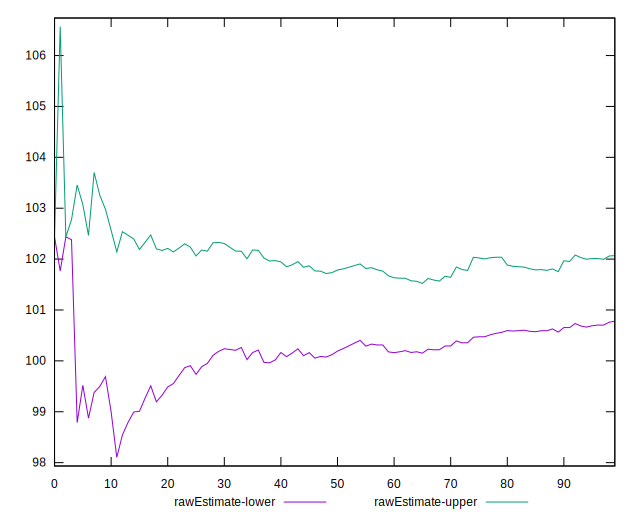
## Score Estimate

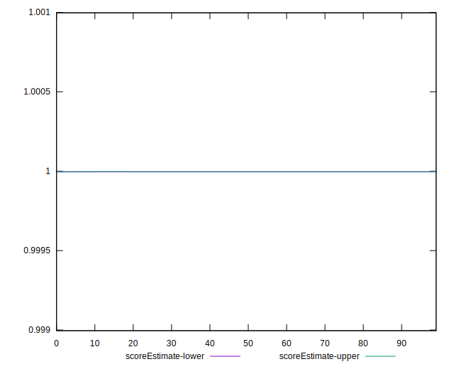
## P Score


```yaml
p90min: 0.9999937485657022
p90max: 0.9999979596483641
p90range: 0.00000421108266190906
p90mean: 0.9999968392661436
p90median: 0.9999968737985967
p90stdev: 6.419018380557146e-7
p90skewness: -1.7544705702254118
p90eccentricity: 1.0000000000000007
p90discretization: 1.010752688172043
outlandishness: 0.999999810214271
confidence: 3.90853858203328e-7
p90confidence: 2.5952713900331613e-7

```

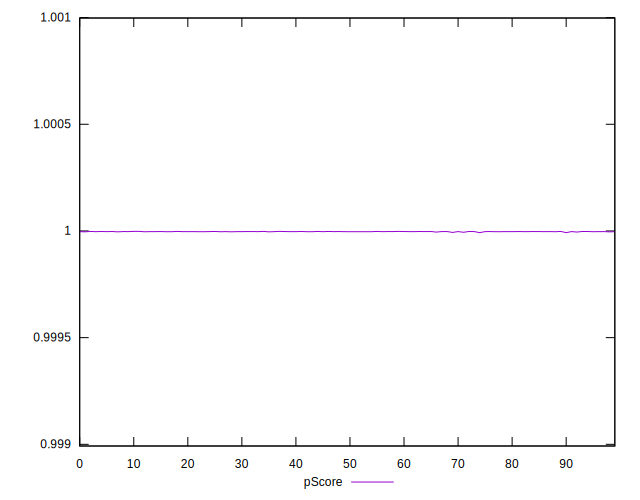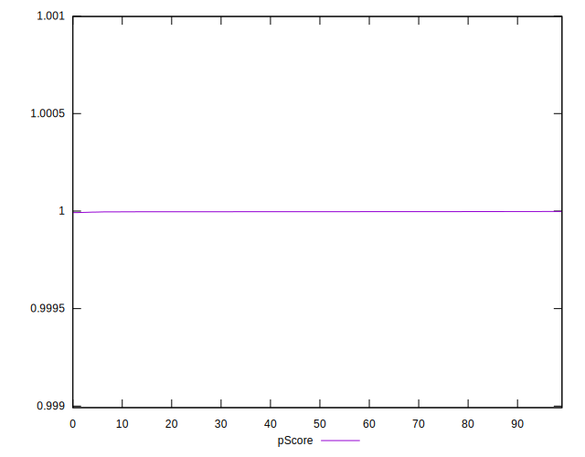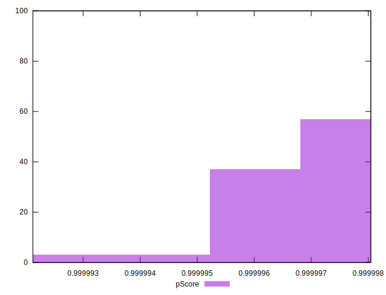
## Score Difference


```yaml
p90min: 0
p90max: 0
p90range: 0
p90mean: 0
p90median: 0
p90stdev: 0
p90skewness: .nan
p90eccentricity: .nan
p90discretization: 94
outlandishness: .nan
confidence: 0
p90confidence: 0

```


## P Score Difference


```yaml
p90min: -0.000006251434297777081
p90max: -0.0000020403516358680207
p90range: 0.00000421108266190906
p90mean: -0.000003160733856387875
p90median: -0.000003126201403302886
p90stdev: 6.419018380557145e-7
p90skewness: -1.7544705714232416
p90eccentricity: 1.0000000000000002
p90discretization: 1.010752688172043
outlandishness: 1.0609459834884527
confidence: 3.9085385820332793e-7
p90confidence: 2.595271390033161e-7

```

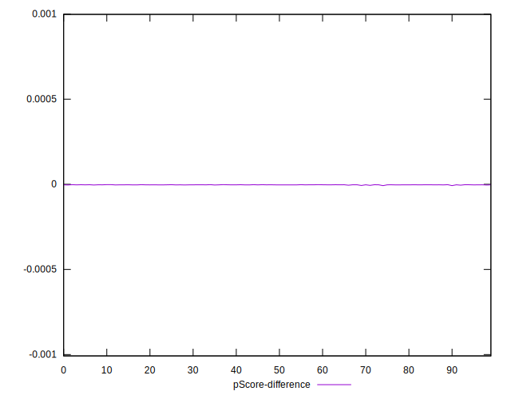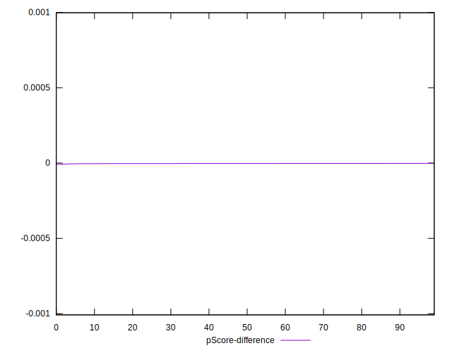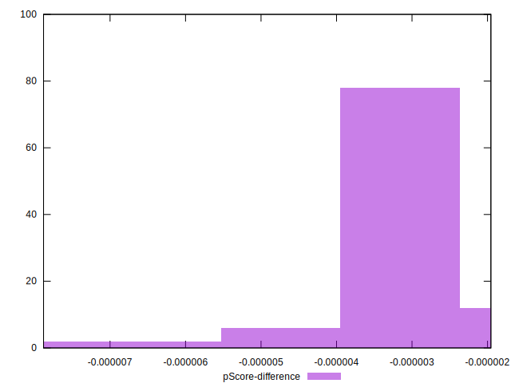