# //bootup-time/samples/pages+cached

[→ Parent](../..)


## Raw


```yaml
p90min: 621.1360000000001
p90max: 668.0920000000002
p90range: 46.95600000000013
p90mean: 636.5752765957448
p90median: 634.0440000000003
p90stdev: 11.250042821104552
p90skewness: 0.9333378598523925
p90eccentricity: 0.9999999999999996
p90discretization: 1
outlandishness: 1.0101383172125185
confidence: 12.501012995409011
p90confidence: 4.5485014279903675

```

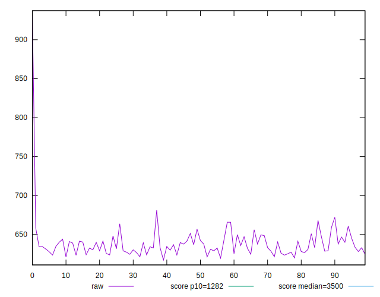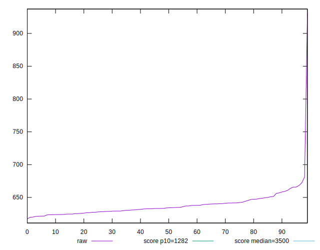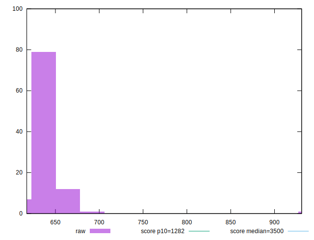
## Score


```yaml
p90min: 0.98
p90max: 0.99
p90range: 0.010000000000000009
p90mean: 0.9862765957446802
p90median: 0.99
p90stdev: 0.004834284156383737
p90skewness: -0.5281426177624561
p90eccentricity: 0.9999999999999983
p90discretization: 47
outlandishness: 0.9992364741342732
confidence: 0.0023581551664037794
p90confidence: 0.001954547972686182

```

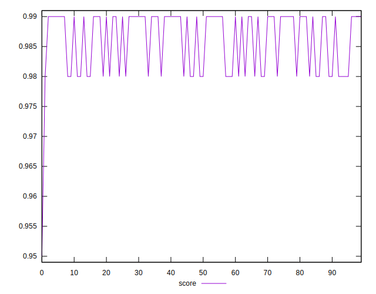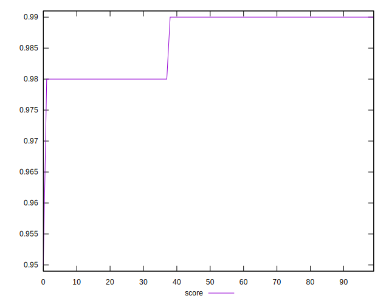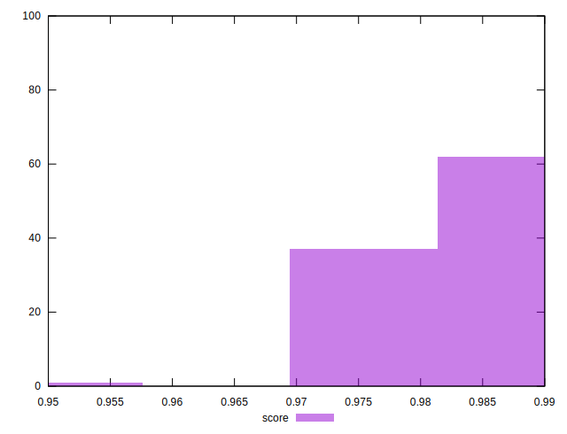
## Raw Estimate

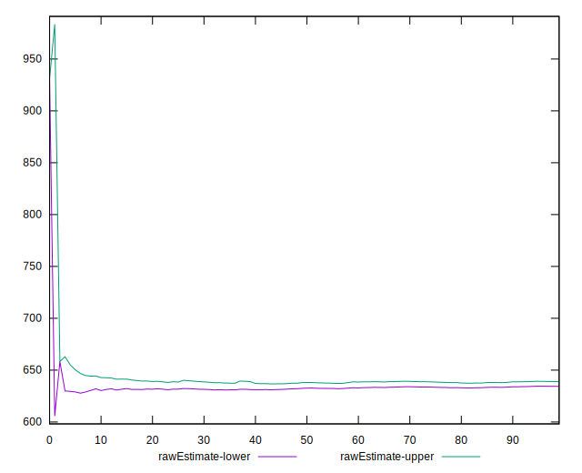
## Score Estimate

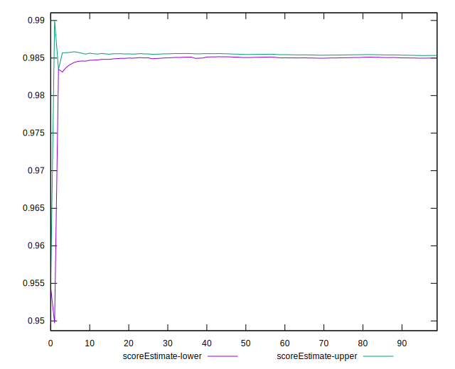
## P Score


```yaml
p90min: 0.9827079389193064
p90max: 0.9863144699208798
p90range: 0.0036065310015733765
p90mean: 0.9851662805248087
p90median: 0.9853690237758218
p90stdev: 0.0008576862438697155
p90skewness: -1.000342000812651
p90eccentricity: 1.0000000000000004
p90discretization: 1
outlandishness: 0.9993274768598059
confidence: 0.001255509893070409
p90confidence: 0.0003467708671908921

```

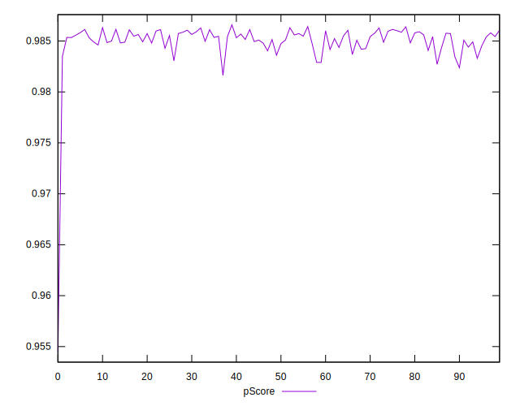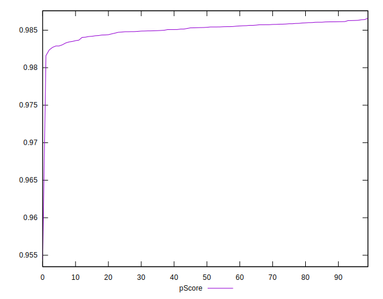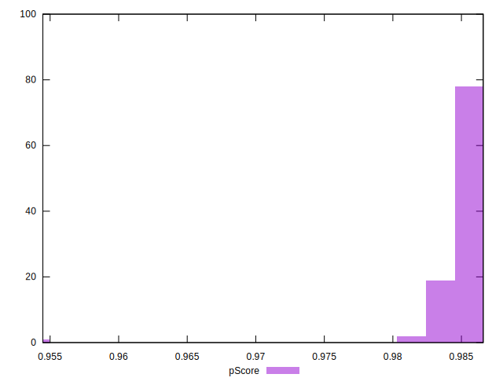
## Score Difference


```yaml
p90min: 0
p90max: 0
p90range: 0
p90mean: 0
p90median: 0
p90stdev: 0
p90skewness: .nan
p90eccentricity: .nan
p90discretization: 94
outlandishness: .inf
confidence: 4.330179641073934e-18
p90confidence: 0

```


## P Score Difference


```yaml
p90min: -0.004907216795537073
p90max: 0.004924640933983149
p90range: 0.009831857729520221
p90mean: -0.0011345781182920637
p90median: -0.003886050426184784
p90stdev: 0.004058134132204975
p90skewness: 0.5578177107928338
p90eccentricity: 0.9999999999999994
p90discretization: 1
outlandishness: 0.8811912344207963
confidence: 0.0016172440951334936
p90confidence: 0.0016407429899452145

```

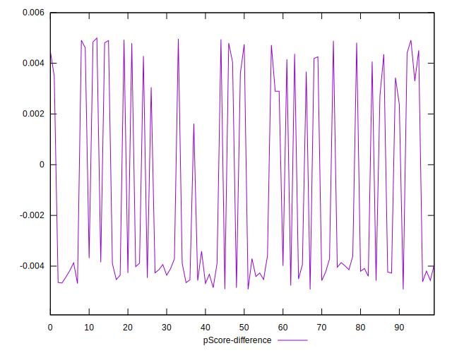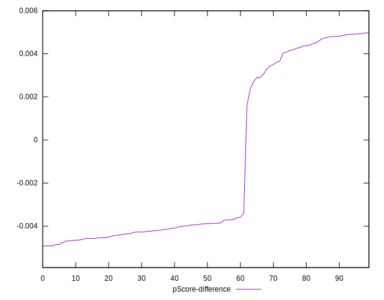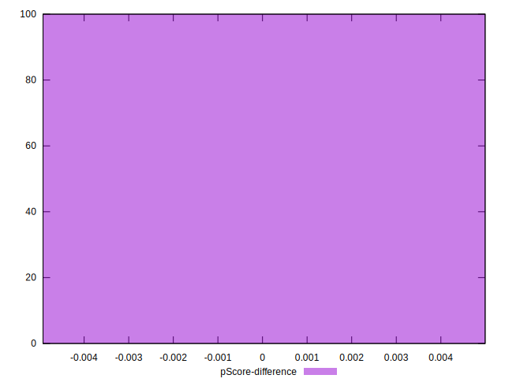