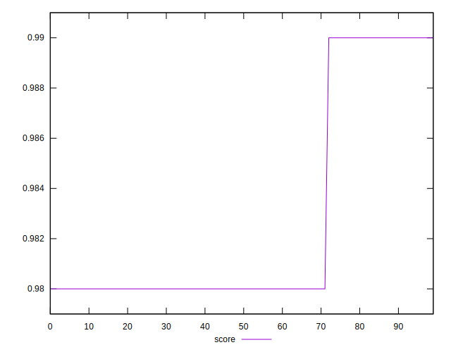
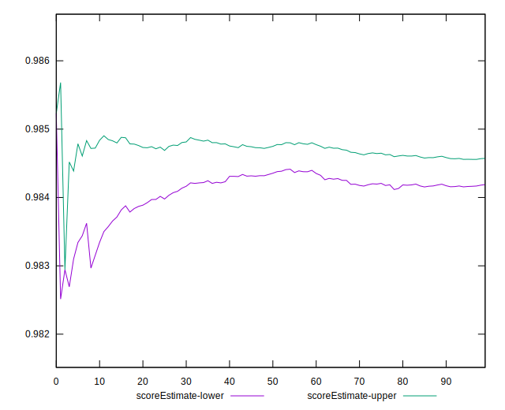
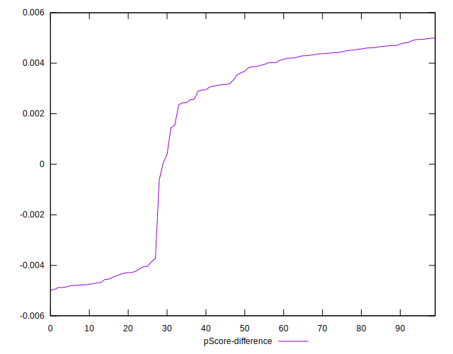

# //bootup-time/samples/pages

[→ Parent](../..)


## Raw


```yaml
p90min: 626.0480000000003
p90max: 683.3240000000006
p90range: 57.276000000000295
p90mean: 647.0583829787237
p90median: 645.3560000000003
p90stdev: 12.290840198680378
p90skewness: 0.7428455246450675
p90eccentricity: 0.9999999999999997
p90discretization: 1.010752688172043
outlandishness: 1.0027987882655474
confidence: 6.12611302823358
p90confidence: 4.969305902553912

```


## Score


```yaml
p90min: 0.98
p90max: 0.99
p90range: 0.010000000000000009
p90mean: 0.9826595744680848
p90median: 0.98
p90stdev: 0.004418416948360679
p90skewness: 1.059395507154799
p90eccentricity: 1.0000000000000007
p90discretization: 47
outlandishness: 1.0002858275016435
confidence: 0.0017600432929356436
p90confidence: 0.00178640882694011

```


## Raw Estimate


## Score Estimate


## P Score


```yaml
p90min: 0.9814394222164682
p90max: 0.9859588137404319
p90range: 0.004519391523963745
p90mean: 0.9843646701250814
p90median: 0.9845117656294728
p90stdev: 0.0009622359469511438
p90skewness: -0.8254312852943505
p90eccentricity: 1.0000000000000002
p90discretization: 1.010752688172043
outlandishness: 0.9998380087261
confidence: 0.0004879872602467091
p90confidence: 0.0003890413261859233

```


## Score Difference


```yaml
p90min: 0
p90max: 0
p90range: 0
p90mean: 0
p90median: 0
p90stdev: 0
p90skewness: .nan
p90eccentricity: .nan
p90discretization: 94
outlandishness: .nan
confidence: 0
p90confidence: 0

```


## P Score Difference


```yaml
p90min: -0.004874073977398474
p90max: 0.004944048184619687
p90range: 0.009818122162018161
p90mean: 0.001578259219732854
p90median: 0.003648358523322459
p90stdev: 0.00377470119361223
p90skewness: -0.8773937320502089
p90eccentricity: 0.9999999999999999
p90discretization: 1.010752688172043
outlandishness: 0.8852374304868073
confidence: 0.001518501732504296
p90confidence: 0.0015261483038245417

```

