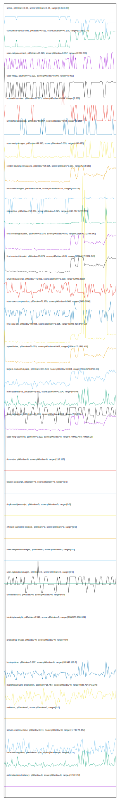

# //correlation/pages+cached+noadtech

[→ Parent](../..)

[0. score, p90stdev=0.01, score:p90stdev=0.01, range=[0.63:0.69]](../../meta/score/samples/pages+cached+noadtech)  
[1. cumulative-layout-shift, p90stdev=0.521, score:p90stdev=0.106, range=[0.394:1.75]](../../cumulative-layout-shift/samples/pages+cached+noadtech/)  
[2. uses-rel-preconnect, p90stdev=68.128, score:p90stdev=0.057, range=[0:206.276]](../../uses-rel-preconnect/samples/pages+cached+noadtech/)  
[3. uses-http2, p90stdev=70.321, score:p90stdev=0.056, range=[0:450]](../../uses-http2/samples/pages+cached+noadtech/)  
[4. unused-css-rules, p90stdev=67.871, score:p90stdev=0.054, range=[0:300]](../../unused-css-rules/samples/pages+cached+noadtech/)  
[5. unminified-javascript, p90stdev=50.057, score:p90stdev=0.04, range=[0:160]](../../unminified-javascript/samples/pages+cached+noadtech/)  
[6. uses-webp-images, p90stdev=56.393, score:p90stdev=0.033, range=[450:650]](../../uses-webp-images/samples/pages+cached+noadtech/)  
[7. render-blocking-resources, p90stdev=54.615, score:p90stdev=0.031, range=[314:631]](../../render-blocking-resources/samples/pages+cached+noadtech/)  
[8. offscreen-images, p90stdev=34.44, score:p90stdev=0.03, range=[150:320]](../../offscreen-images/samples/pages+cached+noadtech/)  
[9. interactive, p90stdev=213.384, score:p90stdev=0.025, range=[4197.717:6722.227]](../../interactive/samples/pages+cached+noadtech/)  
[10. first-meaningful-paint, p90stdev=79.079, score:p90stdev=0.01, range=[1896.417:2339.843]](../../first-meaningful-paint/samples/pages+cached+noadtech/)  
[11. first-contentful-paint, p90stdev=79.079, score:p90stdev=0.01, range=[1896.417:2339.843]](../../first-contentful-paint/samples/pages+cached+noadtech/)  
[12. unused-javascript, p90stdev=71.501, score:p90stdev=0.009, range=[2000:2290]](../../unused-javascript/samples/pages+cached+noadtech/)  
[13. uses-text-compression, p90stdev=71.679, score:p90stdev=0.008, range=[2460:2850]](../../uses-text-compression/samples/pages+cached+noadtech/)  
[14. first-cpu-idle, p90stdev=89.093, score:p90stdev=0.005, range=[1896.417:6497.22]](../../first-cpu-idle/samples/pages+cached+noadtech/)  
[15. speed-index, p90stdev=79.079, score:p90stdev=0.005, range=[1896.417:2539.418]](../../speed-index/samples/pages+cached+noadtech/)  
[16. largest-contentful-paint, p90stdev=134.873, score:p90stdev=0.004, range=[7633.829:8210.03]](../../largest-contentful-paint/samples/pages+cached+noadtech/)  
[17. max-potential-fid, p90stdev=2.852, score:p90stdev=0.004, range=[64:84]](../../max-potential-fid/samples/pages+cached+noadtech/)  
[18. uses-rel-preload, p90stdev=14.403, score:p90stdev=0.004, range=[754:835]](../../uses-rel-preload/samples/pages+cached+noadtech/)  
[19. uses-long-cache-ttl, p90stdev=0.522, score:p90stdev=0, range=[784462.483:784856.25]](../../uses-long-cache-ttl/samples/pages+cached+noadtech/)  
[20. uses-passive-event-listeners, p90stdev=NaN, score:p90stdev=0, range=[NaN:NaN]](../../uses-passive-event-listeners/samples/pages+cached+noadtech/)  
[21. no-document-write, p90stdev=NaN, score:p90stdev=0, range=[NaN:NaN]](../../no-document-write/samples/pages+cached+noadtech/)  
[22. dom-size, p90stdev=0, score:p90stdev=0, range=[110:110]](../../dom-size/samples/pages+cached+noadtech/)  
[23. legacy-javascript, p90stdev=0, score:p90stdev=0, range=[0:0]](../../legacy-javascript/samples/pages+cached+noadtech/)  
[24. duplicated-javascript, p90stdev=0, score:p90stdev=0, range=[0:0]](../../duplicated-javascript/samples/pages+cached+noadtech/)  
[25. efficient-animated-content, p90stdev=0, score:p90stdev=0, range=[0:0]](../../efficient-animated-content/samples/pages+cached+noadtech/)  
[26. uses-responsive-images, p90stdev=0, score:p90stdev=0, range=[0:0]](../../uses-responsive-images/samples/pages+cached+noadtech/)  
[27. uses-optimized-images, p90stdev=0, score:p90stdev=0, range=[0:0]](../../uses-optimized-images/samples/pages+cached+noadtech/)  
[28. unminified-css, p90stdev=0, score:p90stdev=0, range=[0:0]](../../unminified-css/samples/pages+cached+noadtech/)  
[29. total-byte-weight, p90stdev=0.591, score:p90stdev=0, range=[1060573:1061159]](../../total-byte-weight/samples/pages+cached+noadtech/)  
[30. preload-lcp-image, p90stdev=0, score:p90stdev=0, range=[0:0]](../../preload-lcp-image/samples/pages+cached+noadtech/)  
[31. unsized-images, p90stdev=NaN, score:p90stdev=0, range=[NaN:NaN]](../../unsized-images/samples/pages+cached+noadtech/)  
[32. third-party-summary, p90stdev=NaN, score:p90stdev=0, range=[NaN:NaN]](../../third-party-summary/samples/pages+cached+noadtech/)  
[33. font-display, p90stdev=NaN, score:p90stdev=0, range=[NaN:NaN]](../../font-display/samples/pages+cached+noadtech/)  
[34. bootup-time, p90stdev=3.187, score:p90stdev=0, range=[93.948:118.7]](../../bootup-time/samples/pages+cached+noadtech/)  
[35. mainthread-work-breakdown, p90stdev=16.457, score:p90stdev=0, range=[582.704:743.276]](../../mainthread-work-breakdown/samples/pages+cached+noadtech/)  
[36. redirects, p90stdev=0, score:p90stdev=0, range=[0:0]](../../redirects/samples/pages+cached+noadtech/)  
[37. server-response-time, p90stdev=0.41, score:p90stdev=0, range=[1.741:78.487]](../../server-response-time/samples/pages+cached+noadtech/)  
[38. total-blocking-time, p90stdev=1.426, score:p90stdev=0, range=[7:17]](../../total-blocking-time/samples/pages+cached+noadtech/)  
[39. estimated-input-latency, p90stdev=0, score:p90stdev=0, range=[12.8:12.8]](../../estimated-input-latency/samples/pages+cached+noadtech/)  
