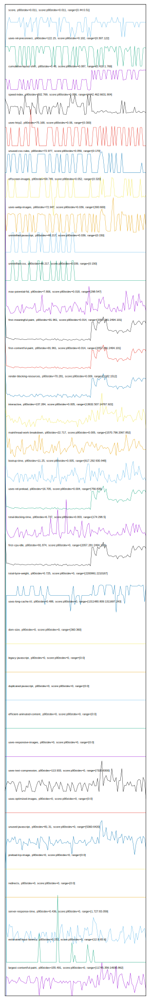

# //correlation/pages+cached

[→ Parent](../..)

[0. score, p90stdev=0.011, score:p90stdev=0.011, range=[0.44:0.51]](../../meta/score/samples/pages+cached)  
[1. third-party-summary, p90stdev=NaN, score:p90stdev=0.176, range=[NaN:NaN]](../../third-party-summary/samples/pages+cached/)  
[2. uses-rel-preconnect, p90stdev=122.15, score:p90stdev=0.102, range=[0:307.122]](../../uses-rel-preconnect/samples/pages+cached/)  
[3. cumulative-layout-shift, p90stdev=0.48, score:p90stdev=0.087, range=[0.419:1.769]](../../cumulative-layout-shift/samples/pages+cached/)  
[4. speed-index, p90stdev=502.769, score:p90stdev=0.086, range=[4442.462:6631.904]](../../speed-index/samples/pages+cached/)  
[5. uses-http2, p90stdev=75.168, score:p90stdev=0.06, range=[0:300]](../../uses-http2/samples/pages+cached/)  
[6. unused-css-rules, p90stdev=72.977, score:p90stdev=0.059, range=[0:170]](../../unused-css-rules/samples/pages+cached/)  
[7. offscreen-images, p90stdev=59.749, score:p90stdev=0.052, range=[0:320]](../../offscreen-images/samples/pages+cached/)  
[8. uses-webp-images, p90stdev=72.947, score:p90stdev=0.039, range=[300:600]](../../uses-webp-images/samples/pages+cached/)  
[9. unminified-javascript, p90stdev=48.217, score:p90stdev=0.039, range=[0:150]](../../unminified-javascript/samples/pages+cached/)  
[10. unminified-css, p90stdev=48.217, score:p90stdev=0.039, range=[0:150]](../../unminified-css/samples/pages+cached/)  
[11. max-potential-fid, p90stdev=7.806, score:p90stdev=0.018, range=[298:547]](../../max-potential-fid/samples/pages+cached/)  
[12. first-meaningful-paint, p90stdev=91.961, score:p90stdev=0.014, range=[2057.281:2494.101]](../../first-meaningful-paint/samples/pages+cached/)  
[13. first-contentful-paint, p90stdev=91.961, score:p90stdev=0.014, range=[2057.281:2494.101]](../../first-contentful-paint/samples/pages+cached/)  
[14. render-blocking-resources, p90stdev=70.281, score:p90stdev=0.009, range=[1182:1512]](../../render-blocking-resources/samples/pages+cached/)  
[15. interactive, p90stdev=137.284, score:p90stdev=0.005, range=[13632.507:14767.922]](../../interactive/samples/pages+cached/)  
[16. mainthread-work-breakdown, p90stdev=22.717, score:p90stdev=0.005, range=[1570.796:2067.852]](../../mainthread-work-breakdown/samples/pages+cached/)  
[17. bootup-time, p90stdev=11.25, score:p90stdev=0.005, range=[617.292:930.948]](../../bootup-time/samples/pages+cached/)  
[18. uses-rel-preload, p90stdev=16.705, score:p90stdev=0.004, range=[756:835]](../../uses-rel-preload/samples/pages+cached/)  
[19. total-blocking-time, p90stdev=6.737, score:p90stdev=0.003, range=[174:298.5]](../../total-blocking-time/samples/pages+cached/)  
[20. first-cpu-idle, p90stdev=91.874, score:p90stdev=0, range=[2057.281:2494.101]](../../first-cpu-idle/samples/pages+cached/)  
[21. total-byte-weight, p90stdev=0.725, score:p90stdev=0, range=[2200991:2210167]](../../total-byte-weight/samples/pages+cached/)  
[22. uses-long-cache-ttl, p90stdev=0.488, score:p90stdev=0, range=[1311480.809:1311697.243]](../../uses-long-cache-ttl/samples/pages+cached/)  
[23. uses-passive-event-listeners, p90stdev=NaN, score:p90stdev=0, range=[NaN:NaN]](../../uses-passive-event-listeners/samples/pages+cached/)  
[24. no-document-write, p90stdev=NaN, score:p90stdev=0, range=[NaN:NaN]](../../no-document-write/samples/pages+cached/)  
[25. dom-size, p90stdev=0, score:p90stdev=0, range=[360:360]](../../dom-size/samples/pages+cached/)  
[26. legacy-javascript, p90stdev=0, score:p90stdev=0, range=[0:0]](../../legacy-javascript/samples/pages+cached/)  
[27. duplicated-javascript, p90stdev=0, score:p90stdev=0, range=[0:0]](../../duplicated-javascript/samples/pages+cached/)  
[28. efficient-animated-content, p90stdev=0, score:p90stdev=0, range=[0:0]](../../efficient-animated-content/samples/pages+cached/)  
[29. uses-responsive-images, p90stdev=0, score:p90stdev=0, range=[0:0]](../../uses-responsive-images/samples/pages+cached/)  
[30. uses-text-compression, p90stdev=113.933, score:p90stdev=0, range=[7320:8300]](../../uses-text-compression/samples/pages+cached/)  
[31. uses-optimized-images, p90stdev=0, score:p90stdev=0, range=[0:0]](../../uses-optimized-images/samples/pages+cached/)  
[32. unused-javascript, p90stdev=81.31, score:p90stdev=0, range=[5360:6420]](../../unused-javascript/samples/pages+cached/)  
[33. preload-lcp-image, p90stdev=0, score:p90stdev=0, range=[0:0]](../../preload-lcp-image/samples/pages+cached/)  
[34. unsized-images, p90stdev=NaN, score:p90stdev=0, range=[NaN:NaN]](../../unsized-images/samples/pages+cached/)  
[35. font-display, p90stdev=NaN, score:p90stdev=0, range=[NaN:NaN]](../../font-display/samples/pages+cached/)  
[36. redirects, p90stdev=0, score:p90stdev=0, range=[0:0]](../../redirects/samples/pages+cached/)  
[37. server-response-time, p90stdev=0.436, score:p90stdev=0, range=[1.727:83.059]](../../server-response-time/samples/pages+cached/)  
[38. estimated-input-latency, p90stdev=0.232, score:p90stdev=0, range=[12.8:65.6]](../../estimated-input-latency/samples/pages+cached/)  
[39. largest-contentful-paint, p90stdev=155.491, score:p90stdev=0, range=[11745.356:14930.862]](../../largest-contentful-paint/samples/pages+cached/)  
