# //cumulative-layout-shift/samples/pages+cached+noadtech+nomedia+nocss

[→ Parent](../..)


## Raw


```yaml
p90min: 0.6958385416666666
p90max: 3.864670138888889
p90range: 3.1688315972222227
p90mean: 1.2352141326832118
p90median: 0.6958385416666666
p90stdev: 1.1909090592481013
p90skewness: 1.7550294029241251
p90eccentricity: 1.0000000000000016
p90discretization: 47
outlandishness: 1.104101584788427
confidence: 0.48730016280566424
p90confidence: 0.48149608341355776

```

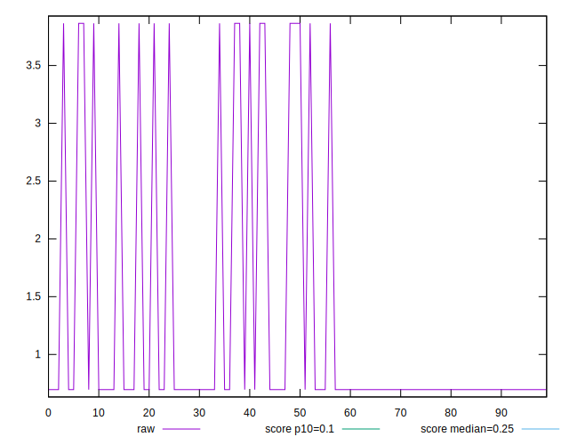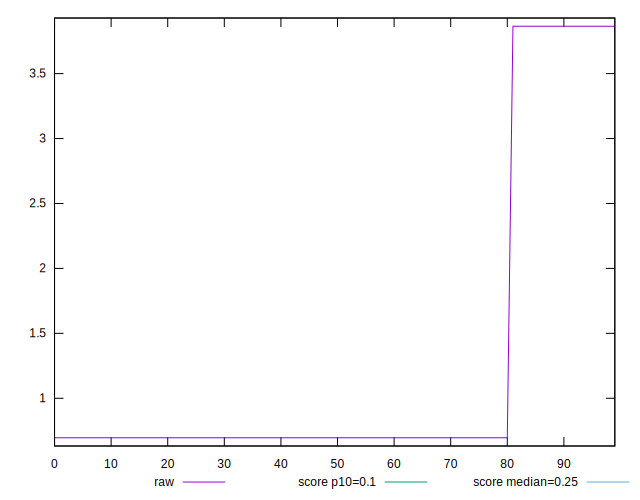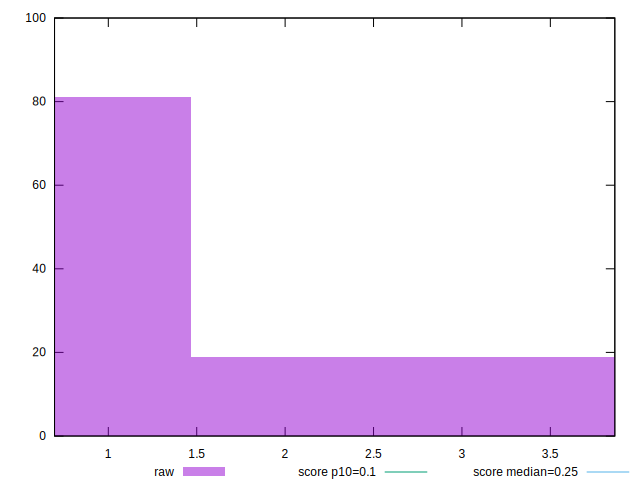
## Score


```yaml
p90min: 0
p90max: 0.08
p90range: 0.08
p90mean: 0.06638297872340429
p90median: 0.08
p90stdev: 0.030065568906647983
p90skewness: -1.7550294029241227
p90eccentricity: 1.0000000000000002
p90discretization: 47
outlandishness: 0.952876331360947
confidence: 0.012302330315888756
p90confidence: 0.012155801118257826

```

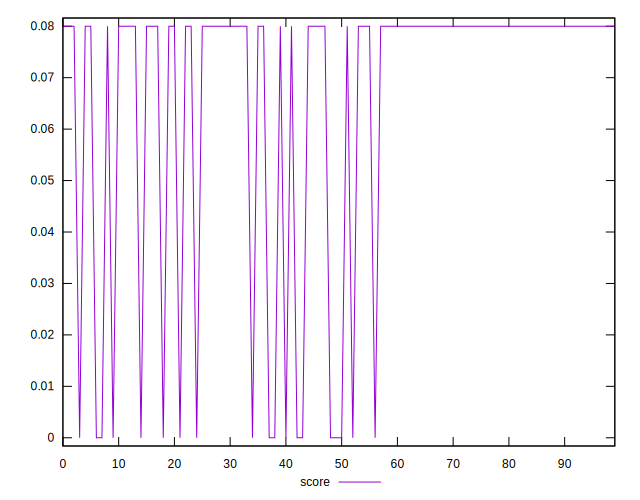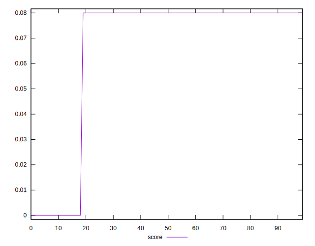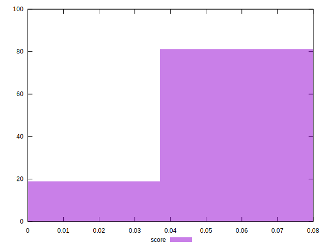
## Raw Estimate

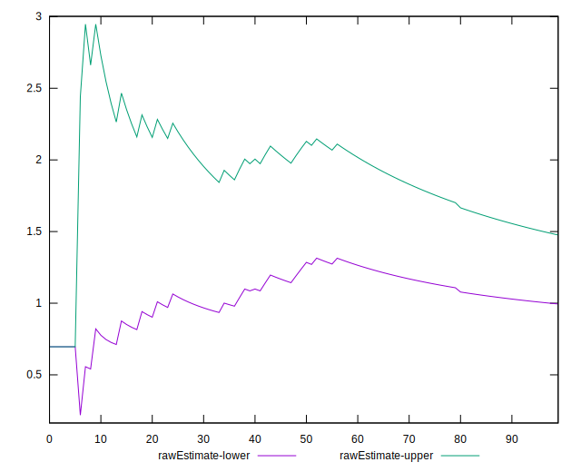
## Score Estimate

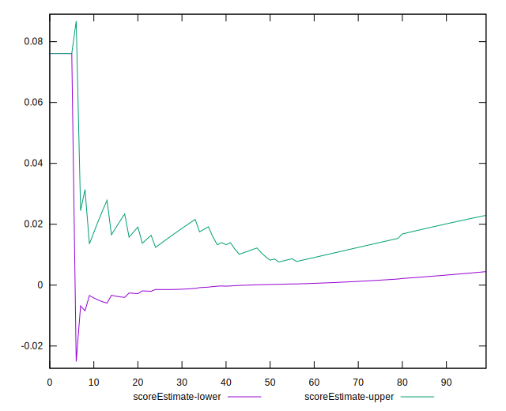
## P Score


```yaml
p90min: 0.00006417586681428666
p90max: 0.07611248195409825
p90range: 0.07604830608728397
p90mean: 0.06316808942860305
p90median: 0.07611248195409825
p90stdev: 0.028580444836263666
p90skewness: -1.755029402924116
p90eccentricity: 0.9999999999999988
p90discretization: 47
outlandishness: 0.9529236297117498
confidence: 0.011694642268119757
p90confidence: 0.011555351052217748

```

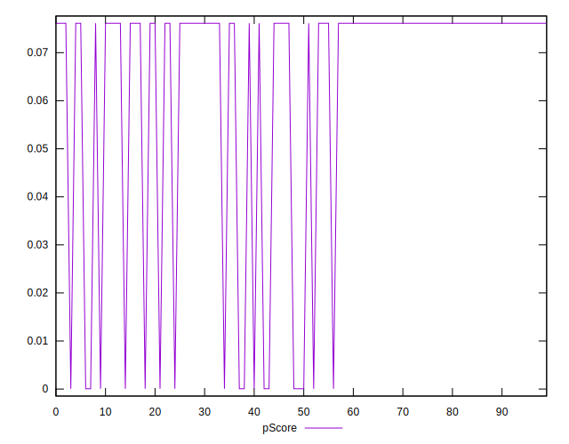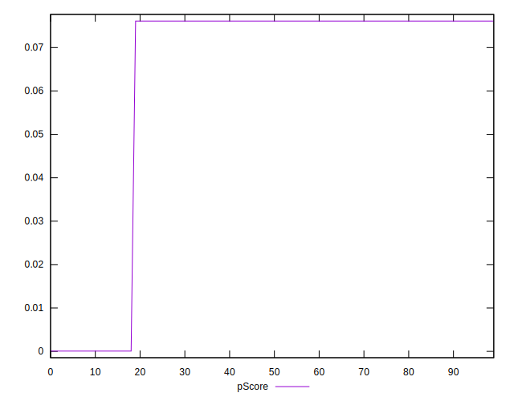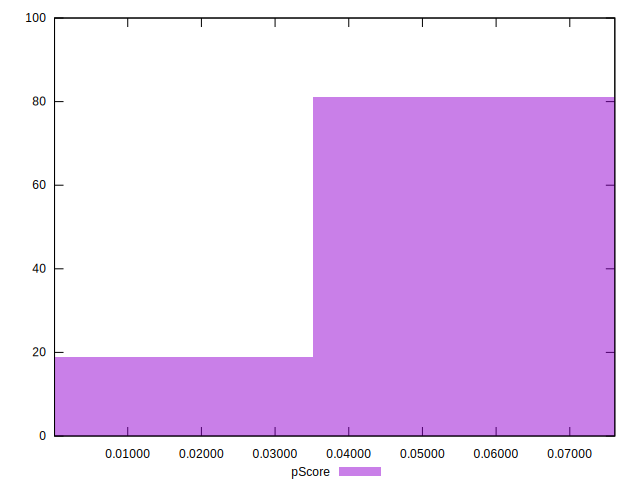
## Score Difference


```yaml
p90min: 0
p90max: 0
p90range: 0
p90mean: 0
p90median: 0
p90stdev: 0
p90skewness: .nan
p90eccentricity: .nan
p90discretization: 94
outlandishness: .nan
confidence: 0
p90confidence: 0

```


## P Score Difference


```yaml
p90min: -0.003887518045901747
p90max: 0.00006417586681428666
p90range: 0.003951693912716034
p90mean: -0.0032148892948011525
p90median: -0.003887518045901747
p90stdev: 0.0014851240703843164
p90skewness: 1.7550294029241307
p90eccentricity: 1.0000000000000016
p90discretization: 47
outlandishness: 0.9519472228815629
confidence: 0.0006076880477689943
p90confidence: 0.0006004500660400777

```

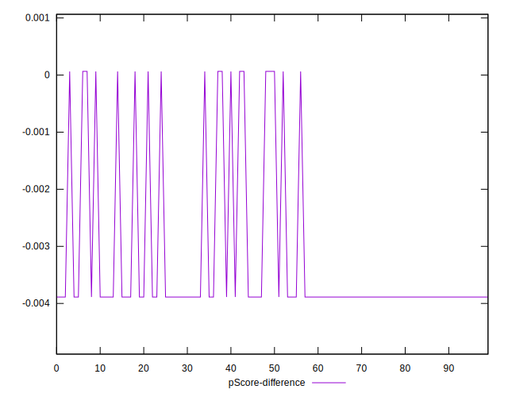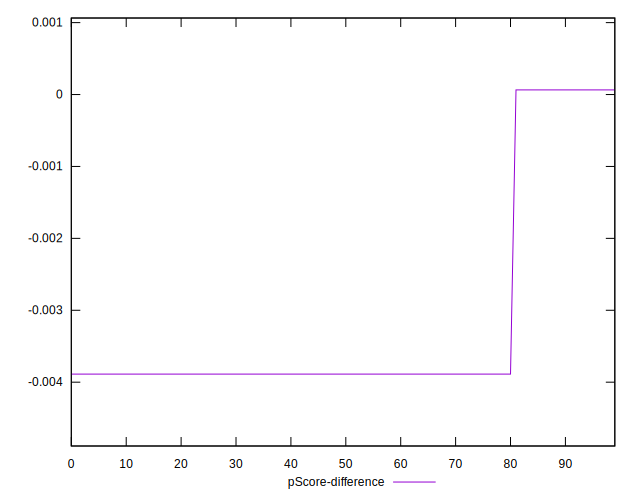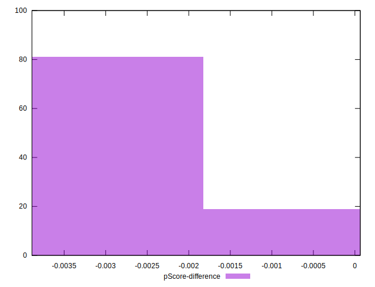