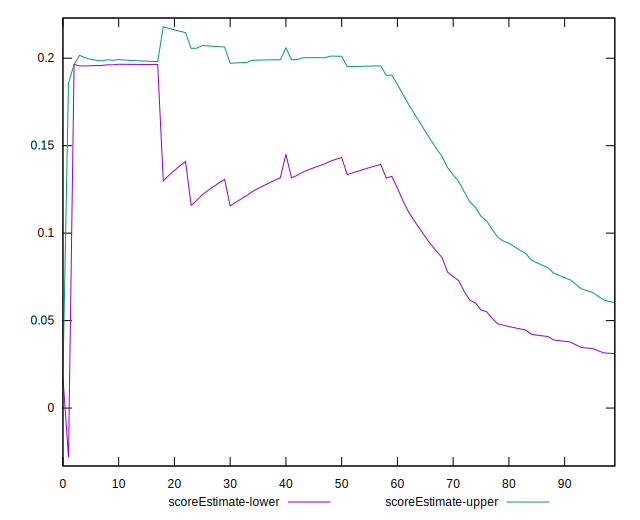

# //cumulative-layout-shift/samples/pages+cached+noadtech+nomedia

[→ Parent](../..)


## Raw


```yaml
p90min: 0.4164168294270833
p90max: 1.7676270548502604
p90range: 1.351210225423177
p90mean: 0.8402802585033654
p90median: 0.460498046875
p90stdev: 0.4521077875493322
p90skewness: 0.7416343679955387
p90eccentricity: 1.0000000000000016
p90discretization: 5.222222222222222
outlandishness: 1.0362742233474402
confidence: 0.1851510193163477
p90confidence: 0.18279156354995993

```


## Score


```yaml
p90min: 0
p90max: 0.24
p90range: 0.24
p90mean: 0.11436170212765942
p90median: 0.2
p90stdev: 0.09381464875224463
p90skewness: -0.12884617762598813
p90eccentricity: 0.9999999999999989
p90discretization: 15.666666666666666
outlandishness: 1.0059250296592752
confidence: 0.037473588795859866
p90confidence: 0.037930172409255204

```


## Raw Estimate


## Score Estimate


## P Score


```yaml
p90min: 0.003113146976724157
p90max: 0.2377319269603771
p90range: 0.23461877998365294
p90mean: 0.11288946696571166
p90median: 0.19645555020220185
p90stdev: 0.09233297239211515
p90skewness: -0.12021863272856122
p90eccentricity: 1.0000000000000004
p90discretization: 5.222222222222222
outlandishness: 1.0080235833193887
confidence: 0.03686138451297054
p90confidence: 0.03733111628591088

```


## Score Difference


```yaml
p90min: 0
p90max: 0
p90range: 0
p90mean: 0
p90median: 0
p90stdev: 0
p90skewness: .nan
p90eccentricity: .nan
p90discretization: 94
outlandishness: .nan
confidence: 0
p90confidence: 0

```


## P Score Difference


```yaml
p90min: -0.0035791534417845376
p90max: 0.0034250563607062245
p90range: 0.007004209802490762
p90mean: -0.0014434307905196524
p90median: -0.003322631340705578
p90stdev: 0.002672045676483329
p90skewness: 0.848701010124232
p90eccentricity: 0.9999999999999996
p90discretization: 5.875
outlandishness: 0.8858467124867965
confidence: 0.0010809890448286387
p90confidence: 0.001080333983470707

```

