# //cumulative-layout-shift/samples/pages+cached+noadtech

[→ Parent](../..)


## Raw


```yaml
p90min: 0.39359130859374997
p90max: 1.7495150756835938
p90range: 1.3559237670898439
p90mean: 0.8527726130586986
p90median: 0.44002919578552246
p90stdev: 0.5211295247991695
p90skewness: 0.7185190236303481
p90eccentricity: 0.9999999999999987
p90discretization: 5.529411764705882
outlandishness: 1.0310231966669867
confidence: 0.20947199580616982
p90confidence: 0.21069772136958298

```

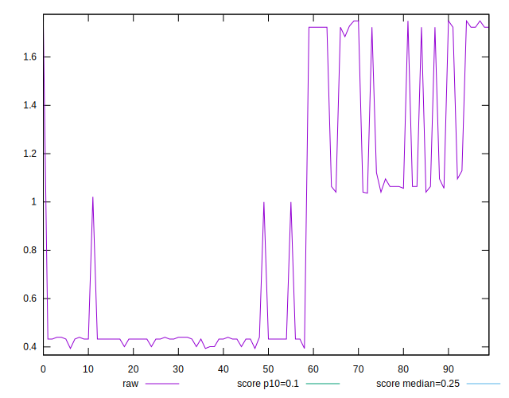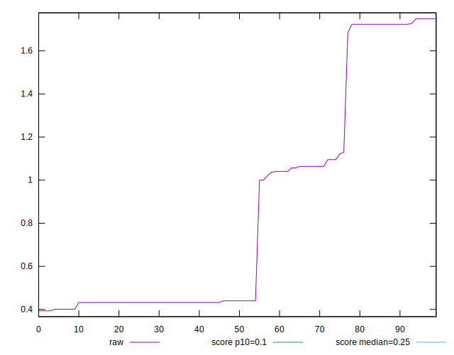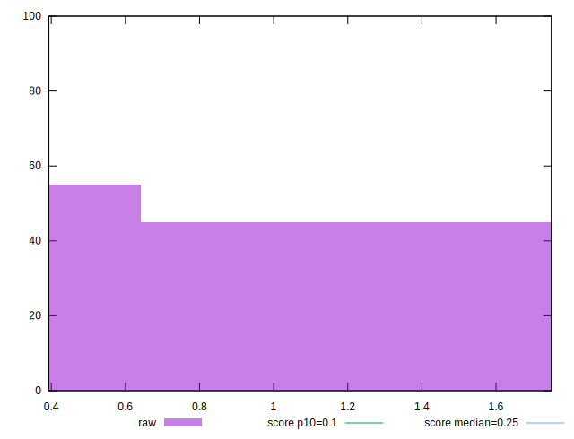
## Score


```yaml
p90min: 0
p90max: 0.26
p90range: 0.26
p90mean: 0.1279787234042553
p90median: 0.21
p90stdev: 0.10579566603392498
p90skewness: -0.20449656884671746
p90eccentricity: 1.000000000000001
p90discretization: 13.428571428571429
outlandishness: 1.001896159849752
confidence: 0.04210117607176637
p90confidence: 0.04277421390145904

```

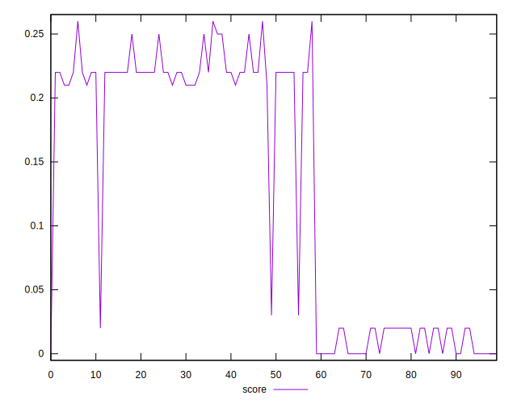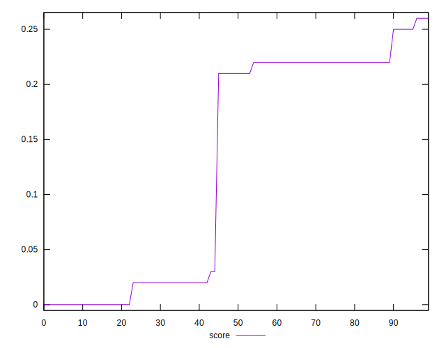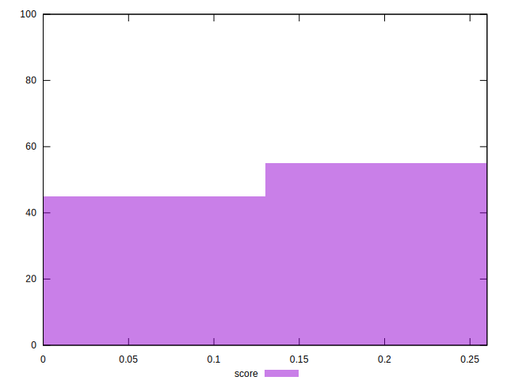
## Raw Estimate

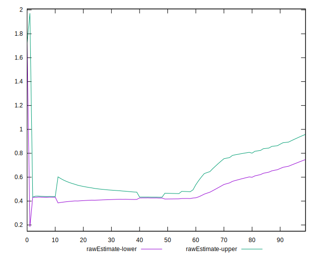
## Score Estimate

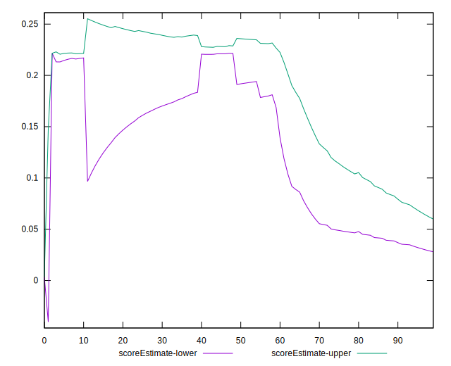
## P Score


```yaml
p90min: 0.0032521211570840647
p90max: 0.26278877104710546
p90range: 0.2595366498900214
p90mean: 0.13027003168249113
p90median: 0.21454267585001896
p90stdev: 0.10591987025251942
p90skewness: -0.19988084083859284
p90eccentricity: 1.0000000000000018
p90discretization: 5.529411764705882
outlandishness: 1.0025351861671654
confidence: 0.04214003430007329
p90confidence: 0.042824430871707314

```

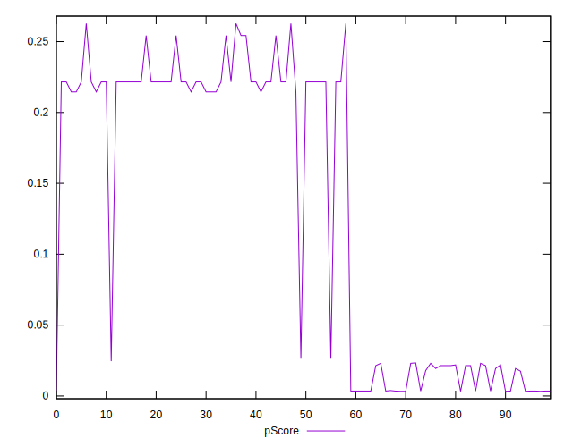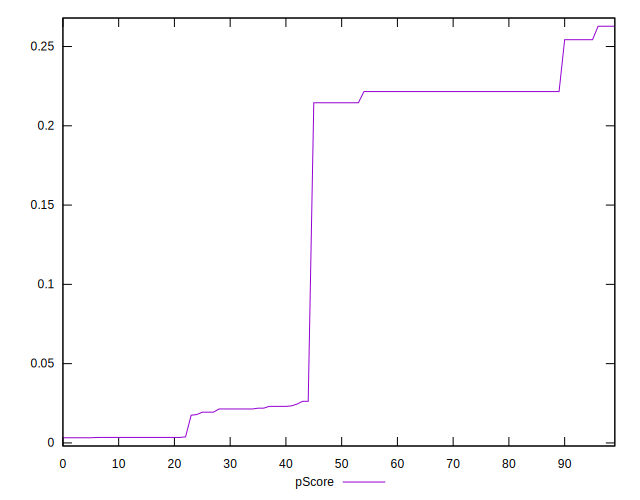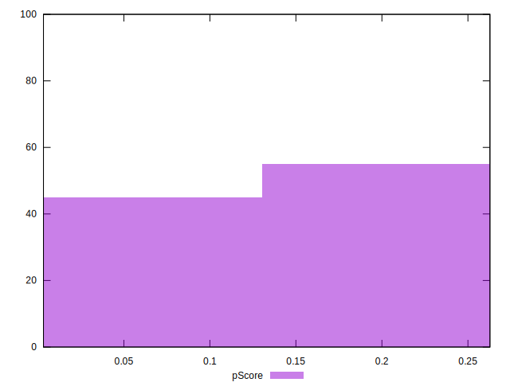
## Score Difference


```yaml
p90min: 0
p90max: 0
p90range: 0
p90mean: 0
p90median: 0
p90stdev: 0
p90skewness: .nan
p90eccentricity: .nan
p90discretization: 94
outlandishness: .nan
confidence: 0
p90confidence: 0

```


## P Score Difference


```yaml
p90min: -0.0021185731800882728
p90max: 0.004542675850018968
p90range: 0.006661249030107241
p90mean: 0.0024456241262645626
p90median: 0.0017507653252574976
p90stdev: 0.0013025979835657327
p90skewness: -0.4091412681946458
p90eccentricity: 0.9999999999999983
p90discretization: 6.266666666666667
outlandishness: 0.9116232321148043
confidence: 0.0006474136511279339
p90confidence: 0.0005266529987984876

```

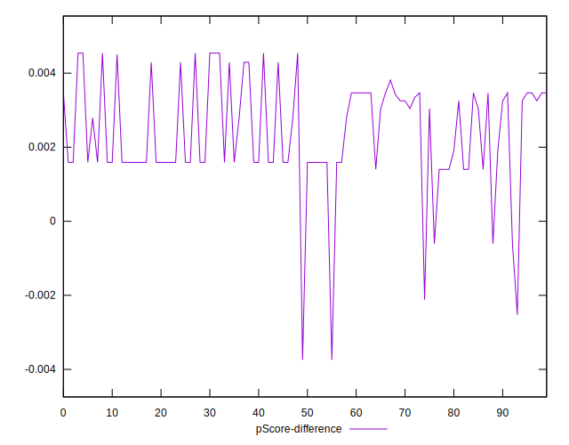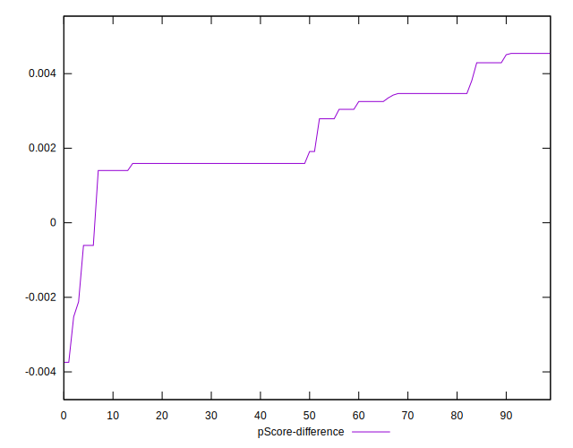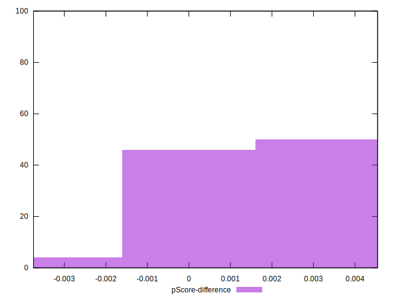